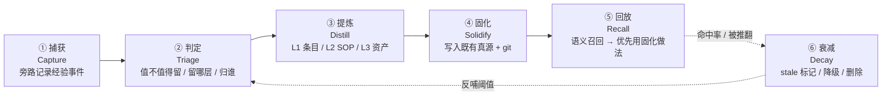

# 00 · 项目总览：AI 自成长引擎

> **一句话**：让 Agent 在陪我干活的过程中，**自动**把经验、流程、偏好、脚本、技能沉淀成可复用资产，并且下次能被**自动想起来**。
>
> 别名：经验自沉淀 / auto-skill-distiller / 自成长 Agent

## 六字段（对齐概念解释器风格）

- **名称 Name**：AI 自成长引擎（AI Self-Growth Engine）
- **层级 Level**：项目（构想中，尚无独立 Git 仓）
- **是什么（一锤定音）**：一套 **策略 + 工具** 的组合。策略层回答"什么时候该沉淀、沉淀成什么形态、写到哪里、怎么淘汰"；工具层是这套策略的自动执行器（捕获器 / 判定器 / 提炼器 / 落盘器 / 召回器）。
- **干什么**：把"一次对话里临时解决的问题"转成"下次不用重新解释的资产"，覆盖四条产出线：
  1. **自动积累经验** —— 踩过的坑、纠正过的做法、验证过的结论
  2. **自动总结 skill** —— 重复出现的做法固化成技能包
  3. **自动固化我的内容** —— 我的偏好、命名、目录约定、写作口径、模板
  4. **自动写流、写脚本** —— 把长链条操作反推成 SOP / 可执行脚本
- **边界（不干什么）**：
  - 不做无人审校的自动部署 —— L3（脚本 / skill）必须我点头，先 dry-run 再生效
  - 不新造第 4 个知识存放地 —— 只写既有真源（`D:\记忆` / 项目仓 `docs/` / 本项目 `技能库\`（L3 暂存）→ 经点头才安装进 `D:\记忆\_Skills\` / handbook）
  - 不存任何凭据明文 —— 只记「存放位置 + 槽位名」（对齐 handbook 40-安全红线）
  - 不代替我决策 —— 它压缩重复劳动，不替我拍板
- **真源在哪**：
  - 项目事实源：本仓 `docs/00-项目总览.md`（本页）
  - 原始想法未加工版：`docs/02-原始想法记录.md`
  - 方案细节：`docs/03-方案构想.md`
  - 路线与待决策：`docs/01-任务看板.md`

---

## 一、为什么值得做（痛点）

| # | 痛点 | 现在的代价 |
|---|---|---|
| P1 | 每次新会话都要重新交代背景、约定、口径 | 重复解释，Agent 容易"失忆式跑偏" |
| P2 | 好方法只活在那一次对话里 | 第二次遇到要重新想一遍，质量还不稳定 |
| P3 | 踩过的坑会重复踩 | 同一个报错第二次照样从头排查 |
| P4 | 手工整理 skill / 文档 / 脚本成本高 | 想做但没时间 → 资产烂尾，越攒越乱 |
| P5 | 已有资产分散（Obsidian / D:\记忆 / Loomy skills / 各仓脚本） | 缺自动汇聚与去重，检索靠人脑 |
| P6 | 现有 `loomy-learned-*` 技能已经是"手工固化"的产物 | 证明这套东西有价值，但产出速度受限于我的手工意愿 |

> **核心判断**：P6 说明"沉淀"本身已经被验证有效，缺的不是价值证明，而是**把沉淀这一步也自动化**。

## 二、目标 / 非目标

**目标（可验收）**

- G1：对话中"顺手"产生可复用资产，我**不需要额外动作**（最多勾一下确认）
- G2：三级产物分层，成本与确定性匹配（见 §三）
- G3：每条资产都能回答"**下次什么信号会让我想起它**"（否则不收）
- G4：资产可回溯、可 diff、可 revert（带来源 + 进 git）
- G5：有淘汰机制，90 天不命中或被反复推翻的自动降级 —— 防记忆污染

**非目标**

- 不追求"全自动无人干预"；人在环是设计前提，不是妥协
- 不做通用 Agent 框架；只做我自己的这套环境（Loomy + Obsidian + D:\记忆）里的闭环
- 第一版不做跨设备同步、不做多用户

## 三、核心概念：三级产物（成本递增）

| 层级 | 形态 | 例子 | 落地位置 | 闸门 |
|---|---|---|---|---|
| **L1 经验条目** | 一句可检索的事实 / 偏好 / 坑 | "含空格的飞书字段名会截断 JSON，改用字段 ID" | `D:\记忆\<type>\*.md` + MEMORY 索引 | 自动写入，可撤销 |
| **L2 工作流 SOP** | 步骤 + 前置条件 + 校验点 + 失败回退 | "磁盘迁移遗留目录废弃判定流程" | 项目仓 `docs/运行手册/` 或 handbook | 生成草稿 → 我确认 |
| **L3 可执行资产** | 脚本（.ps1/.py）+ skill（SKILL.md + scripts/）+ 触发词 | `loomy-learned-*` 那一类 | 本项目 `技能库\`（L3 暂存）→ 经点头才安装进 `D:\记忆\_Skills\` | 我点头 + dry-run 通过 |

> **原则**：能 L1 解决的不要升 L2，能 L2 解决的不要写 L3。**过度固化 = 噪声**。

## 四、架构：五段流水线



### ① 捕获 Capture —— 什么信号值得记

旁路记录器，不打断对话。触发信号分五类：

| 类型 | 信号 | 为什么值钱 |
|---|---|---|
| **纠正** | 我说"不对 / 不是这样 / 以后都…" | 存在一条我没说出口的隐含规则 |
| **重复** | 同一问题 / 同一请求第 2 次出现 | 重复即复用价值的最硬指标 |
| **踩坑闭环** | 报错 → 排查 → 修复成功 | 完整因果链，最难自己复现 |
| **显式指令** | "记住 / 别忘了 / 固化下来 / 做成技能" | 我主动标注的高优先级 |
| **长链条操作** | 一串工具调用 / 命令序列成功跑通 | 天然可脚本化候选 |
| **偏好表达** | 格式、命名、目录约定、语气、模板选择 | L1 稳定收益，成本最低 |

**经验事件 schema（草稿）**

```yaml
event_id: 2026-09-19-001
captured_at: 2026-09-19T21:40+08:00
trigger_type: 纠正 | 重复 | 踩坑闭环 | 显式指令 | 长链条 | 偏好
context_summary: 当时在做什么（两三句，不存全文）
user_utterance: 关键原话片段（脱敏）
tools_involved: [bash, lark-cli, ...]
paths_involved: [D:\Work\...]
outcome: 成功 / 失败 / 待定
signals_for_recall: 「下次出现什么，就该想起这条」  # 必填，缺则不收
sensitivity: 无 / 含路径 / 含凭据位置（只记槽位名）
```

### ② 判定 Triage —— 四个过滤器

1. **会不会再发生？** 一次性的 → 丢
2. **是事实 / 偏好 / 流程 / 代码？** → 决定层级 L1/L2/L3
3. **归属哪一层？** 项目特有 → 项目仓 docs；跨项目 → handbook 或 `D:\记忆`
4. **撞车检查**：与既有 skill / 记忆相似度超阈值 → 走**增补**，不新建

### ③ 提炼 Distill —— 按层级产出

- L1：一句话 + 触发条件 + 来源，可直接被语义检索
- L2：从工具调用序列**反推**步骤，补齐前置条件、校验点、失败回退（最容易漏的是后两项）
- L3：SKILL.md（含 description 触发词）+ `scripts/`，必须附**怎么验证它没坏**

### ④ 固化 Solidify —— 只写既有真源（owner 表）

| 内容类型 | 唯一落点 | 附带动作 |
|---|---|---|
| 跨会话状态 / 决策 / 偏好 | `D:\记忆\<type>\*.md` | 更新 MEMORY 索引 |
| 项目当前事实 | 该项目仓 `docs/` + README | git commit |
| 跨项目默认规范 | handbook（`通用规范/`） | 版本号 + commit |
| 可执行技能 / 脚本 | 本项目 `技能库\<skill-id>\`（暂存，不生效）；安装才进 `D:\记忆\_Skills\` | 更新 `技能库\README.md` §二 清单 + git commit + 安装需点头 |
| 结构化数据（表格类） | 飞书 | 只做数据，不做正文 |

> 依据：handbook `50-知识管理三工具规范`（Obsidian / GitHub / 飞书 职责定界 + 单写真源法则）

### ⑤ 回放 Recall + ⑥ 衰减 Decay

- **召回**：语义检索命中后，若是"这类任务以前有固化做法" → **先查 skill 再临场发挥**（记忆只做线索，技能才是可执行方法）
- **衰减**：
  - 90 天未命中 → 标 `stale`
  - 连续 2 次被我推翻 → 降级或直接删
  - 每条资产维护 `命中次数 / 推翻次数` 计数
- **复盘**：每周生成一份「新固化清单 + 命中率 + 被推翻清单」，反哺 §② 的阈值

## 五、与既有体系的关系

| 已有东西 | 本项目对它做什么 |
|---|---|
| `D:\记忆`（记忆真源） | 复用为 L1 落点，**不替代**；本项目补的是"自动写入 + 衰减计数" |
| Loomy skills + MEMORY 索引 | 复用其记忆-技能协同规则；补的是"自动提炼成 skill"这一段（程序技能目录只放已安装生效项，项目产出先存本项目技能库） |
| `loomy-learned-*` 系列技能 | 它们就是**手工版的本项目产物** → 直接当作 L2/L3 的样板对照 |
| handbook `通用规范/` | 提供落盘规范与安全红线约束；本项目不 override 它 |
| ai-platform | 若将来要跑常驻服务（捕获器 / 召回器），归属那边；本仓只放策略与文档 |
| **自适应工作流引擎**（`D:\Work\自适应工作流引擎\`） | **下游姊妹项目**：本仓产出的 L2/L3 交给它挂载运行 + 健康探测；它回流的 drift / 假信号 / 失败样本，正是本仓最有价值的经验事件来源（详见其 `docs/00-项目总览.md` §五） |

## 六、可参照的现成做法（避免重造轮子）

| 参照 | 可借鉴点 |
|---|---|
| Voyager（Minecraft skill library） | 自动写可执行技能 → 存库 → 后续复用，技能库随难度增长 |
| Agent Workflow Memory (AWM) | 从成功轨迹归纳 workflow，再注入 prompt |
| Reflexion / memory stream | 反思机制 + 记忆流检索 + 定期 reflection 汇总 |
| Claude Skills / Cursor Rules | 声明式技能包：description 决定触发，正文决定怎么做 |
| handbook + 概念解释器 | 我自己这套「六字段 / 单写真源 / 边界不越权」纪律，正是防污染的现成框架 |

## 七、风险与红线

| 风险 | 后果 | 对策 |
|---|---|---|
| **记忆污染** | 错的经验被反复召回并当成事实 | 每条必须带来源；推翻计数达阈值即降级 |
| **技能爆炸** | 几百个 skill，检索质量反而下降 | 强制撞车检查（增补优先）+ 衰减 + 单一 owner |
| **隐私 / 凭据泄漏** | 明文密钥进 git | 只存槽位名；固化前做敏感串扫描 |
| **过度自动化** | 我失去掌控，产物不敢用 | L2 草稿待确认、L3 必须人工 + dry-run |
| **噪声收集癖** | 什么都记 = 什么都没记 | `signals_for_recall` 是必填门槛，填不出就不收 |

## 八、最小闭环长什么样（验收标尺）

> 一次真实对话里：我纠正了一次做法 → 会话结束时它给我一条"建议固化"（L1，含触发信号）→ 我勾确认 → 写进 `D:\记忆` 并 commit → 三天后我遇到同类问题，它**主动引用**这条而不是重新问我。
>
> 这条链路走通，M0 就算成功；后面都是往上加自动化程度。

---

**As of 2026-09-19**：想法已捕获并完成首轮结构化，状态 = 构想中，未开工。路线见 `docs/01-任务看板.md`。
