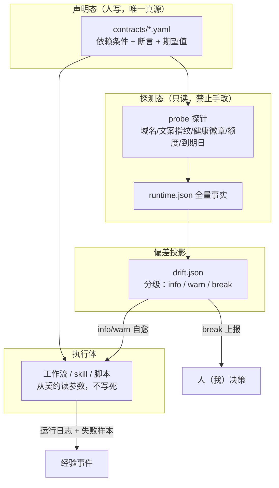
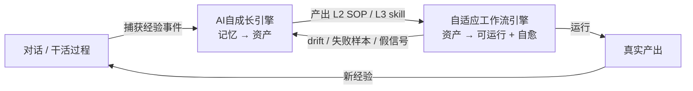

# 00 · 项目总览：自适应工作流引擎

> **一句话**：把 ai-platform 已经验证过的「声明态 / 只读探测 / drift 投影」三件套，**从网关推广到 skill 与自动化工作流**，让固化下来的东西在外部改版后能自己发现坏在哪、能自己修一部分、修不了的主动叫我。
>
> 别名：工作流自动化构造 / Adaptive Workflow Engine / AWE

## 六字段

- **名称 Name**：自适应工作流引擎（Adaptive Workflow Engine）
- **层级 Level**：项目（构想中，尚无独立 Git 仓）
- **是什么（一锤定音）**：一套**工作流的构造与自愈框架**。构造 = 把记忆资产变成可调度、可验证的工作流（skill / 脚本 / n8n 节点，载体待定）；自愈 = 每个工作流带一份**契约（contract）**，由只读探针定期核对，drift 出现时按分级策略处置。
- **干什么**：
  1. **构造**：提供工作流的标准骨架（前置条件 / 步骤 / 校验点 / 失败回退 / 契约 / 回归基线），使新工作流一出生就"可被探测"
  2. **自适应**：外部世界变了（域名、UI 文案、选择器、会员到期、额度、模型改名）→ 探针对比声明态 → 产出 drift → 按级别自愈或上报
  3. **调度**：把可运行的工作流挂到触发器（会话内调用 / 定时 / 事件），并记录每次运行的健康度
- **边界（不干什么）**：
  - **不做沉淀**：从对话里发现经验、提炼成资产 —— 那是 [[../AI自成长引擎/docs/00-项目总览|AI 自成长引擎]] 的活；本项目只接它产出的 L2/L3
  - **不替代 ai-platform**：网关 / 编排器 / 端口的真源仍在 `D:\Work\AI平台\docs\design\AI基础设施\`（`gateways.json` + `gateway_runtime.json`）；本项目**复用其范式**，不接管其服务
  - **不改 handbook、不改记忆正文**：跨项目规范与记忆条目由我手写
  - **不做全自动自愈到"改代码即上线"**：L3 级以上自修正必须我点头（见 §四分级）
  - **不存凭据明文**（handbook 40-安全红线）
- **真源在哪**：
  - 项目事实源：本页
  - 试点资产盘点（含失效证据）：`docs/02-镜像站试点盘点.md`
  - 设计与选型：`docs/03-方案构想.md`
  - 路线与待决策：`docs/01-任务看板.md`
  - 待安装 skill 草稿：归上游 `D:\Work\AI自成长引擎\技能库\`；本仓不再存放 skill 草稿（生效位置为 `D:\记忆\_Skills\`，安装需点头）

---

## 一、问题的准确形状

不是"没有自动化"，而是"**自动化会静默过期，且过期后给出假信号**"。

试点实证（详见 `docs/02-镜像站试点盘点.md` §四）：镜像站 2026-09-15 菜单文案改版后，`evalB_ext.js` 三处硬编码断言全断裂，脚本却仍返回结构化结果——`ok:false` 假阴性，或"以为切到 Extended 其实是 Standard"的假阳性。而当时的唯一应对措施，是在手册里手写两行 ⚠️ 注释。

同类事件在本机不是孤例：

| 时间 | 事件 | 结果 |
|---|---|---|
| 2026-08-27 | 镜像站整体迁移（`<POOL_HOST_LEGACY>`/`<CARD-23.MIRROR_LEGACY_HOST>` 停用 → `<POOL_HOST>`） | text_searcher 设题适配器**整体失效**、阻塞，需人工重排 |
| 2026-09-06 | 固化脚本 A/B 写死选择器与文案 | 提速 5–6 倍（74s→9.6s）——**但同时也写死了失效日期** |
| 2026-09-15 | 菜单文案变（无 `Thinking• Extended`，pill 变 `Thinking`） | 脚本三重断裂，靠手册注释兜 |
| 2026-10-28 | 镜像站会员到期（**已知未来事件**） | 目前无人登记、无提醒 |

> **核心判断**：固化（写死）与自适应是对立统一的。写死带来 5–6 倍提速，是必须保留的收益；但**写死的东西必须有"过期检测器"**，否则提速的代价是把故障从"显式失败"变成"隐式错误结论"。本项目就是补这个检测器。

## 二、核心架构：三件套的推广

ai-platform 已经用铁律验证过这套结构（`docs/design/AI基础设施/00-AI基础设施-总览.md`）：

| 现有（网关域） | 推广后（skill / 工作流域） |
|---|---|
| `config/gateways.json` = 声明态（身份/路径/期望状态，**绝不写 online/pid/health**） | `contracts/<workflow>.yaml` = 工作流契约（依赖的外部条件、断言、期望状态） |
| `inspect_gateways.ps1` = 只读探测，**禁止手改输出** | `probe.<ps1\|py\|js>` = 只读探针（可达性/文案指纹/额度/到期日/健康徽章） |
| `gateway_runtime.json` = 全量运行态 | `runtime.json` = 每次探测的全量事实 |
| `gateway_drift.json` = 异常投影 | `drift.json` = 与契约的偏差清单（分级） |
| 代码位置是真实存在源，Obsidian 只解释与索引 | skill/脚本是执行真源，Obsidian 只放契约与说明 |

**三条铁律（照搬 ai-platform，不新造）**

1. **声明态与运行态分离**：契约里绝不写"当前健康/当前文案"；探针只读，产物禁止手改
2. **执行体不硬编码**：域名、选择器、菜单文案、到期日一律从契约读；执行体内出现字面量即算违规
3. **代码/脚本是真实存在源**：Obsidian 只解释与索引，不反向充当运行事实源

## 三、"自适应"的四档能力（明确分级，防止吹牛）

| 档 | 能力 | 例子（镜像站试点） | 是否需人工 |
|---|---|---|---|
| **A0 静态** | 写死，坏了靠人发现 | **现状**：`evalB_ext.js` | — |
| **A1 探测报警** | 定期核对契约，drift 就报 | 探针发现 pill 文案集合里没有 `Extended`、只剩 `Thinking` → 出 drift 报告 | 报给人 |
| **A2 参数化自愈** | 契约里给**候选集/正则**，探针选中当前有效项自动切换 | 契约写 `mode_label: {candidates: ["Thinking• Extended","Thinking• Standard"], match: regex}` → 探针回填当前命中项，执行体读回填值 | **不需要**（在候选集内） |
| **A3 结构自愈** | 选择器失效时按语义特征重定位（角色/文本/位置打分） | composer 从 `contenteditable` 变 `textarea` → 探针按"可编辑 + 在发送按钮同容器"重定位 | dry-run 后**需确认** |
| **A4 流程重构** | 步骤增删、顺序调整 | 上游加了验证码/二次确认步骤 | **必须人工**，本项目不做自动 |

> **本项目交付目标 = A1 + A2 稳定可用，A3 提供 dry-run 草稿，A4 明确排除。**
> 理由：A2 能吃掉镜像站这类"文案/域名/卡号轮换"漂移的绝大多数（试点 §五 表里 6 项有 4 项属 A2 可覆盖），性价比最高；A3 是语义定位，误判代价大，只能出草稿；A4 等于让机器改方法论，越界。

## 四、自愈动作的分级闸门

| drift 级别 | 判据 | 自动动作 | 是否叫我 |
|---|---|---|---|
| `info` | 候选集内换了一个命中项（如卡号 CARD-19→CARD-23） | 回填 runtime，继续跑 | 周报里汇总，不单独打扰 |
| `warn` | 契约候选集**未覆盖**，但探针给出了高置信替代（A3） | 出 dry-run 草稿 + 暂停该工作流 | **立刻**报，等我点头 |
| `break` | 前置条件不成立（域名 404 / 会员到期 / 额度耗尽 / 活跃卡 0） | 熔断该工作流，不再空跑烧轮次 | **立刻**报 |
| `silent-risk` | 执行成功但**校验点不成立**（如 pill=`Standard` 却继续发问） | **视为 break**，不产出结论 | **立刻**报 |

> ★ `silent-risk` 是本项目存在的理由：现状最危险的不是崩溃，而是"跑通了但结论是错的"。任何校验点不过，一律不许产出结论。

## 五、与 AI 自成长引擎的分工（避免两仓打架）

| 维度 | AI 自成长引擎 | 自适应工作流引擎（本项目） |
|---|---|---|
| 方向 | 沉淀：对话 → 资产 | 运行：资产 → 可执行 + 自愈 |
| 核心产物 | L1 条目 / L2 SOP / L3 skill | 契约 + 探针 + drift 投影 + 调度记录 |
| 关心什么 | 值不值得记、记到哪、会不会忘 | 跑不跑得通、外部变没变、变了怎么办 |
| 不碰什么 | 不管运行健康 | 不管该不该沉淀 |
| 交接接口 | 产出带 `signals_for_recall` 的 L2/L3，附契约建议字段 | 回流 drift 事件与失败样本，作为对方的经验事件来源 |

> **单写真源纪律**：契约（声明态）归本项目；skill/SOP 正文归记忆库或 ai-platform；drift/runtime 归本项目且**只由探针写**。三者互不越权。

## 六、验收标尺（怎么算成了）

用镜像站试点，跑通这条链路即验收：

> 探针每天（或按需）核对镜像站契约 → 某天上游把 `Thinking• Standard` 又改名 → 探针在**我不知情**的情况下产出 `warn` drift + 高置信候选 → 执行体在候选集内自动切换（`info`）或直接熔断（`break`）→ 周报里我看到一行"X 项 info 自愈、1 项 break 熔断"，而**整条送审链路没有一次给出假结论**。
>
> 对照组：拿 `docs/runbooks/测试任务-镜像零到Extended计时.md` 当回归基线，自愈后计时不得显著劣化（基线 9.6~14s）。

## 七、风险与红线

| 风险 | 后果 | 对策 |
|---|---|---|
| **探针本身变成新的硬编码** | 换个地方再烂一次 | 探针只读契约、只输出事实；探针的常量也必须来自契约 |
| **自愈掩盖真问题** | 一直"自动修好"，实际环境已面目全非 | `info` 级也要进周报计数；同一契约项 30 天内自愈 ≥3 次 → 强制升级 `warn` |
| **假信号（silent-risk）** | 比崩溃更危险的错误结论 | 校验点不过一律熔断，不许产出结论（§四） |
| **探针打扰真人浏览器** | 抢占日常 Chrome / 顶掉标签页 | 探针优先走**非 UI 通道**（健康徽章端点 `<MIRROR_HEALTH_API>/endpoint?carid=vip-NN`）；必须用 UI 时遵守共享标签页纪律、独立 tab、绝不 `close` 他人页 |
| **烧账号额度** | 受限卡被反复试 | drift=`break`（活跃卡 0 / 会员到期）即熔断，不重试 |
| **凭据入仓** | 红线 | 契约里只写槽位名；固化前扫敏感串 |

## 八、明确不做

- ❌ A4 流程重构（机器改方法论）
- ❌ 不引入常驻服务在 M0（先用 Loomy 定时任务 + 脚本）
- ❌ 不做通用工作流市场 / 多人协作编排
- ❌ 不接管 ai-platform 的 `gateways.json` 与端口登记
- ❌ 不为了让探针"更聪明"而引入向量库或视觉模型（A3 先用规则打分）

---

**As of 2026-09-19**：立项 + 试点盘点 + 架构定稿 + 契约落盘（`contracts\gpt-mirror-extended-review.yaml`，8 conditions / 11 gates）+ skill 草稿。**载体选型已拍板（D1=契约中立、D2=暂不装 n8n）**；D4 已执行（旧 `evalB_ext.js` 加失效标注，未改其逻辑）；D7 已执行（会员 2026-10-28 到期，提前 14 天提醒的 Loomy 定时任务已建，且写入契约 break 条件）。剩余：T6 P1 探针首跑（阻塞 A1 验收）、D5/D6/D8 待表态。详见 `docs/01-任务看板.md`。
