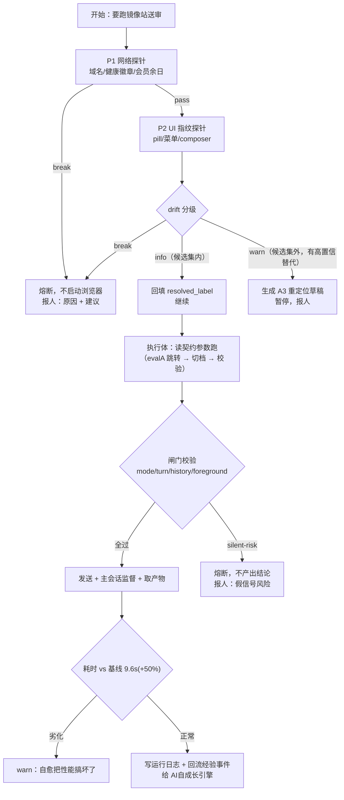

# 03 · 方案构想：契约、探针、自愈、载体

> [[00-项目总览]] 讲"为什么这么切"，本页讲"东西具体长什么样"。
> 贯穿全页的一条设计原则：**契约与载体解耦** —— 契约是 YAML 声明，载体（skill / 脚本 / n8n 节点）只是执行壳，换壳不用重写知识。

## 一、载体选型：n8n？skill？还是自研？

先说事实：**本机目前零 n8n 痕迹**（`D:\Work`、`D:\记忆` 全库 grep 无命中）；而 ai-platform 已有常驻服务 `central:8000`、`orchestrator:8791`、`search_gateway:3000`，且已有成熟的「声明态 + 只读探测 + drift」三件套与端口登记规范。

| 方案 | 优点 | 代价 | 适配镜像站试点？ |
|---|---|---|---|
| **A. Loomy skill + 脚本 + 定时任务** | 零新增基建；skill 已是本机既有效果形态（`_Skills\loomy-learned-*`）；探针可直接用 Loomy schedule 跑；与 AI 自成长引擎天然同轨 | 无可视化画布；分支/重试要自己写在脚本里 | ✅ 完全够，且能立刻开跑 |
| **B. 真装 n8n** | 可视化流程、内建 cron/webhook/错误分支/重试、节点生态 | 新增一个常驻服务（要进 `gateways.json` + 端口登记 + 维护规范）；Windows 本机要 n8n 进程常驻；契约→节点要做映射层；**它是另一套声明态真源，与三件套铁律有冲突风险** | ⚠️ 能跑，但 M0 阶段是杀鸡用牛刀 |
| **C. 扩展 ai-platform orchestrator（:8791）** | 复用既有服务、既有 drift 范式同域 | 要改 ai-platform 代码，跨仓耦合；本项目还只是构想，不该先动基建 | ⏳ 将来落点，不是起步 |
| **D. 契约中立 + A 起步，预留 B/C 接口** | 知识不绑死载体；M0 零基建；将来要 n8n 只是生成节点 | 需要一开始就把契约写成载体无关的 YAML（多花一点点设计成本） | ✅ **建议** |

> **✅ 已拍板 = D（2026-09-19，决策 D1/D2）**：M0 用 A（skill + 脚本 + Loomy 定时任务）跑通闭环，**契约层从一开始就写成载体中立**（已落盘 `contracts\gpt-mirror-extended-review.yaml`）。本机零 n8n 痕迹，现在**不装** n8n；等探针与自愈逻辑稳定后（A6），再决定要不要导出成 n8n workflow JSON 或挂到 orchestrator:8791 —— 那时是"生成一个壳"，不是"重写一套知识"。
>
> 若将来要走 B：按 ai-platform 的 `02-维护规范` + `01-端口登记` 把 n8n 登记进 `gateways.json`，端口避开 8000 / 8791 / 3000 / 3100。

## 二、目录骨架

```
D:\Work\自适应工作流引擎\
├── README.md
├── project.yaml
├── contracts\                      # ★ 声明态真源（人写，唯一）
│   └── gpt-mirror-extended-review.yaml
├── probes\                         # ★ 只读探针（产物禁止手改）
│   ├── probe_gpt_mirror.ps1        #   非 UI 通道优先：健康徽章端点
│   └── probe_gpt_mirror_ui.js      #   仅当必须看 UI 时用（独立 tab，不 close）
├── runtime\                        # 探针产物（.gitignore? → 见 D5）
│   ├── gpt-mirror.runtime.json
│   └── gpt-mirror.drift.json
├── runners\                        # 执行壳（载体可换）
│   ├── README.md                   #   如何本地跑 / 如何导出成 n8n 节点
│   └── evalB_ext_adaptive.js       #   ← 现有 evalB 的契约化改造版
└── docs\  (00/01/02/03)
# → 注：skill 草稿见 AI自成长引擎\技能库\（本仓无本地草稿目录）
```

## 三、契约 schema（v0.1）

以镜像站为样例。**注意所有会变的东西都在 `conditions` 里给了候选集或探针目标，执行体不许写字面量。**

```yaml
# contracts/gpt-mirror-extended-review.yaml
contract_version: 1
workflow_id: gpt-mirror-extended-review
display_name: GPT 镜像站 Extended 送审
owner_skill: loomy-learned-gpt-mirror-extended-review
skill_home: D:\Work\AI自成长引擎\技能库\loomy-learned-gpt-mirror-extended-review\SKILL.md   # 技能库暂存（草稿，不生效）
skill_install_to: D:\记忆\_Skills\          # 程序运行时目录（安装需点头）
skill_index: D:\Work\AI自成长引擎\技能库\README.md
source_assets:                                            # 知识出处（可回溯）
  - D:\Work\AI平台\docs\runbooks\GPT镜像站送审流程.md
  - D:\记忆\调度大脑记忆\流程\workflow_ai_<POOL_NAME>_open.md
  - D:\记忆\调度大脑记忆\反馈\feedback_gpt_mirror_subagent_flow.md
baseline:                                                 # 回归对照基线
  metric: 零到可发问耗时(s)
  value: 9.6
  tolerance: "+50%"                                       # 自愈后不得劣化超过 50%
  reference: D:\Work\AI平台\docs\runbooks\测试任务-镜像零到Extended计时.md

conditions:                                               # ★ 外部条件（探针核对对象）
  account_pool:
    probe: http_get
    urls:                                                 # 域名会漂 → 候选集
      - https://<POOL_HOST>/
    health_regex: '(账号池|GPT-5|n-card)'
    on_fail: break                                        # 池不可达 = 熔断
    history: [<POOL_HOST_LEGACY>, <CARD-23.MIRROR_LEGACY_HOST>]            # 已死域名，仅记录
  active_card:
    probe: account_health_badge                           # ★ 非 UI 免费探针
    endpoint: "https://<MIRROR_HEALTH_API>/endpoint?carid={card_id}"
    expect: "isHealthy == true"
    min_active: 1
    on_fail: break
    card_selector: ".n-card span"                         # UI 兜底路径
    card_text_prefix: "GPT-5"
  membership_expiry:                                      # ★ 已知未来事件，必须登记
    probe: static_date
    value: 2026-10-28
    warn_before_days: 14
    on_fail: break
  reasoning_mode:                                         # ★ 2026-09-15 断裂点
    probe: dom_text_set
    pill_selector: "button.__composer-pill"
    pill_ready_regex: '^(Model|Auto|Thinking|Extended)$'   # 放宽为集合，覆盖文案漂移
    item_selector: '[role=menuitemradio]'
    candidates:                                           # A2 自愈靠这个
      - {label: "Thinking• Extended", weight: 100}
      - {label: "Thinking• Standard", weight: 60}
    match: regex_fuzzy                                    # 允许文案微调（空格/圆点变体）
    resolved_label: null                                  # 探针回填，执行体只读这里
    on_fail: warn                                         # 候选集未覆盖 → 出草稿等人
  opencli_session:
    probe: process_alive
    profile: LOCAL_BROWSER_PROFILE
    daemon_pid_port: 19825
    lease: single_tenant                                  # 单租户占用纪律
    on_fail: break

gates:                                                    # ★ 闸门：不过就不许产出结论
  - id: mode_gate
    assert: "runtime.reasoning_mode.resolved_label != null"
    on_violate: silent-risk                               # 假信号按 break 处理
  - id: turn_budget
    assert: "window_turns <= 24 and task_turns <= 3"      # 2026-09-18 用户修订 12→24；数值断言必须标 source
    source: D:\Work\AI平台\resource-ops\docs\操作手册\01_镜像站GPT操作手册.md §9.3
    on_violate: break
  - id: history_budget
    assert: "chat_history_count <= 10"
    on_violate: info                                      # 可自动清理
  - id: foreground_supervision
    assert: "not background_task"                         # 主会话监督，禁后台轮询
    on_violate: break
  - id: no_fork
    assert: "not fork_subagent"
    on_violate: break
  - id: context_pushed
    assert: "github_context_pushed == true"               # 提问前先 push 让 GPT 强读
    on_violate: warn

self_heal:
  L1_param: true          # 候选集内自动回填（info 级）
  L2_relocate: dry_run    # 选择器重定位只出草稿（warn 级）
  L3_restructure: false   # 流程重构 → 一律人工（A4 排除）
  escalate_after: 3       # 同一条件 30 天内自愈 ≥3 次 → 升 warn

probe_schedule: daily_0830      # 建议：每天早上一次 + 执行前必查一次
```

## 四、探针设计（关键：优先非 UI 通道）

盘点时发现的最大机会点：**镜像站后端没有随前端改版迁移**，账号池前端自己就在轮询 `<MIRROR_HEALTH_API>/endpoint?carid=vip-NN` 拿健康徽章 `{"label":"GPT-5 ㉓","isHealthy":true}`。

所以探针分两层，**能走 API 绝不碰浏览器**：

| 层 | 探什么 | 通道 | 成本 | 备注 |
|---|---|---|---|---|
| **P1 静态/网络** | 域名可达、会员余日、健康徽章活跃卡数 | HTTP GET（PowerShell `Invoke-WebRequest`，走 `127.0.0.1:7890` 代理） | 极低，可日跑 | **不碰 Chrome，零打扰** |
| **P2 UI 指纹** | pill 文案集合、菜单项文案集合、composer 类型、选择器存活性 | opencli eval（独立 tab，跑完不 close 他人页） | 中，需真人浏览器 | 仅在 P1 通过且要执行前跑；遵守共享标签页纪律 |

**探针铁律**（照搬 ai-platform）：

1. 只读，**禁止修改**被测站点任何状态（不点账号卡、不发送、不切模式 —— 只 `querySelector` + 读文本）
2. 产物只写 `runtime\*.json`，**禁止手改**
3. 探针自身的所有常量来自契约，**探针里不许出现第二个硬编码域名**
4. P2 探针失败要能区分「站点变了」和「探针自己坏了」——所以每次运行都记 `probe_self_test`（对一个已知的稳定元素做断言）

**drift 产物格式**

```json
{
  "probed_at": "2026-09-19T08:30:00+08:00",
  "contract_version": 1,
  "probe_self_test": "pass",
  "items": [
    {"condition": "membership_expiry", "level": "warn", "days_left": 39,
     "expected": ">= 14", "actual": 39, "action": "report_only"},
    {"condition": "reasoning_mode", "level": "info",
     "expected_candidates": ["Thinking• Extended", "Thinking• Standard"],
     "resolved": "Thinking• Standard", "action": "auto_filled"},
    {"condition": "reasoning_mode.pill_ready_regex", "level": "break",
     "note": "pill 实际文案 'Reasoning' 不在候选集内", "action": "circuit_break"}
  ],
  "summary": {"info": 1, "warn": 1, "break": 1, "silent_risk": 0}
}
```

## 五、自愈执行序（一次运行里怎么跑）



**三条不能破的执行纪律**（从既有记忆直接继承，写进 skill 正文）：主会话前台监督不用后台任务；发送前必过 `mode_gate`；上一轮没结束绝不发下一轮（`streaming:true len:0` 属正常，不喊停）。

## 六、待安装 skill 的形态

严格照 `loomy-learned-*` 现有四段式（何时用 / 怎么做 / 怎么验证没坏 / 来源），**多加两段本项目特有的**：

| 段 | 是否新增 | 内容 |
|---|---|---|
| 适用场景 | 现有 | 什么时候触发这个 skill |
| 前置探针 | **新增** | 跑哪条探针命令、看 `drift.json` 哪个字段、什么级别就不许往下走 |
| 执行步骤 | 现有 | 从契约读参数，步骤 + 每步校验点 + 失败回退 |
| 闸门清单 | **新增** | 发送前必过的断言，含 `silent-risk` 判定 |
| 禁止事项 | 现有 | 禁 fork / 禁后台轮询 / 禁 Auto 模式提问 / 禁占他人标签页 |
| 验证方式 | 现有 | 回归基线：零→可发问 ≤14.4s（9.6 × 1.5）、`ok:true`、pill 与契约 `resolved_label` 一致 |
| 来源 | 现有 | 契约路径 + 原手册 + 记忆条目清单 |

> 草稿在**上游技能库 `D:\Work\AI自成长引擎\技能库\<skill-id>\`**，**安装 = 复制到 `D:\记忆\_Skills\`**（该目录是程序运行时加载处）。安装这一步必须我点头 —— 它会改变 Agent 后续真实行为。安装顺序与闸门见 [[../../AI自成长引擎/技能库/README|技能库 README]] §四 的五步闸门。

## 七、Windows 传参三坑（继承手册 §三·六，实现时必须规避）

1. `opencli.cmd` 是批处理 → **多行 JS 传参会炸**，必须压成单行或走临时文件
2. JS 字符串里带 `&`（如 URL 的 `&fn=&cd=&ts=&sig=`）→ 被 cmd 当命令分隔，**URL 先 base64，JS 内 `atob` + `decodeURIComponent(escape())` 还原**；Python 侧 `subprocess.run(..., shell=False)`
3. 大文件取回：`fetch → arrayBuffer → window.__buf`，按 **30000 字节分块**（3 的倍数，规避 base64 跨块填充）逐段 `b64decode`；整段拼接必报 `Incorrect padding`
   - 可复用脚本：`D:\Work\课程思政教学竞赛\6-上课要用的素材\课件和教具\opencli_scripts\_dl_theme2.py`

## 八、暂不做（防膨胀）

- 不做 UI 视觉识别 / 截图比对定位（P2 先用 DOM 文本指纹）
- 不做多站点通用探针框架（先把镜像站一个啃透，再抽象）
- 不做工作流可视化编排 UI
- M0 不引入常驻服务

---

**下一步**：`docs/01-任务看板.md` —— A1 阶段先只做 P1 网络探针 + 契约文件，因为**它零打扰、当天能出真实 drift（会员余日 39 天就是第一个 warn）**。
