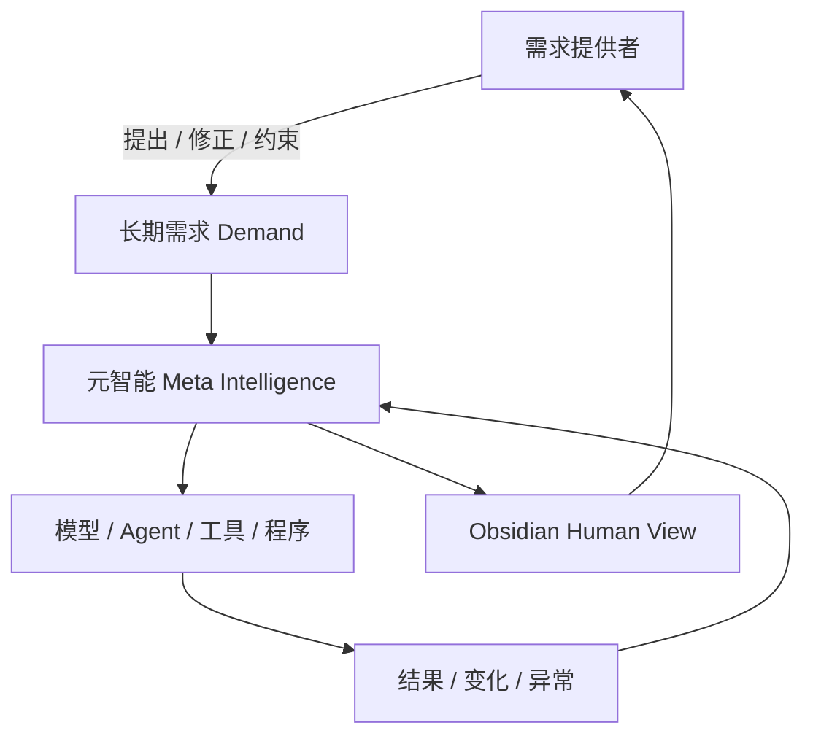

# 先读这个：元智能 V1

这不是一套“让人管理文件”的 Obsidian 系统。

这是一个**围绕长期需求持续运行的元智能系统规范**。

## 核心关系

## 最重要的原则

1. **系统服务需求，不服务工具。**
2. **人只负责提出和修正需求，不负责维护系统细节。**
3. **需求可以长期存在；任务必须结束。**
4. **模型、Agent、Prompt、程序、目录都是可替换实现。**
5. **机器层可以复杂；Human View 必须简单。**
6. **Human View 只展示会改变理解或判断的信息。**
7. **任何新增复杂度都必须证明自己降低了长期维护成本。**

## 对执行模型的要求

如果你是负责落地本项目的 Flash/快速模型：

- 不要重新发明架构。
- 不要把本包改成一个大型 Agent 框架。
- 先实现最小闭环。
- 文件如何组织由你负责。
- 用户默认不看文件树。
- Obsidian 面向用户只展示“需求视图”。
- 遇到架构性不确定、冲突、需要改变原则的事项，不自行扩大设计；按 `05_MACHINE_PROTOCOLS/REPORT_TO_HIGH_INTELLIGENCE.md` 汇报。

从 `IMPLEMENTATION_ORDER.md` 开始执行。
