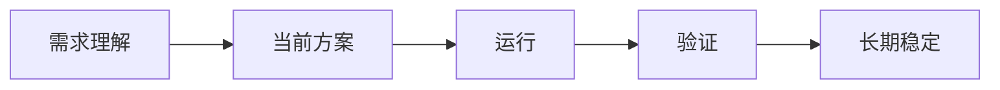

# Demand Home — 人类入口模板

> 这是用户应该主要看到的页面。文件树与机器细节不是用户工作区。

## 需求

**名称：** {{demand_name}}  
**一句话：** {{demand_statement}}

## 当前状态

| 项目 | 当前情况 |
|---|---|
| 状态 | {{status}} |
| 阶段 | {{phase}} |
| 稳定性 | {{stability}} |
| 当前主要问题 | {{main_issue}} |
| 正在进行 | {{active_work}} |
| 需要人工决定 | {{human_decision_count}} |

## 现在做到哪里

**当前节点：** {{current_node}}

## 现在正在做

- {{now_1}}
- {{now_2}}
- {{now_3}}

## 下一步

1. {{next_1}}
2. {{next_2}}
3. {{next_3}}

## 未来观察

- {{future_1}}
- {{future_2}}

## 最近变化

| 变化 | 影响 | 系统响应 |
|---|---|---|
| {{change}} | {{impact}} | {{response}} |

## 需要我决定

{{human_decision_or_none}}

---

### 展开：当前问题

{{issue_summary}}

### 展开：当前实验

{{experiment_summary}}

### 展开：最近重要历史

{{recent_history_summary}}
