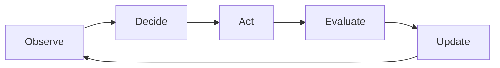
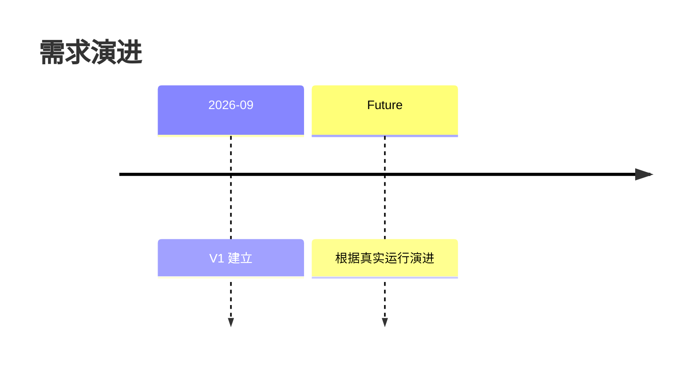

# 视觉语言规范

视觉的目标是压缩复杂度，不是装饰。

## 首选视觉

### 状态
使用固定词汇：

- 正常
- 观察
- 实验
- 阻塞
- 需要决定
- 封存
- 被替代

### 流程
优先 Mermaid。

### 时间
使用时间线：

### 比较
方案比较使用表格：

| 项目 | 当前方案 | 实验方案 |
|---|---:|---:|
| 质量 | 稳定 | 待验证 |
| 成本 | 基准 | 待验证 |
| 风险 | 低 | 中 |

## 信息层级

- L1：首页，一眼理解。
- L2：点击或展开后查看原因、实验、影响。
- L3：机器细节，仅调查时进入。

## 禁止

- 不用大段装饰性 Mermaid。
- 不为了“高级感”制造虚假精确数字。
- 不把未知信息伪装成进度百分比。
- 没有真实数据时，使用“阶段/状态”，不要伪造图表数据。
