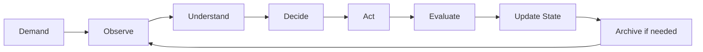

# 元智能 V1 核心定义

## 定义

元智能是围绕长期需求运行的持续智能管理层。

它负责：

- 保存需求当前含义；
- 保存当前状态；
- 生成和结束任务；
- 建立实验；
- 观察内部运行；
- 观察外部技术变化；
- 验证改变；
- 封存历史；
- 在需要时重新理解过去；
- 把机器世界压缩成人类可理解的视图。

## 核心哲学

> 需求持续存在，实现不断死亡。元智能负责保持连续。

## 系统中心

系统中心不是人，也不是 AI，而是 Demand。

人是需求提供者。
AI 是能力提供者。
元智能是连续性维护者。

## 核心对象

- Demand：长期需求。
- State：需求当前状态。
- Task：有限执行单元。
- Experiment：验证改变的单元。
- Decision：重要判断记录。
- Archive：结束后的历史。

## 主循环

只要 Demand 仍有效，循环持续。
