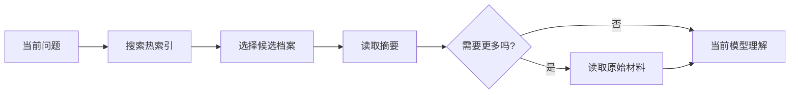

# 归档与提取流程

## 存储

完整事实进入冷存档。

## 索引

每个归档对象保留轻量索引：

- ID
- 类型
- 名称
- 时间
- 结论
- 关键问题
- 被什么替代
- 未来什么情况下值得重新打开

## 提取

```mermaid
flowchart LR
    Q[当前问题] --> I[搜索热索引]
    I --> S[选择候选档案]
    S --> M[读取摘要]
    M --> N{需要更多吗?}
    N -- 否 --> U[当前模型理解]
    N -- 是 --> F[读取原始材料]
    F --> U
```

## 原则

不是“永久理解过去”，而是“永远能重新找到过去”。
