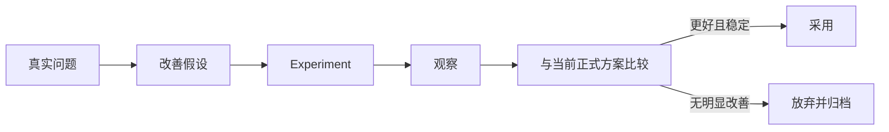

# 内部优化流程

内部优化只来自真实运行。

触发示例：

- 重复出现同类错误；
- 同一环节频繁升级高智力模型；
- 质量下降；
- 成本上升；
- 人工介入反复出现；
- 某一步成为明显瓶颈。

流程：

```mermaid
flowchart LR
    P[真实问题] --> H[改善假设]
    H --> X[Experiment]
    X --> O[观察]
    O --> C[与当前正式方案比较]
    C -->|更好且稳定| A[采用]
    C -->|无明显改善| R[放弃并归档]
```

禁止：仅因为“有新想法”就重构。
