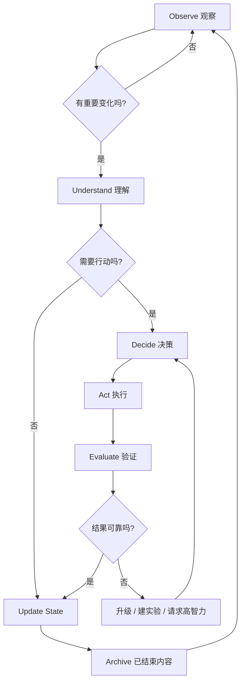

# 主循环

## Observe

观察来源：

- 当前系统运行结果；
- 错误和异常；
- 人新增需求；
- 任务结果；
- 实验结果；
- 外部技术变化。

## Understand

只理解对当前 Demand 有关的变化。

## Decide

选择：忽略、记录、创建 Task、创建 Experiment、升级高智力模型、请求人工决定。

## Act

由最低必要智力执行。

## Evaluate

验证结果是否真的改善需求，而不仅仅是“执行成功”。

## Update

刷新 Current State 和 Human View。
