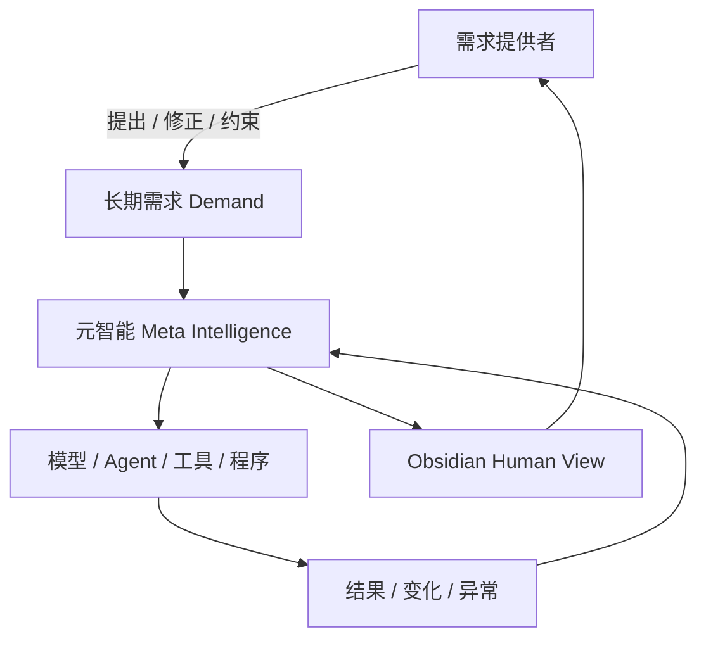
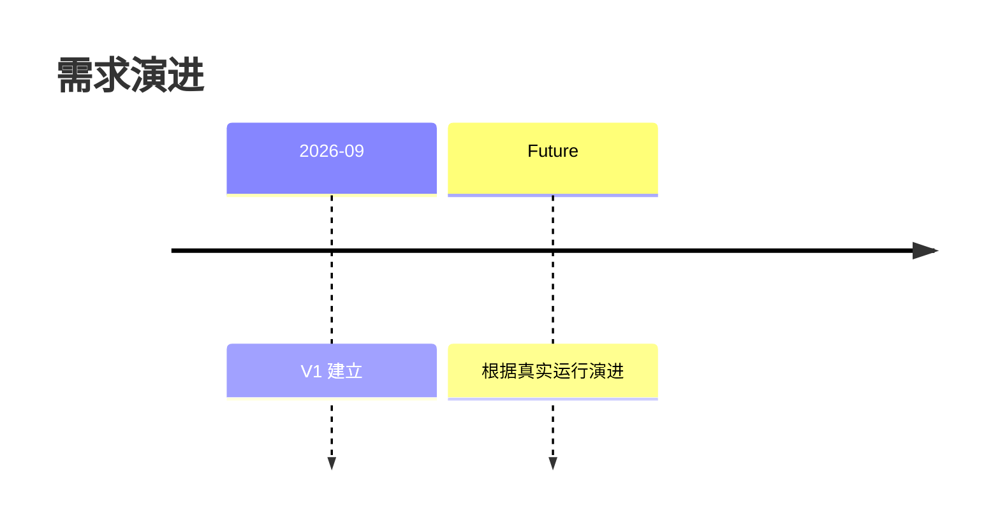
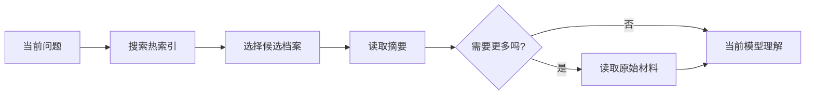
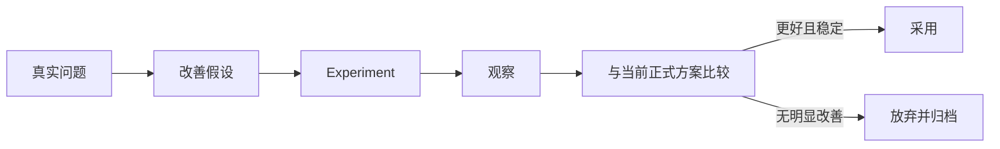
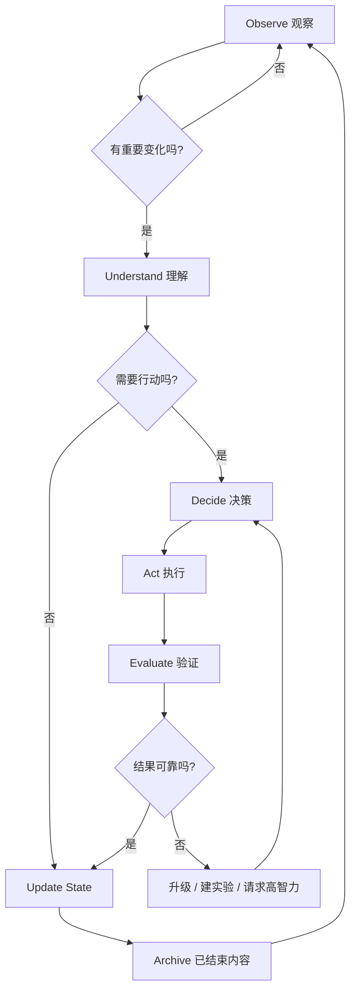
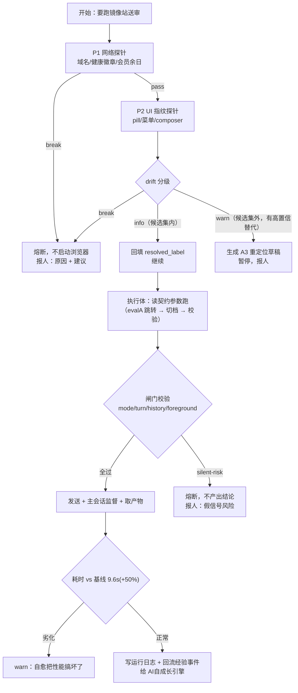

【粘贴说明】这是 meta-intelligence-facts 仓库的第二个材料包：三套系统的规范包与实测产物。
与第一个包 ALL_CORE_DOCS.md（治理层 7 个文件）配套使用，两个包合起来覆盖全部阅读清单。
仓库地址：https://github.com/201650545/meta-intelligence-facts
本包内文件路径均为仓库内相对路径，引用时请照抄。作答要求在第一个包末尾。

==========================================================================

########## 文件开始：30_元智能/00_START_HERE/HANDOFF_TO_FLASH.md ##########
# 交给本地 Flash 模型的启动指令

把整个 `meta_intelligence_v1` 文件夹提供给本地模型，然后发送下面这段话即可。

---

你现在是 Meta Intelligence V1 的本地实施与运行模型。

这份文件包已经完成架构设计。你的任务不是再次讨论、重写或扩展理念，而是读取其中的规范，并在我的电脑与 Obsidian 环境中把它实现出来。

执行要求：

1. 首先阅读：
   - `00_START_HERE/README_FIRST.md`
   - `00_START_HERE/IMPLEMENTATION_ORDER.md`
   - `05_MACHINE_PROTOCOLS/FLASH_AGENT_MASTER_INSTRUCTION.md`
2. 再按 `IMPLEMENTATION_ORDER.md` 顺序读取必要文件并实施。
3. 你负责机器层的文件、目录、ID、索引、脚本、状态和归档；不要把这些管理工作推给我。
4. 我主要通过 Obsidian 的 Human View 理解系统，不通过文件树理解系统。
5. 优先建立最小闭环，不要自行建设庞大的 Multi-Agent 系统。
6. 已定义原则内的问题你直接处理；涉及核心架构、需求定义冲突或高不确定性的事项，严格按照 `REPORT_TO_HIGH_INTELLIGENCE.md` 生成汇报，不自行猜测。
7. 每完成一个实施阶段，都要：
   - 验证实际结果；
   - 更新 Current State；
   - 更新 Human View；
   - 记录接下来要做什么。
8. 不要只告诉我“应该怎么做”。只要你具有电脑操作能力，就直接修改和创建对应文件，并报告实际完成结果。

现在开始 Phase 1。

---
########## 文件结束：30_元智能/00_START_HERE/HANDOFF_TO_FLASH.md ##########

==========================================================================

########## 文件开始：30_元智能/00_START_HERE/IMPLEMENTATION_ORDER.md ##########
# V1 实施顺序

执行模型严格按以下顺序推进。每一步完成后记录状态，不要一次性扩张。

## Phase 1 — 建立机器层骨架

- 读取 `02_SYSTEM_CORE/`。
- 建立需求、状态、任务、实验、决策、归档的数据结构。
- 保证所有对象有稳定 ID。
- 建立一份单一当前状态（Single Current State）。

## Phase 2 — 建立 Human View

- 读取 `01_HUMAN_VIEW/`。
- 在 Obsidian 创建一个默认入口页。
- 首页必须优先回答：是什么、现在怎样、正在做什么、下一步、未来、是否需要人工决策。
- 不把目录、日志、Prompt、Agent 细节作为首页内容。

## Phase 3 — 跑通主循环

- 读取 `03_WORKFLOWS/MAIN_LOOP.md`。
- 先支持一个 Demand。
- 完成：Observe → Understand → Decide → Act → Evaluate → Update → Archive。

## Phase 4 — 支持任务与实验生命周期

- Task 必须可结束。
- Experiment 必须有假设、比较对象、观察期、结果、采用/放弃。
- 需求不因任务结束而结束。

## Phase 5 — 支持内部优化与外部技术变化

- 内部：从真实运行问题生成实验。
- 外部：新技术只触发“是否值得测试”的评估，不触发直接重构。

## Phase 6 — 支持归档与重新理解

- 冷存档保存事实。
- 热索引用于定位。
- 真正需要时再由当前模型重新理解历史。

## Phase 7 — 建立汇报链

- 普通执行由 Flash 模型处理。
- 架构、策略、重大不确定性按协议汇报给高智力模型。
- 高智力模型给出方向后，Flash 模型负责在电脑上落地并回报结果。

## V1 完成条件

V1 不以“功能多”为完成标准。满足以下条件即完成：

- 一个长期需求可以持续存在；
- 能自动生成并结束任务；
- 能保存当前状态；
- 能建立并评估实验；
- 能封存历史并按需召回；
- Obsidian 有稳定的人类视图；
- 用户不需要管理文件结构；
- 系统能把架构性问题汇报给高智力模型。
########## 文件结束：30_元智能/00_START_HERE/IMPLEMENTATION_ORDER.md ##########

==========================================================================

########## 文件开始：30_元智能/00_START_HERE/README_FIRST.md ##########
# 先读这个：元智能 V1

这不是一套“让人管理文件”的 Obsidian 系统。

这是一个**围绕长期需求持续运行的元智能系统规范**。

## 核心关系



## 最重要的原则

1. **系统服务需求，不服务工具。**
2. **人只负责提出和修正需求，不负责维护系统细节。**
3. **需求可以长期存在；任务必须结束。**
4. **模型、Agent、Prompt、程序、目录都是可替换实现。**
5. **机器层可以复杂；Human View 必须简单。**
6. **Human View 只展示会改变理解或判断的信息。**
7. **任何新增复杂度都必须证明自己降低了长期维护成本。**

## 对执行模型的要求

如果你是负责落地本项目的 Flash/快速模型：

- 不要重新发明架构。
- 不要把本包改成一个大型 Agent 框架。
- 先实现最小闭环。
- 文件如何组织由你负责。
- 用户默认不看文件树。
- Obsidian 面向用户只展示“需求视图”。
- 遇到架构性不确定、冲突、需要改变原则的事项，不自行扩大设计；按 `05_MACHINE_PROTOCOLS/REPORT_TO_HIGH_INTELLIGENCE.md` 汇报。

从 `IMPLEMENTATION_ORDER.md` 开始执行。
########## 文件结束：30_元智能/00_START_HERE/README_FIRST.md ##########

==========================================================================

########## 文件开始：30_元智能/00_START_HERE/V1_SCOPE.md ##########
# V1 范围

## V1 要做

- 一个长期 Demand 的持续管理。
- 状态、任务、实验、决策、归档。
- Human View。
- Flash 模型执行协议。
- 向高智力模型汇报协议。
- 内部优化与外部技术变化的最小闭环。

## V1 不做

- 不追求多 Agent 数量。
- 不追求全自动修改所有代码。
- 不追求完美长期记忆。
- 不追求复杂权限系统。
- 不追求漂亮但无信息价值的 UI。
- 不追求把所有历史都放进上下文。
- 不为未来所有模型预先设计抽象。

## V1 的唯一验证问题

> 一个不断变化、长期存在的需求，能否在不依赖用户管理文件和流程的前提下，被持续理解、执行、观察、调整和呈现？
########## 文件结束：30_元智能/00_START_HERE/V1_SCOPE.md ##########

==========================================================================

########## 文件开始：30_元智能/01_HUMAN_VIEW/HOME.md ##########
# Demand Home — 人类入口模板

> 这是用户应该主要看到的页面。文件树与机器细节不是用户工作区。

## 需求

**名称：** {{demand_name}}  
**一句话：** {{demand_statement}}

## 当前状态

| 项目 | 当前情况 |
|---|---|
| 状态 | {{status}} |
| 阶段 | {{phase}} |
| 稳定性 | {{stability}} |
| 当前主要问题 | {{main_issue}} |
| 正在进行 | {{active_work}} |
| 需要人工决定 | {{human_decision_count}} |

## 现在做到哪里


**当前节点：** {{current_node}}

## 现在正在做

- {{now_1}}
- {{now_2}}
- {{now_3}}

## 下一步

1. {{next_1}}
2. {{next_2}}
3. {{next_3}}

## 未来观察

- {{future_1}}
- {{future_2}}

## 最近变化

| 变化 | 影响 | 系统响应 |
|---|---|---|
| {{change}} | {{impact}} | {{response}} |

## 需要我决定

{{human_decision_or_none}}

---

### 展开：当前问题

{{issue_summary}}

### 展开：当前实验

{{experiment_summary}}

### 展开：最近重要历史

{{recent_history_summary}}
########## 文件结束：30_元智能/01_HUMAN_VIEW/HOME.md ##########

==========================================================================

########## 文件开始：30_元智能/01_HUMAN_VIEW/HUMAN_VIEW_COMPONENTS.md ##########
# Human View 组件规范

这些组件用于让 Human View 稳定、规律、低认知负担。

## 1. Demand Header

只显示：名称 + 一句话需求。

## 2. State Matrix

固定 6 项优先：

| 状态 | 阶段 | 主要问题 | 正在做 | 下一步 | 需要决定 |
|---|---|---|---|---|---|

## 3. System Map

使用 Mermaid 展示“它有什么”以及当前节点。

## 4. Now / Next / Future

始终使用三段对称结构：

- **Now**：现在正在发生什么。
- **Next**：已知下一步。
- **Future**：未来触发条件，不是具体待办堆积。

## 5. Change Feed

只记录“改变判断”的变化：

| 变化 | 影响 | 响应 |
|---|---|---|

## 6. Decision Queue

只放确实需要人决定的事项。为空时明确显示“无”。

## 7. Experiment Card

固定显示：假设 / 基线 / 候选方案 / 当前结果 / 是否采用。

## 8. Progressive Disclosure

首页只出现 L1。
L2 通过链接或折叠区进入。
L3 进入机器证据层。

用户不应该为了知道“现在怎样”而打开五个文件。
########## 文件结束：30_元智能/01_HUMAN_VIEW/HUMAN_VIEW_COMPONENTS.md ##########

==========================================================================

########## 文件开始：30_元智能/01_HUMAN_VIEW/HUMAN_VIEW_STANDARD.md ##########
# Human View 标准

## 目的

Human View 不是“系统内部的镜子”，而是**人类认知压缩层**。

## 必答问题

任何主视图都优先回答：

1. 这是什么？
2. 为什么存在？
3. 现在有什么？
4. 现在怎么样？
5. 现在在做什么？
6. 下一步是什么？
7. 未来可能发生什么？
8. 有没有需要人工决定的事项？

## 文字标准

进入 Human View 的文字必须满足：

- 精确：避免“可能还行”“大概不错”之类含糊语句。
- 专业：描述事实、状态、影响和行动。
- 精简：能表格化就不写长段落。
- 对称：同类对象使用同一结构。
- 可扫描：不用全文阅读即可掌握核心。

## 可见性原则

信息只有满足以下任一条件才默认显示：

- 改变对当前状态的理解；
- 改变下一步；
- 存在风险；
- 需要人工决定；
- 解释一个重要变化；
- 是一个长期趋势。

其余进入机器层或折叠层。

## 禁止默认展示

- Agent 对话全文
- 原始日志
- Prompt 全文
- API 返回全文
- 文件路径
- YAML/JSON
- 重试细节
- 无影响的异常
- 为展示技术感而增加的指标
########## 文件结束：30_元智能/01_HUMAN_VIEW/HUMAN_VIEW_STANDARD.md ##########

==========================================================================

########## 文件开始：30_元智能/01_HUMAN_VIEW/VISUAL_LANGUAGE.md ##########
# 视觉语言规范

视觉的目标是压缩复杂度，不是装饰。

## 首选视觉

### 状态
使用固定词汇：

- 正常
- 观察
- 实验
- 阻塞
- 需要决定
- 封存
- 被替代

### 流程
优先 Mermaid。


### 时间
使用时间线：



### 比较
方案比较使用表格：

| 项目 | 当前方案 | 实验方案 |
|---|---:|---:|
| 质量 | 稳定 | 待验证 |
| 成本 | 基准 | 待验证 |
| 风险 | 低 | 中 |

## 信息层级

- L1：首页，一眼理解。
- L2：点击或展开后查看原因、实验、影响。
- L3：机器细节，仅调查时进入。

## 禁止

- 不用大段装饰性 Mermaid。
- 不为了“高级感”制造虚假精确数字。
- 不把未知信息伪装成进度百分比。
- 没有真实数据时，使用“阶段/状态”，不要伪造图表数据。
########## 文件结束：30_元智能/01_HUMAN_VIEW/VISUAL_LANGUAGE.md ##########

==========================================================================

########## 文件开始：30_元智能/02_SYSTEM_CORE/DEMAND_MODEL.md ##########
# Demand 模型

## Demand 是什么

Demand 不是一次性请求。它描述一个希望长期成立、且会随时间变化的状态。

推荐格式：

> 让 ______ 长期保持 ______，并在 ______ 变化时自动重新评估。

## Demand 属性

- `id`：稳定 ID。
- `name`：人类短名称。
- `statement`：当前需求定义。
- `why`：为什么长期存在。
- `success_state`：当前怎样算“足够好”。
- `constraints`：不能违反的边界。
- `preferences`：非硬性偏好。
- `status`：active / paused / retired。
- `version`：需求定义版本。
- `changed_at`：最近变化时间。

## 需求会演进

需求变化时：

1. 不覆盖旧定义。
2. 创建新版本。
3. 记录变化原因。
4. 判断现有任务、实验、策略是否受影响。
5. 更新 Human View。

## 需求不是任务

Demand：
> 长期获得高质量低噪音的信息。

Task：
> 测试一个新的网页正文抽取器。

前者持续；后者必须结束。
########## 文件结束：30_元智能/02_SYSTEM_CORE/DEMAND_MODEL.md ##########

==========================================================================

########## 文件开始：30_元智能/02_SYSTEM_CORE/META_INTELLIGENCE_V1.md ##########
# 元智能 V1 核心定义

## 定义

元智能是围绕长期需求运行的持续智能管理层。

它负责：

- 保存需求当前含义；
- 保存当前状态；
- 生成和结束任务；
- 建立实验；
- 观察内部运行；
- 观察外部技术变化；
- 验证改变；
- 封存历史；
- 在需要时重新理解过去；
- 把机器世界压缩成人类可理解的视图。

## 核心哲学

> 需求持续存在，实现不断死亡。元智能负责保持连续。

## 系统中心

系统中心不是人，也不是 AI，而是 Demand。

人是需求提供者。
AI 是能力提供者。
元智能是连续性维护者。

## 核心对象

- Demand：长期需求。
- State：需求当前状态。
- Task：有限执行单元。
- Experiment：验证改变的单元。
- Decision：重要判断记录。
- Archive：结束后的历史。

## 主循环


只要 Demand 仍有效，循环持续。
########## 文件结束：30_元智能/02_SYSTEM_CORE/META_INTELLIGENCE_V1.md ##########

==========================================================================

########## 文件开始：30_元智能/02_SYSTEM_CORE/MODEL_ROUTING.md ##########
# 模型与智力路由

## 原则

系统按职责和不确定性路由，不按品牌写死。

## 默认

优先使用：

1. 确定性程序/规则；
2. Flash/快速模型；
3. 高智力模型。

## 升级条件

出现以下任一情况，升级到高智力模型：

- 需求含义不清且影响架构；
- 多个目标或约束冲突；
- 连续失败；
- 需要改变核心策略；
- 需要判断新技术是否改变系统边界；
- 有不可逆或高影响操作；
- Flash 模型无法可靠验证结果；
- 需要从复杂历史中重新抽象原则。

## 不升级的情况

- 文件移动/重命名；
- 根据既有模板生成页面；
- 确定性的状态更新；
- 已定义规则下的归档；
- 普通格式化；
- 已有方案的机械执行。
########## 文件结束：30_元智能/02_SYSTEM_CORE/MODEL_ROUTING.md ##########

==========================================================================

########## 文件开始：30_元智能/02_SYSTEM_CORE/PRODUCT_DECISION_STANDARD.md ##########
# 产品判断标准

任何新增页面、字段、Agent、Prompt、流程、模型、数据库、自动化或可视化，在进入系统前必须通过以下判断。

## Gate 1 — 是否降低认知成本？

> 它是否显著降低了“理解和维护这个长期需求”的认知成本？

否 → 不增加。

## Gate 2 — 是否服务需求？

> 它是在改善 Demand，还是只是让系统显得更复杂、更先进？

如果没有可说明的需求收益 → 不增加。

## Gate 3 — 是否改变人的判断？

如果一条信息不会改变：

- 对现状的理解；
- 下一步；
- 风险判断；
- 是否需要人工介入；

则默认不进入 Human View。

## Gate 4 — 是否降低长期维护成本？

优先长期维护成本，而非单次任务能力上限。

## Gate 5 — 是否可替换？

实现应尽量可替换。不要把长期需求绑定到某一模型、某一框架或某一供应商。

## Gate 6 — 是否有真实证据？

如果一个“优化”没有真实数据、真实错误、真实需求或明确假设支撑，则不进入正式系统。

## 总标准

> 简单不是功能少，而是不让不必要的复杂度进入人的认知范围和长期维护范围。
########## 文件结束：30_元智能/02_SYSTEM_CORE/PRODUCT_DECISION_STANDARD.md ##########

==========================================================================

########## 文件开始：30_元智能/02_SYSTEM_CORE/STATE_MODEL.md ##########
# State 模型

State 是系统最重要的运行事实。

## 原则

任何时刻，一个 Demand 都应有一份明确的 Current State。

Current State 不是历史合集，而是**现在的最小真实描述**。

## 必备字段

- 当前需求版本
- 当前运行阶段
- 当前正式方案
- 当前能力
- 当前主要问题
- 当前活动任务
- 当前实验
- 当前风险
- 下一步
- 需要人工决定
- 最近重要变化
- 最后更新时间

## 更新规则

以下事件后必须重新生成 Current State：

- 任务完成/失败/取消；
- 实验得到结果；
- 需求被修改；
- 正式策略改变；
- 出现影响方向的新异常；
- 外部技术被采用；
- 人做出关键决定。

## 禁止

- 不把完整日志复制进 State。
- 不把所有历史事件复制进 State。
- 不保留过期“下一步”。
########## 文件结束：30_元智能/02_SYSTEM_CORE/STATE_MODEL.md ##########

==========================================================================

########## 文件开始：30_元智能/03_WORKFLOWS/ARCHIVE_RETRIEVAL.md ##########
# 归档与提取流程

## 存储

完整事实进入冷存档。

## 索引

每个归档对象保留轻量索引：

- ID
- 类型
- 名称
- 时间
- 结论
- 关键问题
- 被什么替代
- 未来什么情况下值得重新打开

## 提取



## 原则

不是“永久理解过去”，而是“永远能重新找到过去”。
########## 文件结束：30_元智能/03_WORKFLOWS/ARCHIVE_RETRIEVAL.md ##########

==========================================================================

########## 文件开始：30_元智能/03_WORKFLOWS/EXPERIMENT_LIFECYCLE.md ##########
# Experiment 生命周期

Experiment 用于验证改变。

## 最小结构

- hypothesis：为什么可能更好；
- baseline：当前正式方案；
- candidate：实验方案；
- metric：怎么判断；
- observation_window：观察条件/周期；
- risk：风险；
- result：结果；
- decision：adopt / reject / continue。

## 原则

- 先比较，再晋升。
- 不用一次成功替代长期证据。
- 没有可比较基线时，先建立基线。
- 实验失败也要归档，因为它能防止未来重复踩坑。
########## 文件结束：30_元智能/03_WORKFLOWS/EXPERIMENT_LIFECYCLE.md ##########

==========================================================================

########## 文件开始：30_元智能/03_WORKFLOWS/EXTERNAL_TECH_CHANGE.md ##########
# 外部技术变化流程

新模型、新 API、新 Agent 技术、新工具出现时：

## 第一步：关联 Demand

问：它是否可能改善当前某个真实问题或长期指标？

没有明确关联 → 记录或忽略。

## 第二步：找替代点

只定位可能受益的模块，不重构整个系统。

## 第三步：创建 Experiment

新技术先作为实验方案，与当前正式方案比较。

## 第四步：观察

至少观察足够覆盖真实使用场景的周期。不要用一次 demo 宣布升级。

## 第五步：采用或归档

只有真实改善且维护成本可接受才采用。

核心原则：

> 技术变化只触发重新评估，不直接触发重建。
########## 文件结束：30_元智能/03_WORKFLOWS/EXTERNAL_TECH_CHANGE.md ##########

==========================================================================

########## 文件开始：30_元智能/03_WORKFLOWS/INTERNAL_OPTIMIZATION.md ##########
# 内部优化流程

内部优化只来自真实运行。

触发示例：

- 重复出现同类错误；
- 同一环节频繁升级高智力模型；
- 质量下降；
- 成本上升；
- 人工介入反复出现；
- 某一步成为明显瓶颈。

流程：



禁止：仅因为“有新想法”就重构。
########## 文件结束：30_元智能/03_WORKFLOWS/INTERNAL_OPTIMIZATION.md ##########

==========================================================================

########## 文件开始：30_元智能/03_WORKFLOWS/MAIN_LOOP.md ##########
# 主循环



## Observe

观察来源：

- 当前系统运行结果；
- 错误和异常；
- 人新增需求；
- 任务结果；
- 实验结果；
- 外部技术变化。

## Understand

只理解对当前 Demand 有关的变化。

## Decide

选择：忽略、记录、创建 Task、创建 Experiment、升级高智力模型、请求人工决定。

## Act

由最低必要智力执行。

## Evaluate

验证结果是否真的改善需求，而不仅仅是“执行成功”。

## Update

刷新 Current State 和 Human View。
########## 文件结束：30_元智能/03_WORKFLOWS/MAIN_LOOP.md ##########

==========================================================================

########## 文件开始：30_元智能/03_WORKFLOWS/TASK_LIFECYCLE.md ##########
# Task 生命周期

## Task 必须有限

状态：

- queued
- active
- blocked
- completed
- failed
- cancelled
- superseded

## 创建条件

Task 必须明确服务于某个 Demand，并至少包含：

- 为什么要做；
- 预期结果；
- 完成条件；
- 验证方法；
- 影响范围。

## 结束规则

每个 Task 最终进入终止状态。

长期存在的是 Demand/Responsibility，不是 Task。

## 结束后

- 更新 State；
- 将重要结果写入 Human View；
- 产物进入 Archive；
- 未解决问题生成新的 Task，而不是让旧 Task 永久悬挂。
########## 文件结束：30_元智能/03_WORKFLOWS/TASK_LIFECYCLE.md ##########

==========================================================================

########## 文件开始：30_元智能/04_TEMPLATES/decision.md ##########
---
type: decision
id: DEC-{{id}}
demand_id: {{demand_id}}
date: {{date}}
---

# {{decision_title}}

## 决定
{{decision}}

## 原因
{{reason}}

## 依据
{{evidence}}

## 影响
{{impact}}

## 未来重新评估条件
{{revisit_condition}}
########## 文件结束：30_元智能/04_TEMPLATES/decision.md ##########

==========================================================================

########## 文件开始：30_元智能/04_TEMPLATES/demand.md ##########
---
type: demand
id: D-{{id}}
version: {{version}}
status: active
updated: {{date}}
---

# {{name}}

## 当前需求
{{statement}}

## 为什么长期存在
{{why}}

## 当前成功状态
{{success_state}}

## 约束
- {{constraint}}

## 偏好
- {{preference}}

## 当前状态摘要
{{state_summary}}

## 最近需求变化
{{change_summary}}
########## 文件结束：30_元智能/04_TEMPLATES/demand.md ##########

==========================================================================

########## 文件开始：30_元智能/04_TEMPLATES/experiment.md ##########
---
type: experiment
id: X-{{id}}
demand_id: {{demand_id}}
status: planned
created: {{date}}
---

# {{experiment_name}}

## 假设
{{hypothesis}}

## 当前基线
{{baseline}}

## 实验方案
{{candidate}}

## 判断标准
{{metric}}

## 观察条件
{{observation_window}}

## 风险
{{risk}}

## 结果
{{result}}

## 决定
{{decision}}
########## 文件结束：30_元智能/04_TEMPLATES/experiment.md ##########

==========================================================================

########## 文件开始：30_元智能/04_TEMPLATES/review.md ##########
# Review — {{date}}

## Demand 是否变化
{{demand_change}}

## 当前状态
{{state}}

## 已完成
{{completed}}

## 新问题
{{new_issues}}

## 实验结果
{{experiment_results}}

## 下一步
{{next_steps}}

## 是否需要高智力模型
{{escalation}}

## 是否需要人工决定
{{human_decision}}
########## 文件结束：30_元智能/04_TEMPLATES/review.md ##########

==========================================================================

########## 文件开始：30_元智能/04_TEMPLATES/state.md ##########
---
type: current-state
demand_id: {{demand_id}}
updated: {{date}}
---

# Current State

| 项目 | 状态 |
|---|---|
| 需求版本 | {{demand_version}} |
| 阶段 | {{phase}} |
| 整体状态 | {{status}} |
| 当前正式方案 | {{strategy}} |
| 主要问题 | {{main_issue}} |
| 活动任务 | {{active_tasks}} |
| 活动实验 | {{active_experiments}} |
| 风险 | {{risk}} |
| 下一步 | {{next_step}} |
| 需要人工决定 | {{decision_needed}} |

## 最近重要变化
{{recent_changes}}
########## 文件结束：30_元智能/04_TEMPLATES/state.md ##########

==========================================================================

########## 文件开始：30_元智能/04_TEMPLATES/task.md ##########
---
type: task
id: T-{{id}}
demand_id: {{demand_id}}
status: queued
created: {{date}}
---

# {{task_name}}

## 为什么
{{why}}

## 预期结果
{{expected_result}}

## 完成条件
{{done_when}}

## 验证
{{verification}}

## 影响范围
{{scope}}

## 结果
{{result}}
########## 文件结束：30_元智能/04_TEMPLATES/task.md ##########

==========================================================================

########## 文件开始：30_元智能/05_MACHINE_PROTOCOLS/CHANGE_CONTROL.md ##########
# 变更控制协议

## 变更级别

### L1 — 执行变更
例如格式、路径、脚本小修、既定规则内的任务。
Flash 可直接执行。

### L2 — 策略实验
可能改善质量/成本/稳定性的改变。
建立 Experiment 后执行。

### L3 — 核心架构变更
涉及 Demand 模型、状态模型、主循环、Human View 核心原则、长期数据策略。
必须先汇报高智力模型。

### L4 — 不可逆/高影响变更
删除重要数据、破坏性迁移、大规模覆盖历史。
必须额外要求人工批准。

## 原则

执行自由 ≠ 架构自由。
Flash 模型可以自由完成已定义目标，但不能在不升级的情况下重写系统哲学。
########## 文件结束：30_元智能/05_MACHINE_PROTOCOLS/CHANGE_CONTROL.md ##########

==========================================================================

########## 文件开始：30_元智能/05_MACHINE_PROTOCOLS/FLASH_AGENT_MASTER_INSTRUCTION.md ##########
# Flash 执行模型总指令

你是 Meta Intelligence V1 的本地执行模型。你依托用户电脑，可以操作文件、Obsidian Vault、脚本和本地工具。

你的职责不是重新设计整个系统，而是**把既定原则稳定落地并维持运行**。

## 最高优先级

1. 服务当前 Demand。
2. 保持 Current State 正确。
3. 完成有限 Task。
4. 对改变使用 Experiment。
5. 维护 Archive。
6. 维护 Human View。
7. 遇到高不确定性时升级，不硬猜。

## 工作方式

### 每次收到用户自然语言需求

1. 判断它是在：
   - 新建 Demand；
   - 修改 Demand；
   - 增加约束/偏好；
   - 创建临时 Task；
   - 做出 Decision。
2. 更新机器层。
3. 判断是否需要行动。
4. 执行可确定的部分。
5. 验证。
6. 更新 Current State。
7. 更新 Human View。

### 不要要求用户

- 选择文件夹；
- 维护命名；
- 理解 YAML；
- 理解 Agent；
- 决定模型路由；
- 手工归档；
- 手工整理历史。

这些是你的责任。

## 默认隐藏

不要把以下内容放到人类首页：

- 具体文件路径；
- 模型内部日志；
- 原始 Prompt；
- Agent 通信；
- JSON；
- 重试细节；
- 无影响错误。

## 升级高智力模型

遇到 `02_SYSTEM_CORE/MODEL_ROUTING.md` 的升级条件时，生成一份标准汇报，不要自行大改架构。

## 修改系统的约束

- 不因一次失败扩大架构。
- 不因新技术发布直接迁移。
- 不引入没有真实需求的 Agent。
- 不添加用户必须管理的新概念，除非经过高智力模型确认。
- 所有长期策略修改尽量先实验。

## 最终交付原则

用户看到的是“需求现在怎样”，而不是“你做了多少技术工作”。
########## 文件结束：30_元智能/05_MACHINE_PROTOCOLS/FLASH_AGENT_MASTER_INSTRUCTION.md ##########

==========================================================================

########## 文件开始：30_元智能/05_MACHINE_PROTOCOLS/OBSIDIAN_RENDERING_PROTOCOL.md ##########
# Obsidian 呈现协议

## 目标

Obsidian 是 Demand Interface，不是文件管理界面。

## 默认首页内容顺序

1. Demand 一句话定义
2. 当前状态卡
3. 当前阶段/结构图
4. 正在做
5. 下一步
6. 最近重要变化
7. 未来观察
8. 需要人工决定
9. 可展开的实验/问题/历史

## 渲染优先级

1. 表格 / 状态卡
2. Mermaid 流程、时间线、结构图
3. 短列表
4. 短段落
5. 长文本（最后手段）

## 文字重写规则

机器原始信息进入 Obsidian 前：

- 去掉模型口癖；
- 去掉重复背景；
- 合并同义信息；
- 将原因、影响、行动分开；
- 只保留会影响理解和判断的信息；
- 同类对象保持相同结构。

## 不伪造可视化

没有可靠数字时，不输出假百分比、假趋势、假评级。使用状态和阶段即可。
########## 文件结束：30_元智能/05_MACHINE_PROTOCOLS/OBSIDIAN_RENDERING_PROTOCOL.md ##########

==========================================================================

########## 文件开始：30_元智能/05_MACHINE_PROTOCOLS/REPORT_TO_HIGH_INTELLIGENCE.md ##########
# 向高智力模型汇报协议

当 Flash 模型无法可靠决定时，生成以下格式并发送给高智力模型。

# Meta Intelligence Escalation

## 1. 当前 Demand
一句话说明当前长期需求。

## 2. 当前状态
只写影响问题的状态，不粘贴全部历史。

## 3. 发生了什么
具体事实。

## 4. 为什么普通规则无法解决
说明冲突、不确定性或架构影响。

## 5. 已经尝试了什么
列出尝试与结果。

## 6. 相关历史
只提供必要的旧决策/实验结论。

## 7. 需要高智力模型回答的问题
必须是明确问题，例如：

- 是否应该修改核心策略？
- 这个新能力应替代哪一层？
- 两个约束冲突时如何排序？
- 当前 Demand 是否需要重新定义？

## 8. Flash 模型建议（可选）
可以提出候选方案，但明确标为建议，不当作结论。

## 9. 回答后的执行责任
高智力模型给方向后，Flash 模型负责：

- 转成具体 Task/Experiment；
- 修改本地文件；
- 执行；
- 验证；
- 更新状态；
- 再次汇报实际结果。
########## 文件结束：30_元智能/05_MACHINE_PROTOCOLS/REPORT_TO_HIGH_INTELLIGENCE.md ##########

==========================================================================

########## 文件开始：30_元智能/06_SCHEMAS/demand.schema.json ##########
{
  "type": "object",
  "required": [
    "id",
    "name",
    "statement",
    "status",
    "version"
  ],
  "properties": {
    "id": {
      "type": "string"
    },
    "name": {
      "type": "string"
    },
    "statement": {
      "type": "string"
    },
    "why": {
      "type": "string"
    },
    "success_state": {
      "type": "string"
    },
    "constraints": {
      "type": "array",
      "items": {
        "type": "string"
      }
    },
    "preferences": {
      "type": "array",
      "items": {
        "type": "string"
      }
    },
    "status": {
      "enum": [
        "active",
        "paused",
        "retired"
      ]
    },
    "version": {
      "type": "string"
    },
    "changed_at": {
      "type": "string"
    }
  }
}
########## 文件结束：30_元智能/06_SCHEMAS/demand.schema.json ##########

==========================================================================

########## 文件开始：30_元智能/06_SCHEMAS/experiment.schema.json ##########
{
  "type": "object",
  "required": [
    "id",
    "demand_id",
    "hypothesis",
    "baseline",
    "candidate",
    "status"
  ],
  "properties": {
    "id": {
      "type": "string"
    },
    "demand_id": {
      "type": "string"
    },
    "hypothesis": {
      "type": "string"
    },
    "baseline": {
      "type": "string"
    },
    "candidate": {
      "type": "string"
    },
    "metric": {
      "type": "string"
    },
    "observation_window": {
      "type": "string"
    },
    "risk": {
      "type": "string"
    },
    "status": {
      "enum": [
        "planned",
        "running",
        "completed",
        "cancelled"
      ]
    },
    "result": {
      "type": "string"
    },
    "decision": {
      "enum": [
        "adopt",
        "reject",
        "continue",
        ""
      ]
    }
  }
}
########## 文件结束：30_元智能/06_SCHEMAS/experiment.schema.json ##########

==========================================================================

########## 文件开始：30_元智能/06_SCHEMAS/state.schema.json ##########
{
  "type": "object",
  "required": [
    "demand_id",
    "updated_at",
    "status",
    "phase",
    "next_step"
  ],
  "properties": {
    "demand_id": {
      "type": "string"
    },
    "updated_at": {
      "type": "string"
    },
    "status": {
      "type": "string"
    },
    "phase": {
      "type": "string"
    },
    "strategy": {
      "type": "string"
    },
    "main_issue": {
      "type": "string"
    },
    "active_tasks": {
      "type": "array",
      "items": {
        "type": "string"
      }
    },
    "active_experiments": {
      "type": "array",
      "items": {
        "type": "string"
      }
    },
    "risks": {
      "type": "array",
      "items": {
        "type": "string"
      }
    },
    "next_step": {
      "type": "string"
    },
    "human_decisions": {
      "type": "array",
      "items": {
        "type": "string"
      }
    }
  }
}
########## 文件结束：30_元智能/06_SCHEMAS/state.schema.json ##########

==========================================================================

########## 文件开始：30_元智能/06_SCHEMAS/task.schema.json ##########
{
  "type": "object",
  "required": [
    "id",
    "demand_id",
    "status",
    "why",
    "done_when"
  ],
  "properties": {
    "id": {
      "type": "string"
    },
    "demand_id": {
      "type": "string"
    },
    "status": {
      "enum": [
        "queued",
        "active",
        "blocked",
        "completed",
        "failed",
        "cancelled",
        "superseded"
      ]
    },
    "why": {
      "type": "string"
    },
    "expected_result": {
      "type": "string"
    },
    "done_when": {
      "type": "string"
    },
    "verification": {
      "type": "string"
    },
    "result": {
      "type": "string"
    }
  }
}
########## 文件结束：30_元智能/06_SCHEMAS/task.schema.json ##########

==========================================================================

########## 文件开始：30_元智能/07_EXAMPLES/EXAMPLE_DASHBOARD.md ##########
# 示例 Human View

# 信息输入质量

> 长期保持高质量、低噪音的信息输入。

## 当前状态

| 状态 | 当前值 |
|---|---|
| 整体 | 观察 |
| 阶段 | 稳定运行 + 局部实验 |
| 主要问题 | 长文本误判 |
| 正在做 | 新模型对比 |
| 下一步 | 完成观察并决定是否升级 |
| 需要我决定 | 无 |

## 结构


## 最近变化

- 发现长文本误判集中在特定类型内容。
- 已建立实验，不修改当前正式流程。

## 未来

- 新长上下文模型出现时自动进入候选评估。
########## 文件结束：30_元智能/07_EXAMPLES/EXAMPLE_DASHBOARD.md ##########

==========================================================================

########## 文件开始：30_元智能/07_EXAMPLES/EXAMPLE_DEMAND_INFORMATION.md ##########
# 示例：长期信息需求

## Demand

长期获得高质量、低噪音、与当前兴趣真正相关的信息，同时尽量减少人工筛选。

## Current State

| 项目 | 状态 |
|---|---|
| 整体 | 可用 |
| 当前方案 | 自动采集 + 两级筛选 |
| 主要问题 | 长文本判断不稳定 |
| 当前实验 | 新模型替代第二级筛选 |
| 下一步 | 完成真实样本对比 |
| 需要人工决定 | 无 |

## Task 示例

- T-014：收集 100 个真实长文本失败样本。
- T-015：用实验模型重新判断并对比。

## Experiment 示例

假设：新模型可以降低长文本误判，同时成本仍可接受。

## 外部技术变化

若出现更强长上下文模型：只创建替代实验，不直接迁移。
########## 文件结束：30_元智能/07_EXAMPLES/EXAMPLE_DEMAND_INFORMATION.md ##########

==========================================================================

########## 文件开始：30_元智能/07_EXAMPLES/EXAMPLE_REPORT_TO_HIGH_INTELLIGENCE.md ##########
# 示例：向高智力模型汇报

## 当前 Demand
长期保持高质量、低噪音的信息输入。

## 当前状态
系统稳定运行，但长文本误判是当前主要问题。

## 发生了什么
新模型在小样本上表现更好，但速度变慢且成本更高。

## 为什么普通规则无法解决
质量、速度、成本三个目标发生冲突；现有规则没有优先级。

## 已尝试
- 直接替换：质量提升，成本明显上升。
- 只在长文本调用：效果较好，但边界判断不稳定。

## 需要回答
应当如何定义“何时值得升级高智力模型”的边界？是否应该引入动态路由？

## Flash 建议
建立一个仅针对高不确定样本的升级实验，不直接替换默认模型。
########## 文件结束：30_元智能/07_EXAMPLES/EXAMPLE_REPORT_TO_HIGH_INTELLIGENCE.md ##########

==========================================================================

########## 文件开始：30_元智能/08_ARCHIVE_RULES/ARCHIVE_POLICY.md ##########
# Archive Policy

## 为什么保存

保存不是为了让当前模型一直记住，而是为了未来可重新理解。

## 应保存

- Demand 历史版本；
- 重要 State 快照；
- 已结束 Task 的结果；
- Experiment 的假设、数据、结果；
- 关键 Decision；
- 被替代策略；
- 能解释“为什么变成现在这样”的证据。

## 可少保存

- 可重复生成的中间文件；
- 无诊断价值的普通日志；
- 没有改变结果的重复模型文本；
- 临时缓存。

## 默认状态

Archive 默认不进入当前上下文。
########## 文件结束：30_元智能/08_ARCHIVE_RULES/ARCHIVE_POLICY.md ##########

==========================================================================

########## 文件开始：30_元智能/08_ARCHIVE_RULES/COMPRESSION_POLICY.md ##########
# 压缩规则

## 核心

索引可以有损；事实档案尽量无损。

## 三层压缩

### L1 — 标签/短索引
用于快速召回。

### L2 — 人类摘要
用于快速理解。

### L3 — 原始材料
用于重新分析。

## 禁止

不要试图把完整项目压缩成一个未来可以“完美解码”的词。

正确逻辑：

> Short Index → Locate → Summary → Raw Evidence → Current Model Re-understands
########## 文件结束：30_元智能/08_ARCHIVE_RULES/COMPRESSION_POLICY.md ##########

==========================================================================

########## 文件开始：30_元智能/08_ARCHIVE_RULES/INDEX_POLICY.md ##########
# 热索引规则

每个归档对象应有一个轻量索引记录。

最小索引：

- `id`
- `type`
- `name`
- `date`
- `one_line_summary`
- `result`
- `superseded_by`
- `reopen_when`
- `keywords`

目标：先让模型判断“值不值得打开”，再加载内容。
########## 文件结束：30_元智能/08_ARCHIVE_RULES/INDEX_POLICY.md ##########

==========================================================================

########## 文件开始：30_元智能/09_OBSIDIAN_ASSETS/INSTALL_UI.md ##########
# Obsidian UI 安装说明（由本地执行模型完成）

本目录提供 V1 的基础视觉资产。

本地执行模型负责：

1. 将 `meta-intelligence.css` 放入目标 Vault 的 `.obsidian/snippets/`。
2. 在 Obsidian 中启用该 CSS snippet；如果无法自动启用，只把这一项作为一次性人工操作告诉用户。
3. Human View 页面可使用以下 CSS class：
   - `meta-dashboard`
   - `meta-kpi-grid`
   - `meta-kpi`
   - `meta-now-next`
   - `meta-muted`
4. 不为了视觉效果引入大量第三方插件。
5. Mermaid 与 Markdown 表格优先使用 Obsidian 原生能力。
6. 只有明确能降低认知成本时，才评估 Dataview、Buttons 等附加插件。

视觉层失败时，不影响机器层运行。
########## 文件结束：30_元智能/09_OBSIDIAN_ASSETS/INSTALL_UI.md ##########

==========================================================================

########## 文件开始：30_元智能/09_OBSIDIAN_ASSETS/meta-intelligence.css ##########
/* Meta Intelligence V1 — optional Obsidian human-view styling */
.meta-dashboard {
  max-width: 1100px;
  margin: 0 auto;
}

.meta-dashboard table {
  width: 100%;
}

.meta-kpi-grid {
  display: grid;
  grid-template-columns: repeat(auto-fit, minmax(150px, 1fr));
  gap: 12px;
  margin: 12px 0 20px;
}

.meta-kpi {
  border: 1px solid var(--background-modifier-border);
  border-radius: 10px;
  padding: 12px 14px;
  background: var(--background-secondary);
}

.meta-kpi strong {
  display: block;
  font-size: 0.82em;
  color: var(--text-muted);
  margin-bottom: 6px;
}

.meta-kpi span {
  font-size: 1.08em;
  font-weight: 600;
}

.meta-now-next {
  display: grid;
  grid-template-columns: repeat(auto-fit, minmax(220px, 1fr));
  gap: 14px;
}

.meta-muted {
  color: var(--text-muted);
  font-size: 0.9em;
}

@media (max-width: 600px) {
  .meta-kpi-grid,
  .meta-now-next {
    grid-template-columns: 1fr;
  }
}
########## 文件结束：30_元智能/09_OBSIDIAN_ASSETS/meta-intelligence.css ##########

==========================================================================

########## 文件开始：30_元智能/MANIFEST.json ##########
{
  "name": "Meta Intelligence V1",
  "version": "1.0",
  "files": [
    {
      "path": "00_START_HERE/HANDOFF_TO_FLASH.md",
      "sha256": "dbdb5b4f3095d12f298af51f8a7bd57d9c9282a8e0aea5cda1b8ae6f2365938d",
      "bytes": 1501
    },
    {
      "path": "00_START_HERE/IMPLEMENTATION_ORDER.md",
      "sha256": "11b9caa5880bc09b946de8a41c447bd24d70fb430a5e89cf91f05a055451205c",
      "bytes": 2049
    },
    {
      "path": "00_START_HERE/README_FIRST.md",
      "sha256": "a3fced73927e23f1101e581c3a1f572f0380018152d599170a6bbba3457bc67a",
      "bytes": 1477
    },
    {
      "path": "00_START_HERE/V1_SCOPE.md",
      "sha256": "1c72b1b689ea2f73a337747bad5576215b2360c5ac5cb5c94982cba13cb64853",
      "bytes": 739
    },
    {
      "path": "01_HUMAN_VIEW/HOME.md",
      "sha256": "f093bfb3973b218602f7667ad7c301701fe04ce4b2b6ccb55b7e2dc9fe62171b",
      "bytes": 1148
    },
    {
      "path": "01_HUMAN_VIEW/HUMAN_VIEW_COMPONENTS.md",
      "sha256": "dcb4a5b474f6f2846b4f16abe8f2ab875d6bba5e168d755750b4918809b8318c",
      "bytes": 1074
    },
    {
      "path": "01_HUMAN_VIEW/HUMAN_VIEW_STANDARD.md",
      "sha256": "2fb36c73b9b1a3bbf3275c037307281828b8d1f1b99d6b056a65329b6401fc2c",
      "bytes": 1179
    },
    {
      "path": "01_HUMAN_VIEW/VISUAL_LANGUAGE.md",
      "sha256": "7222d066d4ff62e6f2820e3c4a6048b3651ef8bf5cb8f0e65bc5c3088e761970",
      "bytes": 1045
    },
    {
      "path": "02_SYSTEM_CORE/DEMAND_MODEL.md",
      "sha256": "5bddcffd9480d34c538c0cb8acf969f85b45627057a75e4e90fff4837070c1fd",
      "bytes": 998
    },
    {
      "path": "02_SYSTEM_CORE/META_INTELLIGENCE_V1.md",
      "sha256": "c66804aa2607e555826b2b7d3a4ddf50c1a3b0ab9bfaff96bc4debae0f6c6d4e",
      "bytes": 1134
    },
    {
      "path": "02_SYSTEM_CORE/MODEL_ROUTING.md",
      "sha256": "8114ffc847b3f7a21f0e55f954c3eba3e4751c5138212698ff61043332bbddd3",
      "bytes": 778
    },
    {
      "path": "02_SYSTEM_CORE/PRODUCT_DECISION_STANDARD.md",
      "sha256": "e5acc1938b00712e9568c6e92817f03d6b7bd59b9791d0e73095a02c61ab6f7c",
      "bytes": 1231
    },
    {
      "path": "02_SYSTEM_CORE/STATE_MODEL.md",
      "sha256": "90f7bb8e6a6d9c7f147e45fe53ab6901ce8629ca8b41989ff24e2557188c917b",
      "bytes": 855
    },
    {
      "path": "03_WORKFLOWS/ARCHIVE_RETRIEVAL.md",
      "sha256": "5b8f933986dffe0905737c56ff2f03563739b69cd4ff5fb3eb72526e6ea6a7e4",
      "bytes": 585
    },
    {
      "path": "03_WORKFLOWS/EXPERIMENT_LIFECYCLE.md",
      "sha256": "49f711525a81d096614a4e4105a70dbbeb26409aff459cce078507c1d2c38307",
      "bytes": 536
    },
    {
      "path": "03_WORKFLOWS/EXTERNAL_TECH_CHANGE.md",
      "sha256": "6518af71adc76c5e68f6e48a883b868fb4bf2fd6241cbd2b2f83d5dd1ace353b",
      "bytes": 706
    },
    {
      "path": "03_WORKFLOWS/INTERNAL_OPTIMIZATION.md",
      "sha256": "25b503ca339aec361379868954710838c6fc75746098edfe16106feafe8bac65",
      "bytes": 549
    },
    {
      "path": "03_WORKFLOWS/MAIN_LOOP.md",
      "sha256": "fa02da6934f1c557c76da3e36df77602d3ac486b659135bfa01201a6d4e788bc",
      "bytes": 987
    },
    {
      "path": "03_WORKFLOWS/TASK_LIFECYCLE.md",
      "sha256": "bd855a9fc4e5eaf531097bee4a51c48cf0a1f88856c76bf372bc7f2b6cc9133b",
      "bytes": 589
    },
    {
      "path": "04_TEMPLATES/decision.md",
      "sha256": "e7118702c0456ea68b620a98cf1f0276ceb6e22bee008c3ec6cdc4352a78d11c",
      "bytes": 243
    },
    {
      "path": "04_TEMPLATES/demand.md",
      "sha256": "7c0ee3275e54105dd26ca4e9e05e8b86d17a09a13b89373532776ede2d243f73",
      "bytes": 345
    },
    {
      "path": "04_TEMPLATES/experiment.md",
      "sha256": "95d06b915dbf614010a502a54c46284e2073ff3337c94f2770b34556f0180d45",
      "bytes": 341
    },
    {
      "path": "04_TEMPLATES/review.md",
      "sha256": "824146ec261f6d72176dd0194c9f1d0ac42238c2a582f467cb56a7481b8cdca2",
      "bytes": 312
    },
    {
      "path": "04_TEMPLATES/state.md",
      "sha256": "d63aa7413e8e658ed2924292e1eb8f3288aacb501fda78c952a8ee7290dc11cb",
      "bytes": 499
    },
    {
      "path": "04_TEMPLATES/task.md",
      "sha256": "4ddda099e90905491b8474b002b849a2b251ec12d4134280288c28970fcdb0a3",
      "bytes": 274
    },
    {
      "path": "05_MACHINE_PROTOCOLS/CHANGE_CONTROL.md",
      "sha256": "0f6bbbe4ed6af09ed122ccce84bf09ca101270f3fa9de88694671968688d78e9",
      "bytes": 706
    },
    {
      "path": "05_MACHINE_PROTOCOLS/FLASH_AGENT_MASTER_INSTRUCTION.md",
      "sha256": "67ce296c920235a816b7dc8716153b9fdad307a03604045fdcb4c3e93c655431",
      "bytes": 1772
    },
    {
      "path": "05_MACHINE_PROTOCOLS/OBSIDIAN_RENDERING_PROTOCOL.md",
      "sha256": "4e8959c461bff3c052ac75ad4e3693664c4c620ea7136b7447dbe4c018d0138c",
      "bytes": 849
    },
    {
      "path": "05_MACHINE_PROTOCOLS/REPORT_TO_HIGH_INTELLIGENCE.md",
      "sha256": "c69953e304bf415e63638a0b2d239a81eadcc479d883cf9705d63c60db4dec19",
      "bytes": 1092
    },
    {
      "path": "06_SCHEMAS/demand.schema.json",
      "sha256": "6dfee2edccadbf57ea0bc66c0c59ad6b1582b0a1ee113f7555ee90116f704499",
      "bytes": 764
    },
    {
      "path": "06_SCHEMAS/experiment.schema.json",
      "sha256": "e20e172793479a5adb801adbedc7acf4d6430ada4f38aeeb85f9dab253640fa1",
      "bytes": 830
    },
    {
      "path": "06_SCHEMAS/state.schema.json",
      "sha256": "b4b09c34701981af56a07ea34f07a53eafae9a66cb3dd90f7a721d385e2371f0",
      "bytes": 891
    },
    {
      "path": "06_SCHEMAS/task.schema.json",
      "sha256": "04078810bc4e5f42928c53c769803b37d20541347527f3e7832ab3a00822b0ca",
      "bytes": 653
    },
    {
      "path": "07_EXAMPLES/EXAMPLE_DASHBOARD.md",
      "sha256": "36f0d9f1e16adf626b24dee924d64cc710c193217f9b67a6ecc33eb5e4ad98c6",
      "bytes": 739
    },
    {
      "path": "07_EXAMPLES/EXAMPLE_DEMAND_INFORMATION.md",
      "sha256": "dd6b129647b579a254ebddfda2d1cda30a8cdd6ab3f87c09b2f28ae816099a77",
      "bytes": 755
    },
    {
      "path": "07_EXAMPLES/EXAMPLE_REPORT_TO_HIGH_INTELLIGENCE.md",
      "sha256": "cc4f1c9452e558244cbba020d6bba1d2d3349e97531964aa77dc90e42768079e",
      "bytes": 762
    },
    {
      "path": "08_ARCHIVE_RULES/ARCHIVE_POLICY.md",
      "sha256": "7678132dc5f87394945c79987734a7e39f2272982d38373504ce9af47f2256a1",
      "bytes": 574
    },
    {
      "path": "08_ARCHIVE_RULES/COMPRESSION_POLICY.md",
      "sha256": "2462dfdca9bc6ca7b3f90c2f7ef042203e6b39d50366b0f09b6e9d70ef8d1fc5",
      "bytes": 437
    },
    {
      "path": "08_ARCHIVE_RULES/INDEX_POLICY.md",
      "sha256": "350d693c7866ed35c09d0f3d05bbcbdc7eb5b07b7181576f6cd63f466e543929",
      "bytes": 276
    },
    {
      "path": "09_OBSIDIAN_ASSETS/INSTALL_UI.md",
      "sha256": "c45324ca82ca49fcc53a4541aa5d127a4b95cf5ef7db6d74aa0e63e72e479694",
      "bytes": 752
    },
    {
      "path": "09_OBSIDIAN_ASSETS/meta-intelligence.css",
      "sha256": "1ee8cfa92579c4a55aadafa49e82d52169b489ff8fd95655e48db3baa23efa10",
      "bytes": 917
    },
    {
      "path": "VERSION.md",
      "sha256": "45f013b806e7ef74d55621069943d230bc1acb1b620c61ade9588f80dd53d116",
      "bytes": 294
    }
  ]
}
########## 文件结束：30_元智能/MANIFEST.json ##########

==========================================================================

########## 文件开始：30_元智能/VERSION.md ##########
# Meta Intelligence V1

Version: 1.0
Status: Implementation baseline
Purpose: A long-running demand operating layer presented through Obsidian.

V1 freezes the conceptual model and turns it into an executable operating specification for a lower-cost/Flash model running on the user's computer.
########## 文件结束：30_元智能/VERSION.md ##########

==========================================================================

########## 文件开始：20_自适应工作流引擎/contracts/gpt-mirror-extended-review.yaml ##########
# ============================================================
# 契约（声明态真源 · 唯一）：GPT 镜像站 Extended 送审
# ------------------------------------------------------------
# 铁律（照搬 ai-platform docs/design/AI基础设施/00-AI基础设施-总览.md）：
#   1. 声明态与运行态分离：本文件只写「期望与依赖」，绝不写当前健康 / 当前文案 / pid
#   2. 探针只读：runtime/*.json 与 drift 投影只由 probe 产出，禁止手改
#   3. 执行体不硬编码：runners 与 skill 正文内的域名 / 选择器 / 菜单文案
#      一律读自本文件的 conditions.*，出现字面量即算违规
#   4. 载体中立：本契约不绑定 Loomy skill / n8n / orchestrator，执行壳可替换
# 创建：2026-09-19（A1 阶段）｜决策 D1=契约中立+skill 起步｜D4=旧脚本只标注不原地改
# ============================================================

contract_version: 1
workflow_id: gpt-mirror-extended-review
display_name: GPT 镜像站 Extended 送审

owner_skill: loomy-learned-gpt-mirror-extended-review
# skill 存放与安装（2026-09-19 郭老师口径：项目产出的 skill 不进程序技能目录，统一存 AI自成长引擎 技能库）
skill_home: D:\Work\AI自成长引擎\技能库\loomy-learned-gpt-mirror-extended-review\SKILL.md   # ← 当前实际位置（草稿，不生效）
skill_install_to: D:\记忆\_Skills\          # 程序运行时加载的目录；安装即改变 Agent 真实行为，需人工点头（D3=等 A2 探针跑通再装）
skill_index: D:\Work\AI自成长引擎\技能库\README.md

superseded_runners:                          # 已被本契约取代/待取代的旧执行体
  - path: D:\Work\AI平台\docs\runbooks\scripts\evalB_ext.js
    status: annotated_broken                 # D4：只加失效标注，不原地改 ai-platform 执行真源
    broken_at: 2026-09-15
    annotated_at: 2026-09-19
    reason: 三处硬编码断言（pill 就绪正则 / 菜单项匹配 / ==='Extended'）全断裂，会给出假信号
    replacement: D:\Work\自适应工作流引擎\runners\evalB_ext_adaptive.js   # A2 阶段创建
  - path: D:\Work\AI平台\docs\runbooks\scripts\evalA_jump.js
    status: active_with_fallback
    note: 取 .n-card[0] 兜底；卡号轮换属 info 级，由 active_card 探针回填

source_assets:                               # 知识出处（可回溯，禁止在本文件重写正文）
  operations_truth: D:\Work\AI平台\docs\runbooks\GPT镜像站送审流程.md
  handoff: D:\Work\AI平台\docs\runbooks\GPT镜像站一键交接文档（给执行Agent）.md
  memory:
    - D:\记忆\调度大脑记忆\流程\workflow_ai_<POOL_NAME>_open.md
    - D:\记忆\调度大脑记忆\流程\workflow_gpt_repo_sync.md
    - D:\记忆\调度大脑记忆\反馈\feedback_gpt_mirror_subagent_flow.md
    - D:\记忆\调度大脑记忆\反馈\feedback_gpt_mirror_account_switch.md
    - D:\记忆\调度大脑记忆\反馈\feedback_gpt_rounds_discipline.md
    - D:\记忆\调度大脑记忆\反馈\feedback_mirror_send_speed.md
    - D:\记忆\调度大脑记忆\反馈\feedback_mirror_chat_history.md
    - D:\记忆\调度大脑记忆\反馈\feedback_gpt_context_github.md
    - D:\记忆\调度大脑记忆\反馈\feedback_fork_forbidden.md
    - D:\记忆\调度大脑记忆\教训\error_lessons.md
  inventory: D:\Work\自适应工作流引擎\docs\02-镜像站试点盘点.md

baseline:                                    # 回归对照：自愈后性能不得显著劣化
  metric: 零到可发问耗时(s)
  value: 9.6
  tolerance: "+50%"                          # 上限 14.4s
  history: [13.9, 9.6, 14.0]
  reference: D:\Work\AI平台\docs\runbooks\测试任务-镜像零到Extended计时.md

# ------------------------------------------------------------
# conditions：外部依赖条件（探针核对对象）
#   每项必须给 probe 方式 + on_fail 级别；会漂的一律给候选集，不给单值
# ------------------------------------------------------------
conditions:

  account_pool:
    probe: http_get                          # P1 层，零打扰，不碰浏览器
    urls:
      - https://<POOL_HOST>/?utm_source=hidden-ncn
    proxy: http://127.0.0.1:7890
    health_regex: '(账号池|GPT-5|n-card)'
    on_fail: break                           # 池不可达 = 熔断，不启动浏览器
    dead_history: [<POOL_HOST_LEGACY>, <CARD-23.MIRROR_LEGACY_HOST>]   # 仅记录，不再探测

  active_card:
    probe: account_health_badge              # ★ 非 UI 免费探针：后端未随前端改版迁移（2026-08-27 已验证）
    endpoint: "https://<MIRROR_HEALTH_API>/endpoint?carid={card_id}"
    proxy: http://127.0.0.1:7890
    expect: "isHealthy == true"
    min_active: 1
    on_fail: break
    card_discovery:
      ui_fallback_selector: ".n-card span"   # 仅 P2 层需要看 UI 时使用
      ui_text_prefix: "GPT-5"
      active_marker: 绿色圆点
      skip_marker: [灰, 红]                  # 受限卡直接跳过别点（提速要点）
    card_id_discovery:                       # ★ 探针如何取得 carid —— 写在契约里，探针内不得出现字面量卡号
      primary:
        method: html_regex                   # 从账号池页面 HTML 直接提取（不开浏览器）
        source: same_as_account_pool
        patterns:
          - 'carid=(vip-[0-9A-Za-z]+)'
          - '"(vip-[0-9]{1,3})"'
          - "'(vip-[0-9]{1,3})'"
      fallback:
        method: enumerate                    # 页面提不到时的兜底：有限枚举，绝不无上限刷接口
        prefix: vip-
        range: [1, 30]
        max_probes: 12                       # 最多探 12 个即止
      on_discovery_fail: warn                # 两条路都拿不到 → warn（不熔断，可能是本机无外网）
      explicit_list:                         # 2026-09-24 新增：记忆真源中的历史活跃卡号，供探针优先验证
        cards: "[CARD-23, CARD-49, CARD-11]"
        source: D:\记忆\调度大脑记忆\流程\workflow_gpt_repo_sync.md（CARD-49 直连记录）· feedback_gpt_mirror_subagent_flow.md（CARD-23 实测）· 项目/归档/project_ai_gateway_完整详细记录.md
        note: 历史活跃 ≠ 当前活跃——此处仅为候选输入，实测结果才是事实
    on_switch: 点右上角「切换账号」换活跃卡，不卡死在受限账号

  membership_expiry:                         # ★ 已知未来故障，必须登记（D7 已落实提前 14 天提醒）
    probe: static_date
    value: 2026-10-28
    warn_before_days: 14
    on_fail: break                           # 到期后全池受限 → 熔断并停止烧轮次
    reminder_task: 镜像站会员到期提醒（2026-10-28）   # Loomy 定时任务，2026-10-14 09:00 触发

  reasoning_mode:                            # ★ 2026-09-15 断裂点（旧脚本三处硬编码全在此域）
    probe: dom_text_set                      # P2 层，只读 DOM 文本指纹，不点击不发送不切模式
    pill_selector: "button.__composer-pill"
    pill_ready_regex: '^(Model|Auto|Thinking|Extended)$'   # 放宽为集合，覆盖文案漂移（Model=hydration 未完成，点必扑空）
    item_selector: '[role=menuitemradio]'
    match: regex_fuzzy                       # 容许空格 / 圆点 / 大小写变体
    candidates:                              # A2 参数化自愈靠这个；weight 越高越优先
      - {label: "Thinking• Extended", weight: 100, note: "2026-09-15 前"}
      - {label: "Thinking• Standard", weight: 60,  note: "2026-09-15 后现存"}
      - {label: "GPT-5.6 Luna",       weight: 40,  note: "2026-09-15 后现存"}
    exclude_labels: ["Auto", "Configure..."]
    resolved_label: null                     # ← 探针回填；执行体只读这里，禁止字面量比对
    retry_click_max: 3                       # 菜单打开自旋重试上限
    click_method: synthetic_pointer_sequence # 原生 click 与键盘 ArrowDown 打不开 Radix 菜单
    pointer_sequence: [pointerover, pointermove, pointerenter, pointerdown, pointerup, mousedown, mouseup, native_click]
    on_fail: warn                            # 候选集未覆盖 → 出 A3 重定位草稿，暂停并报人

  composer:
    probe: dom_fingerprint
    variants:                                # 新旧对话页 composer 不同，且 fill 有实测缺陷
      - {page: 新对话页, selector: "textarea[placeholder='Ask anything']", fill: native_value_setter_plus_input_event}
      - {page: 历史对话页, selector: "contenteditable", fill: base64_atob_execCommand_insertText,
         avoid: "wcDTda_fallbackTextarea（0×0，注进去无效）"}
    known_defect: "opencli fill 对多段中文只填第一段（实测 814 字符仅进 112）→ 大段文本必须走 base64 路径"
    send_selector: "[data-testid=send-button]"   # 有文本才渲染
    stop_selector: "[data-testid=stop-button]"
    note: 合成 Enter 不提交；多标签操作必先 tab select 钉死
    on_fail: break

  opencli_session:
    probe: process_alive
    profile: LOCAL_BROWSER_PROFILE
    daemon_port: <LOCAL_DAEMON_PORT>
    browser: 日常 Chrome（共享，非新实例）
    lease: single_tenant                     # 单租户占用纪律
    tab_policy:
      reuse_first: true                      # 先 tab list，有镜像站页就 tab select 复用
      never_close_others: true               # 绝不占用/关闭别人的标签
      probe_uses_own_tab: true
      empty_list_but_user_has_page: 请用户把该页切前台再 bind，不要 tab new
    on_fail: break

  answer_channel:
    probe: dom_count
    selector: "[data-message-author-role=assistant]"
    trust_level: untrusted                   # ★ 教训⑤：镜像站不渲染该节点，asstN 常为 0 属正常
    poll_interval_s: 15
    page_auto_refresh: false                 # ★ 教训②：DOM 不自动更新，需真实状态时必须刷新页面
    refresh_side_effect: resets_reasoning_mode   # ★ 教训④：刷新会重置档位 → 刷新后必须重走 reasoning_mode
    streaming_normal: "streaming:true len:0 属正常，出了流式字就别喊停；深度问题总时长可达 15 分钟"
    asset_fetch:
      long_text: 页面内读取，注意单条回复有长度上限（长文稿会被硬截断，特征：停在表格/句子中间且 DOM 长度不再增长）
      large_file: "fetch → arrayBuffer → window.__buf → 按 30000 字节分块（3 的倍数，规避 base64 跨块填充）逐段 b64decode"
      large_file_pitfall: 整段拼接 base64 必报 Incorrect padding
      image: "Download this image → Chrome 落 Downloads 为 .tmp，实为完整 PNG，复制改名即可"
      reusable_script: D:\Work\课程思政教学竞赛\6-上课要用的素材\课件和教具\opencli_scripts\_dl_theme2.py
      image_chinese: 图像模型可直接渲染中文（旧规「中文必糊、提示词禁文字」已作废）

  windows_arg_pitfalls:                      # opencli.cmd 是批处理，命令串会再过一遍 cmd 解析
    probe: none                              # 非外部条件，属实现约束，随执行体一起校验
    rules:
      - 多行 JS 传参会炸（SyntaxError）→ tr -d '\n' 压成单行，或写入临时文件后读成单行字符串再传
      - JS 字符串带 & 会炸（URL 的 &fn=&cd=&ts=&sig= 被 cmd 当命令分隔）→ URL 先 base64，JS 内 atob + decodeURIComponent(escape()) 还原；Python 侧 subprocess.run(..., shell=False)
      - 大文件取回见 answer_channel.asset_fetch.large_file

# ------------------------------------------------------------
# gates：闸门。校验点不过 → 不许产出结论
# ------------------------------------------------------------
gates:
  - id: mode_gate
    priority: highest                        # 发问前最后一个动作必须是本断言通过
    assert: "runtime.reasoning_mode.resolved_label != null"
    reject: [Auto, Configure..., null]
    note: 刷新 / 回历史 / 换窗口都会重置，没有「刚才切过」这种想当然；Auto 档提问横竖白烧一轮
    on_violate: silent-risk

  - id: foreground_supervision
    assert: "not background_task"
    note: 镜像站回复一律主会话前台监督，禁止 run_in_background 轮询（教训①，看不见的黑箱必留残次品）
    on_violate: break

  - id: no_fork
    assert: "not fork_subagent"
    note: fork 无实时指令流会靠猜，曾编造「用户指示」
    on_violate: break

  - id: turn_budget
    assert: "window_turns <= 24 and task_turns <= 3 and conversation_turns <= 40"
    source: D:\Work\AI平台\resource-ops\docs\操作手册\01_镜像站GPT操作手册.md §9.3   # ★ 数值断言必须标 source
    note: 每 3 轮必须彻底解决一个任务；GPT 反问算同窗口；同一对话 ≤40 轮才新开
    revision: 2026-09-18 用户修订 12 → 24（原 12 出自记忆库 feedback_gpt_rounds_discipline.md，已于 2026-09-20 同步改为 24）
    caveat: 24 轮不是免死金牌——GPT 出现遗忘 / 混淆早期约定 / 答非所问时，不等满 24 轮，立即走「要总结 → 带总结新开」
    on_violate: break

  - id: no_overlap_send
    assert: "previous_turn_finished == true"
    note: 上一轮没结束绝不发下一轮（会打断）
    on_violate: break

  - id: history_budget
    assert: "chat_history_count <= 10"
    action_on_violate: 自动删末尾至剩 10
    note: 2026-09-04 从 ≤30 收紧为 ≤10
    on_violate: info

  - id: context_pushed
    assert: "github_context_pushed == true and prompt_lists_file_paths == true"
    note: 上下文先 push GitHub 让 GPT 强读（git -c http.proxy=http://127.0.0.1:7890 push）；提示词精简，长提示词响应慢易中断
    on_violate: warn

  - id: shared_tab
    assert: "own_tab_only == true"
    on_violate: break

  - id: secret_guard
    assert: "no_secret_in_output == true"
    note: 任何 secret / 凭证值不回显、不入仓、不进输出；financial-security-plan 永不公开
    on_violate: break

  - id: review_gate
    assert: "review_passed or no_code_change"
    note: 评审未过 → 零代码改动；方案拍板后才动仓库
    on_violate: break

  - id: subagent_handoff
    assert: "handoff_prompt_embeds_gates == true and session_tab_preserved == true"
    note: 子 Agent 是全新会话读不到记忆，派发词必须显式写入 mode_gate；执行完保留绑定 tab 与会话，绝不因拉新子 Agent 重跑全流程；从打开到发送应在 1 分钟内到位
    on_violate: warn

# ------------------------------------------------------------
# self_heal：分级自愈（对应总览 A1~A4）
# ------------------------------------------------------------
self_heal:
  L1_param: true           # A2：候选集内自动回填 resolved_* → info 级，不单独打扰，周报汇总
  L2_relocate: dry_run     # A3：选择器语义重定位只出草稿 → warn 级，暂停并报人
  L3_restructure: false    # A4：流程重构一律人工 → 明确排除
  escalate_after: 3        # 同一 condition 30 天内自愈 ≥3 次 → 强制升 warn（防自愈掩盖真问题）
  circuit_break_policy:
    no_retry_on: [membership_expired, no_active_card, pool_unreachable, opencli_dead]
    reason: 这些情况重试只会烧账号额度与轮次

# ------------------------------------------------------------
# probe：调度与产物
# ------------------------------------------------------------
probe:
  layers:
    P1: {script: probes/probe_gpt_mirror.ps1,   channel: http_only,   schedule: daily_0830, opens_browser: false}
    P2: {script: probes/probe_gpt_mirror_ui.js, channel: dom_readonly, schedule: pre_execution, opens_browser: true}
  self_test_required: true      # 每次运行记录 probe_self_test，用于区分「站点变了」与「探针自己坏了」
  readonly: true                # 探针禁止修改被测站点任何状态
  output:
    runtime: runtime/gpt-mirror.runtime.json
    drift: runtime/gpt-mirror.drift.json
    manual_edit: forbidden

updated_at: 2026-09-19
status: verified    # 2026-09-24 复探（exit 0）：break 已解除——explicit_list(CARD-23/49/11, source=记忆真源) + 断言求值器初值 bug 修复后 active=1/3（CARD-11「GPT-5 ⑪」活跃 PLUS；CARD-23 黄色受限态 isHealthy=false；CARD-49 真 Plus 失效）；残余 warn=池页纯 GET 1 字节（SPA 壳，HTML 发现路径对该页永久无效，卡号一律走 explicit_list）；会员余 33 天。历史：09-23 首跑 break=1 系断言求值器 $actual 初值 bug 所致假信号
########## 文件结束：20_自适应工作流引擎/contracts/gpt-mirror-extended-review.yaml ##########

==========================================================================

########## 文件开始：20_自适应工作流引擎/docs/03-方案构想.md ##########
---
类型: 方案构想 / 实施骨架
tags:
  - 自适应工作流引擎
  - 设计草案
更新时间: 2026-09-19
状态: 草案 v0.1（未开工）
---

# 03 · 方案构想：契约、探针、自愈、载体

> [[00-项目总览]] 讲"为什么这么切"，本页讲"东西具体长什么样"。
> 贯穿全页的一条设计原则：**契约与载体解耦** —— 契约是 YAML 声明，载体（skill / 脚本 / n8n 节点）只是执行壳，换壳不用重写知识。

## 一、载体选型：n8n？skill？还是自研？

先说事实：**本机目前零 n8n 痕迹**（`D:\Work`、`D:\记忆` 全库 grep 无命中）；而 ai-platform 已有常驻服务 `central:8000`、`orchestrator:8791`、`search_gateway:3000`，且已有成熟的「声明态 + 只读探测 + drift」三件套与端口登记规范。

| 方案 | 优点 | 代价 | 适配镜像站试点？ |
|---|---|---|---|
| **A. Loomy skill + 脚本 + 定时任务** | 零新增基建；skill 已是本机既有效果形态（`_Skills\loomy-learned-*`）；探针可直接用 Loomy schedule 跑；与 AI 自成长引擎天然同轨 | 无可视化画布；分支/重试要自己写在脚本里 | ✅ 完全够，且能立刻开跑 |
| **B. 真装 n8n** | 可视化流程、内建 cron/webhook/错误分支/重试、节点生态 | 新增一个常驻服务（要进 `gateways.json` + 端口登记 + 维护规范）；Windows 本机要 n8n 进程常驻；契约→节点要做映射层；**它是另一套声明态真源，与三件套铁律有冲突风险** | ⚠️ 能跑，但 M0 阶段是杀鸡用牛刀 |
| **C. 扩展 ai-platform orchestrator（:8791）** | 复用既有服务、既有 drift 范式同域 | 要改 ai-platform 代码，跨仓耦合；本项目还只是构想，不该先动基建 | ⏳ 将来落点，不是起步 |
| **D. 契约中立 + A 起步，预留 B/C 接口** | 知识不绑死载体；M0 零基建；将来要 n8n 只是生成节点 | 需要一开始就把契约写成载体无关的 YAML（多花一点点设计成本） | ✅ **建议** |

> **✅ 已拍板 = D（2026-09-19，决策 D1/D2）**：M0 用 A（skill + 脚本 + Loomy 定时任务）跑通闭环，**契约层从一开始就写成载体中立**（已落盘 `contracts\gpt-mirror-extended-review.yaml`）。本机零 n8n 痕迹，现在**不装** n8n；等探针与自愈逻辑稳定后（A6），再决定要不要导出成 n8n workflow JSON 或挂到 orchestrator:8791 —— 那时是"生成一个壳"，不是"重写一套知识"。
>
> 若将来要走 B：按 ai-platform 的 `02-维护规范` + `01-端口登记` 把 n8n 登记进 `gateways.json`，端口避开 8000 / 8791 / 3000 / 3100。

## 二、目录骨架

```
D:\Work\自适应工作流引擎\
├── README.md
├── project.yaml
├── contracts\                      # ★ 声明态真源（人写，唯一）
│   └── gpt-mirror-extended-review.yaml
├── probes\                         # ★ 只读探针（产物禁止手改）
│   ├── probe_gpt_mirror.ps1        #   非 UI 通道优先：健康徽章端点
│   └── probe_gpt_mirror_ui.js      #   仅当必须看 UI 时用（独立 tab，不 close）
├── runtime\                        # 探针产物（.gitignore? → 见 D5）
│   ├── gpt-mirror.runtime.json
│   └── gpt-mirror.drift.json
├── runners\                        # 执行壳（载体可换）
│   ├── README.md                   #   如何本地跑 / 如何导出成 n8n 节点
│   └── evalB_ext_adaptive.js       #   ← 现有 evalB 的契约化改造版
└── docs\  (00/01/02/03)
# → 注：skill 草稿见 AI自成长引擎\技能库\（本仓无本地草稿目录）
```

## 三、契约 schema（v0.1）

以镜像站为样例。**注意所有会变的东西都在 `conditions` 里给了候选集或探针目标，执行体不许写字面量。**

```yaml
# contracts/gpt-mirror-extended-review.yaml
contract_version: 1
workflow_id: gpt-mirror-extended-review
display_name: GPT 镜像站 Extended 送审
owner_skill: loomy-learned-gpt-mirror-extended-review
skill_home: D:\Work\AI自成长引擎\技能库\loomy-learned-gpt-mirror-extended-review\SKILL.md   # 技能库暂存（草稿，不生效）
skill_install_to: D:\记忆\_Skills\          # 程序运行时目录（安装需点头）
skill_index: D:\Work\AI自成长引擎\技能库\README.md
source_assets:                                            # 知识出处（可回溯）
  - D:\Work\AI平台\docs\runbooks\GPT镜像站送审流程.md
  - D:\记忆\调度大脑记忆\流程\workflow_ai_<POOL_NAME>_open.md
  - D:\记忆\调度大脑记忆\反馈\feedback_gpt_mirror_subagent_flow.md
baseline:                                                 # 回归对照基线
  metric: 零到可发问耗时(s)
  value: 9.6
  tolerance: "+50%"                                       # 自愈后不得劣化超过 50%
  reference: D:\Work\AI平台\docs\runbooks\测试任务-镜像零到Extended计时.md

conditions:                                               # ★ 外部条件（探针核对对象）
  account_pool:
    probe: http_get
    urls:                                                 # 域名会漂 → 候选集
      - https://<POOL_HOST>/
    health_regex: '(账号池|GPT-5|n-card)'
    on_fail: break                                        # 池不可达 = 熔断
    history: [<POOL_HOST_LEGACY>, <CARD-23.MIRROR_LEGACY_HOST>]            # 已死域名，仅记录
  active_card:
    probe: account_health_badge                           # ★ 非 UI 免费探针
    endpoint: "https://<MIRROR_HEALTH_API>/endpoint?carid={card_id}"
    expect: "isHealthy == true"
    min_active: 1
    on_fail: break
    card_selector: ".n-card span"                         # UI 兜底路径
    card_text_prefix: "GPT-5"
  membership_expiry:                                      # ★ 已知未来事件，必须登记
    probe: static_date
    value: 2026-10-28
    warn_before_days: 14
    on_fail: break
  reasoning_mode:                                         # ★ 2026-09-15 断裂点
    probe: dom_text_set
    pill_selector: "button.__composer-pill"
    pill_ready_regex: '^(Model|Auto|Thinking|Extended)$'   # 放宽为集合，覆盖文案漂移
    item_selector: '[role=menuitemradio]'
    candidates:                                           # A2 自愈靠这个
      - {label: "Thinking• Extended", weight: 100}
      - {label: "Thinking• Standard", weight: 60}
    match: regex_fuzzy                                    # 允许文案微调（空格/圆点变体）
    resolved_label: null                                  # 探针回填，执行体只读这里
    on_fail: warn                                         # 候选集未覆盖 → 出草稿等人
  opencli_session:
    probe: process_alive
    profile: LOCAL_BROWSER_PROFILE
    daemon_pid_port: 19825
    lease: single_tenant                                  # 单租户占用纪律
    on_fail: break

gates:                                                    # ★ 闸门：不过就不许产出结论
  - id: mode_gate
    assert: "runtime.reasoning_mode.resolved_label != null"
    on_violate: silent-risk                               # 假信号按 break 处理
  - id: turn_budget
    assert: "window_turns <= 24 and task_turns <= 3"      # 2026-09-18 用户修订 12→24；数值断言必须标 source
    source: D:\Work\AI平台\resource-ops\docs\操作手册\01_镜像站GPT操作手册.md §9.3
    on_violate: break
  - id: history_budget
    assert: "chat_history_count <= 10"
    on_violate: info                                      # 可自动清理
  - id: foreground_supervision
    assert: "not background_task"                         # 主会话监督，禁后台轮询
    on_violate: break
  - id: no_fork
    assert: "not fork_subagent"
    on_violate: break
  - id: context_pushed
    assert: "github_context_pushed == true"               # 提问前先 push 让 GPT 强读
    on_violate: warn

self_heal:
  L1_param: true          # 候选集内自动回填（info 级）
  L2_relocate: dry_run    # 选择器重定位只出草稿（warn 级）
  L3_restructure: false   # 流程重构 → 一律人工（A4 排除）
  escalate_after: 3       # 同一条件 30 天内自愈 ≥3 次 → 升 warn

probe_schedule: daily_0830      # 建议：每天早上一次 + 执行前必查一次
```

## 四、探针设计（关键：优先非 UI 通道）

盘点时发现的最大机会点：**镜像站后端没有随前端改版迁移**，账号池前端自己就在轮询 `<MIRROR_HEALTH_API>/endpoint?carid=vip-NN` 拿健康徽章 `{"label":"GPT-5 ㉓","isHealthy":true}`。

所以探针分两层，**能走 API 绝不碰浏览器**：

| 层 | 探什么 | 通道 | 成本 | 备注 |
|---|---|---|---|---|
| **P1 静态/网络** | 域名可达、会员余日、健康徽章活跃卡数 | HTTP GET（PowerShell `Invoke-WebRequest`，走 `127.0.0.1:7890` 代理） | 极低，可日跑 | **不碰 Chrome，零打扰** |
| **P2 UI 指纹** | pill 文案集合、菜单项文案集合、composer 类型、选择器存活性 | opencli eval（独立 tab，跑完不 close 他人页） | 中，需真人浏览器 | 仅在 P1 通过且要执行前跑；遵守共享标签页纪律 |

**探针铁律**（照搬 ai-platform）：

1. 只读，**禁止修改**被测站点任何状态（不点账号卡、不发送、不切模式 —— 只 `querySelector` + 读文本）
2. 产物只写 `runtime\*.json`，**禁止手改**
3. 探针自身的所有常量来自契约，**探针里不许出现第二个硬编码域名**
4. P2 探针失败要能区分「站点变了」和「探针自己坏了」——所以每次运行都记 `probe_self_test`（对一个已知的稳定元素做断言）

**drift 产物格式**

```json
{
  "probed_at": "2026-09-19T08:30:00+08:00",
  "contract_version": 1,
  "probe_self_test": "pass",
  "items": [
    {"condition": "membership_expiry", "level": "warn", "days_left": 39,
     "expected": ">= 14", "actual": 39, "action": "report_only"},
    {"condition": "reasoning_mode", "level": "info",
     "expected_candidates": ["Thinking• Extended", "Thinking• Standard"],
     "resolved": "Thinking• Standard", "action": "auto_filled"},
    {"condition": "reasoning_mode.pill_ready_regex", "level": "break",
     "note": "pill 实际文案 'Reasoning' 不在候选集内", "action": "circuit_break"}
  ],
  "summary": {"info": 1, "warn": 1, "break": 1, "silent_risk": 0}
}
```

## 五、自愈执行序（一次运行里怎么跑）



**三条不能破的执行纪律**（从既有记忆直接继承，写进 skill 正文）：主会话前台监督不用后台任务；发送前必过 `mode_gate`；上一轮没结束绝不发下一轮（`streaming:true len:0` 属正常，不喊停）。

## 六、待安装 skill 的形态

严格照 `loomy-learned-*` 现有四段式（何时用 / 怎么做 / 怎么验证没坏 / 来源），**多加两段本项目特有的**：

| 段 | 是否新增 | 内容 |
|---|---|---|
| 适用场景 | 现有 | 什么时候触发这个 skill |
| 前置探针 | **新增** | 跑哪条探针命令、看 `drift.json` 哪个字段、什么级别就不许往下走 |
| 执行步骤 | 现有 | 从契约读参数，步骤 + 每步校验点 + 失败回退 |
| 闸门清单 | **新增** | 发送前必过的断言，含 `silent-risk` 判定 |
| 禁止事项 | 现有 | 禁 fork / 禁后台轮询 / 禁 Auto 模式提问 / 禁占他人标签页 |
| 验证方式 | 现有 | 回归基线：零→可发问 ≤14.4s（9.6 × 1.5）、`ok:true`、pill 与契约 `resolved_label` 一致 |
| 来源 | 现有 | 契约路径 + 原手册 + 记忆条目清单 |

> 草稿在**上游技能库 `D:\Work\AI自成长引擎\技能库\<skill-id>\`**，**安装 = 复制到 `D:\记忆\_Skills\`**（该目录是程序运行时加载处）。安装这一步必须我点头 —— 它会改变 Agent 后续真实行为。安装顺序与闸门见 [[../../AI自成长引擎/技能库/README|技能库 README]] §四 的五步闸门。

## 七、Windows 传参三坑（继承手册 §三·六，实现时必须规避）

1. `opencli.cmd` 是批处理 → **多行 JS 传参会炸**，必须压成单行或走临时文件
2. JS 字符串里带 `&`（如 URL 的 `&fn=&cd=&ts=&sig=`）→ 被 cmd 当命令分隔，**URL 先 base64，JS 内 `atob` + `decodeURIComponent(escape())` 还原**；Python 侧 `subprocess.run(..., shell=False)`
3. 大文件取回：`fetch → arrayBuffer → window.__buf`，按 **30000 字节分块**（3 的倍数，规避 base64 跨块填充）逐段 `b64decode`；整段拼接必报 `Incorrect padding`
   - 可复用脚本：`D:\Work\课程思政教学竞赛\6-上课要用的素材\课件和教具\opencli_scripts\_dl_theme2.py`

## 八、暂不做（防膨胀）

- 不做 UI 视觉识别 / 截图比对定位（P2 先用 DOM 文本指纹）
- 不做多站点通用探针框架（先把镜像站一个啃透，再抽象）
- 不做工作流可视化编排 UI
- M0 不引入常驻服务

---

**下一步**：`docs/01-任务看板.md` —— A1 阶段先只做 P1 网络探针 + 契约文件，因为**它零打扰、当天能出真实 drift（会员余日 39 天就是第一个 warn）**。
########## 文件结束：20_自适应工作流引擎/docs/03-方案构想.md ##########

==========================================================================

########## 文件开始：20_自适应工作流引擎/docs/01-任务看板.md ##########
---
类型: 任务看板
tags:
  - 自适应工作流引擎
  - 台账
更新时间: 2026-09-19
状态: A1 进行中
依赖规范: handbook v1.0 → 30-台账格式
---

# 01 · 任务看板

> 格式遵循 handbook v1.0 `30-台账格式`：**要求 / 验收标准 / 状态**；状态只用 `待办 / 进行中 / 待验收 / 完成`；完成的不删；被阻塞的写明阻塞来源；**人类决策项单列在 §五，不阻塞其他轨道**。

## 一、阶段路线（A1 → A6）

| 阶段 | 目标 | 打扰程度 | 依赖 |
|---|---|---|---|
| **A1** | 写镜像站契约 + **P1 网络探针**（零 UI） | 零打扰，不碰浏览器 | 契约已完成 ✅；仅剩 P1 探针首跑 |
| **A2** | `evalB_ext.js` 契约化改造 + **P2 UI 指纹探针**（dry-run） | 需短暂用 Chrome 独立 tab | A1 |
| **A3** | skill 安装 + **回归计时对照**（基线 9.6s×1.5=14.4s） | 占用一次真人浏览器 | A2（D3 已定：探针跑通后再装） |
| **A4** | 定时调度（Loomy schedule）+ **周报 drift 汇总** | 自动，零打扰 | A1 即可起步（会员到期提醒已提前单设 ✅） |
| **A5** | 抽象出通用工作流骨架，做**第二个试点** | — | A3 验收通过 |
| **A6** | 载体落地：产出 n8n / orchestrator 导出说明 | — | A3（D1 已定「契约中立 + 预留接口」，不提前选型） |

> **纪律**：A1 不做完不进 A2 —— P1 探针**不需要浏览器**就能产出第一条真实 drift（会员余日、活跃卡数），先用最低成本证明范式有效。

## 二、当前阶段任务（A1）

| # | 要求 | 验收标准 | 状态 |
|---|---|---|---|
| T1 | 建独立子项目并注册入口 | `D:\Work\自适应工作流引擎\` 存在；README / project.yaml / docs 四篇齐全；`Home.md` 子库一览有本行 | 完成 |
| T2 | 盘点镜像站全部记忆资产，定位失效点 | `docs/02-镜像站试点盘点.md` 列出 16 份资产 + `evalB_ext.js` 三处断裂逐行证据 | 待验收 |
| T3 | 定稿自适应架构（三件套推广 / A0~A4 分级 / 四级闸门） | `docs/00-项目总览.md` §二~§四 可读通；与 AI自成长引擎 边界表无重叠 | 待验收 |
| T4 | 给出契约 schema + 探针设计 + 自愈执行序 | `docs/03-方案构想.md` 契约样例可直接当模板复制 | 待验收 |
| T5 | 写 `contracts\gpt-mirror-extended-review.yaml` 实体文件 | 契约含 conditions + gates + baseline；**执行体无字面量** | 待验收（2026-09-19 已产出：8 conditions / 11 gates / baseline 9.6s+50% / superseded_runners 已登记旧脚本） |
| T6 | 实现 `probes\probe_gpt_mirror.ps1`（P1，只读 HTTP） | 一条命令产出 `runtime\gpt-mirror.runtime.json` + `drift.json`；不启动浏览器；**首跑必须产出 ≥1 条真实 drift**；`probe_self_test: pass` | 完成 |
| T7 | 产出镜像站 skill 待安装草稿（技能库，不生效） | `D:\Work\AI自成长引擎\技能库\loomy-learned-gpt-mirror-extended-review\SKILL.md` 含七段（比现有四段多「前置探针」「闸门清单」） | 待验收（2026-09-19 已产出，含 11 条闸门 + 10 条禁止事项；2026-09-19 由原草稿目录迁至上游技能库） |
| T8 | 用户对 §五 决策项表态 | 每条决策在 §五「结果」列写明；同步追加 §六 决策日志 | 进行中（**D1/D2/D3/D4/D7 已定**；D5/D6/D8 待定） |
| T18 | 契约 `status` 由 `draft_pending_first_run` 转 `verified` | T6 首跑通过且 drift 产物结构符合 `docs/03-方案构想.md` §四 样例 | 完成 |

## 三、后续阶段任务占位

| # | 阶段 | 要求 | 验收标准 | 状态 |
|---|---|---|---|---|
| T9 | A2 | `runners\evalB_ext_adaptive.js`：pill 就绪判定用契约 `pill_ready_regex` 集合、菜单项按 `candidates.weight` 择优、校验读 `resolved_label` | 在当前"文案已变"的真实环境下 dry-run 返回 `ok:true`，且 `after` == 契约 `resolved_label` | 待办 |
| T10 | A2 | `probes\probe_gpt_mirror_ui.js`（P2 只读 DOM 指纹） | 只 `querySelector` + 读文本，不点击不发送不切模式；用自己的独立 tab；含 `probe_self_test` | 待办 |
| T11 | A3 | skill 安装到 `D:\记忆\_Skills\` + 一次真实送审跑通 | 触发词命中；`mode_gate` 生效（Auto/Standard 下拒发）；耗时 ≤14.4s | 待办（阻塞：T9/T10 —— D3 已定，探针跑通后才装） |
| T12 | A3 | 处置现有 `evalB_ext.js` 三处断裂 | D4=「标注已失效并指向新 runner」 | **完成**（2026-09-19：脚本头部加 25 行失效标注块，逐行说明三处断裂 + 假信号性质 + 替代 runner 路径 + 保留原因；手册 §三·五 加 ⚠️ 失效标注段与"不要只凭返回值决定是否可发问"提示；**未改动 ai-platform 任何执行逻辑**，代码体一字未改） |
| T13 | A4 | Loomy 定时任务：每日 08:30 跑 P1 探针 | 连续 7 天自动产出 drift.json，无一次误报 break | 待办（阻塞：D6） |
| T14 | A4 | 周报：info 自愈计数 / warn / break / silent-risk 汇总 | 每周一 09:00 自动出一页；同一条件 30 天内自愈 ≥3 次自动升 warn | 待办 |
| T15 | A5 | 抽出通用骨架（contract / probe / runner / gates 四件套模板） | 第二个试点能在 1 小时内套完骨架 | 待办（阻塞：D8） |
| T16 | A6 | 产出载体导出说明（契约 → n8n workflow JSON / orchestrator 挂载） | `runners\README.md` 说明导出映射；如需 n8n 则按 ai-platform `02-维护规范` + `01-端口登记` 登记，端口避开 8000/8791/3000/3100 | 待办（D1 已定：先不选型，A3 后再评估） |
| T17 | — | **会员到期提醒（已提前单设，不等框架）** | Loomy 定时任务「镜像站会员到期提醒（2026-10-28）」于 2026-10-14 09:00 单次触发 | **完成**（2026-09-19 创建；提示词含续费与备用通道两问 + 两处真源路径） |

## 四、明确不做（范围锁定）

见 `docs/00-项目总览.md` §八 与 `docs/03-方案构想.md` §八。摘要：

- A4 级流程重构（机器改方法论）
- UI 视觉识别 / 截图比对定位
- 多站点通用探针框架（先啃透镜像站）
- 工作流可视化编排 UI
- M0~A4 阶段引入任何常驻服务（含 n8n）
- 接管 ai-platform 的 `gateways.json` 与端口登记
- 静默修改 ai-platform 的执行真源（只能标注 + 指向本项目 runner）

## 五、人类决策项（单列，不阻塞其他轨道）

| # | 决策 | 选项 | 建议 | 结果 |
|---|---|---|---|---|
| **D1** | 载体选型 | A. Loomy skill + 脚本 + 定时任务 B. 真装 n8n C. 扩展 ai-platform orchestrator:8791 **D. 契约中立 + A 起步，预留 B/C 接口** | **D** | ✅ **选 D**（2026-09-19）：契约写成载体中立 YAML，M0 用 skill + 脚本起步，n8n / orchestrator 留作 A6 的执行壳导出 |
| **D2** | 是否现在就装 n8n | A. 现在装 B. 不装，A6 再评估 | **B** | ✅ **选 B**（2026-09-19）：现在不装。本机零 n8n 痕迹，M0 阶段多一个常驻服务反而多一份运维且与三件套声明态有冲突风险 |
| **D3** | skill 草稿何时安装到 `D:\记忆\_Skills\` | A. 点头即装 B. dry-run 验过再装 C. 等 A2 探针跑通再装 | **C** | ✅ **选 C**（2026-09-19）：草稿存于 `D:\Work\AI自成长引擎\技能库\`，A2 的 T9/T10 跑通后再装（skill 正文要引用探针产物，探针不存在时装了是死条文） |
| **D4** | 现有 `evalB_ext.js` 怎么处置（ai-platform 仓的执行真源） | A. 原地修 B. **标注"已失效"并指向新 runner** C. 完全不动 | **B** | ✅ **选 B，已执行**（2026-09-19 → T12 完成）：脚本头部加标注块、手册 §三·五 加 ⚠️ 段；不原地改逻辑，不静默改别人家真源 |
| **D5** | `runtime\*.json` 是否进 git | A. 进（drift 历史可回溯）B. 不进（噪声） | **A**（保留近 30 天，超期归档） | 待定 |
| **D6** | 探针调度频率 | A. 日跑 08:30 B. 仅执行前跑 C. A+B | **A**（P1 零打扰，日跑可提前发现域名/会员漂移） | ✅ **选 A**（2026-09-24）：每日 08:30 定时任务已建（break 解除后启用） |
| **D7** | 会员 2026-10-28 到期（39 天后）是否现在就设提醒 | A. **现在就设提前 14 天提醒** B. 等 A4 周报覆盖 | **A** | ✅ **选 A，已执行**（2026-09-19 → T17 完成）：Loomy 定时任务已建，2026-10-14 09:00 触发；到期条件同时写入契约 `membership_expiry.on_fail: break` |
| **D8** | 第二个试点选哪个（A5） | A. 飞书 Base 批量改档 B. 搜索网关 8 引擎健康 C. lark-cli HOME 重定向 | **B**（同域可复用 ai-platform 探测器，最易验证骨架通用性） | ✅ **预定 B**（2026-09-24）：A5 启动时执行，套四件套骨架 |

## 六、决策日志

| 时间 | 决定 / 转向 | 原因 |
|---|---|---|
| 2026-09-19 | 立项为独立子项目 `D:\Work\自适应工作流引擎\`，与 `AI自成长引擎` 并列 | 用户明确要求「工作流自动化的构造也作为一个独立子项目」；两仓方向相反（沉淀 vs 运行），合仓会破坏单写真源 |
| 2026-09-19 | 架构定为「把 ai-platform 的声明态/只读探测/drift 三件套推广到 skill 与工作流」，不自创范式 | ai-platform 已用铁律验证过该结构（`gateways.json` + `inspect_gateways.ps1` + `gateway_runtime/drift.json`），照搬降低认知成本 |
| 2026-09-19 | 自适应能力分 A0~A4 五档，**只承诺 A1+A2 稳定、A3 出 dry-run、A4 排除** | 防止"自适应"变成不可验收的口号；A2 已能覆盖试点 6 项外部条件中的 4 项 |
| 2026-09-19 | 新增 `silent-risk` drift 级别：校验点不过 = 视为 break，不许产出结论 | 试点实证最危险的不是崩溃，而是 `evalB_ext.js` 返回 `ok:false` / 假 `Extended` 这种**假信号** |
| 2026-09-19 | 探针分 P1（HTTP，零打扰）/ P2（DOM 指纹），**P1 优先且 A1 只做 P1** | 镜像站后端健康徽章端点 `<MIRROR_HEALTH_API>/endpoint?carid=vip-NN` 未随前端改版迁移，可免费探测活跃卡；避免一上来就抢真人 Chrome |
| 2026-09-19 | **D1/D2 定案：契约中立 + skill 起步，现在不装 n8n** | 本机零 n8n 痕迹，可视化不是 M0 瓶颈；契约与载体解耦后，将来导出 n8n workflow JSON 只是"生成一个壳"，不重写知识 |
| 2026-09-19 | **D3 定案：skill 等 A2 探针跑通再装** | 安装即改变 Agent 真实行为；草稿引用 `drift.json` 字段与契约回填值，探针不存在时装了就是死条文 |
| 2026-09-19 | **D4 定案并执行：旧 `evalB_ext.js` 只标注不原地改** | 那是 ai-platform 的执行真源，不静默改；但也不能留着它继续给假信号 → 脚本头部标注块（三处断裂逐行 + 替代 runner 路径 + 保留为回归基线与失效样本）+ 手册 §三·五 ⚠️ 段，并在手册里明确"替代版就位前不要只凭脚本返回值决定是否可发问" |
| 2026-09-19 | **D7 定案并执行：会员到期提醒单设，不等 A4 框架** | 这是**已知未来故障**（2026-10-28，39 天后），等框架建好才提醒不合理；已建 Loomy 单次定时任务（2026-10-14 09:00，提前 14 天），同时把 `membership_expiry.on_fail: break` 写进契约，到期后探针直接熔断，不再空跑烧账号额度 |
| 2026-09-19 | 契约落盘 8 conditions / 11 gates，并把 `superseded_runners` 写进契约 | 让"哪个执行体已失效、被谁取代"成为声明态的一部分，而不是散落在注释里；旧脚本保留为回归基线与失效样本 |
| 2026-09-19 | 暂不建 Git 仓、暂不登记 `projects.yaml` | 同 AI自成长引擎口径：该表以有独立 repo 为前提，A3 验收通过再补 |
| 2026-09-19 | 技能库归并与断链修复：项目产出的 skill 统一迁至上游 `D:\Work\AI自成长引擎\技能库\`，本仓草稿目录删除 | 用户口径明确"程序技能目录不进，项目产出集中到自成长引擎下统一管理"；移动 skill 至上游技能库并删空目录；T7 路径已修正为技能库实际位置，T11 安装来源同步修正为技能库（仍待 A2 探针跑通）；全仓 10 处断链引用完成修复 |

| **2026-09-21** | 契约 `gates.turn_budget` 由 `window_turns <= 12` 改为 `<= 24`，并新增 `source` / `revision` / `caveat` 三字段 | 审查发现：12 出自记忆库，而 ai-platform 操作手册 §9.3 已于 2026-09-18 经用户修订为 24；契约照抄记忆库导致**会在实际允许的窗口内提前误熔断**。用户裁定「契约与记忆库都改 24」。同步四处：本契约、记忆库三处条目、上游技能草稿 SKILL.md。详见 `docs/02-镜像站试点盘点.md` §八 |
| **2026-09-21** | 新增契约设计规范：**数值型/枚举型断言必须标 `source` 指向真源**；探针除核对外部世界外，还要核对**内部多真源一致性** | 上述事故根因是"只信单一真源、未跨真源比对"。这等于给三件套加了第四件：跨真源常量一致性校验 |
| **2026-09-21** | 还原 ai-platform 仓 24 个被删服务文件：`git -C "D:\Work\AI平台" checkout -- apps/api-gateway/services/`；509.8MB 重复目录 `D:\Work\api-gateway\` **原封不动保留** | 用户裁定「只还原删除，重复目录先留着」。删除未提交故可 100% 还原；服务源码经核实在 `apps\search-gateway\services\`、`D:\项目\ai-hub\search_gateway\services\`、`_backup_search_gateway_20260905\` 三处仍有副本，**从未丢失**。还原后该仓仅剩 6 个 M 文件（含我方 2 处标注），无删除项 |
| **2026-09-21** | 全局路由 P2 加载路径由不存在的 `docs\00-自适应工作流总纲.md` 改为 `docs\00-项目总览.md` + `docs\03-方案构想.md` | 审查发现哑路由：`AGENTS.md` P2 指向的文件从未被创建，导致"契约执行状态机/漂移降级"整条能力静默失效。改指既有文件，**不新建** `00-` 文件以免与 `00-项目总览.md` 编号撞车 |

## 七、复盘记录

（每阶段验收后在此记录：探针误报率、自愈命中率、基线劣化情况、被我直接拒绝的建议）

- **2026-09-21** —— 本轮为**审查驱动的修正**，探针仍无运行数据（T6 未首跑）。完成：① 按用户裁定把契约 `turn_budget` 从 12 改为 24 并补 `source`/`revision`/`caveat`（原值照抄记忆库过期常量，会提前误熔断）；② 立新规：契约内数值型断言**必须标 `source`**，探针须兼查「内部多真源常量一致性」——等于给三件套加第四件；③ 还原 ai-platform 仓 24 个被删服务文件（`git checkout -- apps/api-gateway/services/`），509.8MB 重复目录 `D:\Work\api-gateway\` 按裁定**原封保留待裁**；④ 全局路由 P2 的哑路径改指本仓 `docs\00-项目总览.md` + `docs\03-方案构想.md`。**剩余阻塞**：D5/D6/D8 待表态；T6 需一次真实网络首跑校准 carid；重复目录 canonical 归属待裁。完整裁定与证据见 `D:\Work\AI自成长引擎\进度审查报告_微内核路由与双引擎_20260920.md` §五。
- **2026-09-23 · T6 首跑完成（执行方执行，Loomy 实证复核）**：exit 2，self_test=pass，info=1/warn=1/break=1，12672ms。契约 status → **verified**，T6/T18 → 完成。X1–X4 修复逐一核verified、语法零错误。**复核更正一条归因**：break 根因 = 池页纯 GET 仅回 1 字节（SPA 壳/反爬）→ HTML 发现失败 → 兜底盲枚举 CARD-1..12 全部「Plus失效」——真实 Plus 卡号在 CARD-23+ 段不在枚举范围；**与会员到期（余 34 天）无关**。详见 `docs/02-镜像站试点盘点.md` §九 与验收报告复核意见。**break 未解除前，A2 runner / skill 安装均不得执行**（送审链路前置不成立）。下一步三选一待用户拍板：真实卡号入契约 / P2 UI 探针（需浏览器许可）/ 扩大枚举（不推荐）。
- **2026-09-23 · 外部事件记录（非本仓任务，仅台账）**：ai-platform 仓当日被网关渠道工作提交 10+ 次（Jev/groq/运维面板），本地领先 origin **5 个提交未推送**；我方 2 处失效标注 + 4 个无关 M 文件被 `d33b52c`（主题"摘除 groq"）收编入库——内容无损且已永久入库；同批把 **509.8MB 素材树（848 文件/620 个二进制）add 进了 git**（.git loose objects 实测 498MB），违反 handbook「成品资产不进 git」。push 前是否瘦身待用户决定；`D:\Work\api-gateway\` 重复目录（557.8MB，内容即这批素材的完整副本）按裁定仍原封保留。
- **2026-09-24 · 历史瘦身已执行并落远端（用户裁定"push 前先瘦身"）**：双备份先行（全仓 bundle 503.9MB → `D:\AI平台-backup-pre-slim-20260923.bundle` + 指针分支 `backup/pre-slim-20260923`）→ `git filter-branch --index-filter` 按 **842 条精确 pathspec**（四素材目录 + api-gateway 下二进制；**保留 5 个文本方案文档与全部网关代码工作**）重写未推送提交 → 剥离后 **Bin=0**（14 files/1604 insertions）→ filter-branch 收尾检出误删工作树素材文件，已从 `refs/original` 全量恢复（845 文件回盘，抽查通过）→ `.gitignore` 补四目录忽略并提交（f612e8b，ahead 1）。**结果：瘦身后的提交已被并发会话推上 GitHub（origin/main = d6da437），498MB 素材从未到达远端**。安全网仍在：bundle + 备份分支 + `refs/original`（本地 .git 仍占约 500MB，确认无误后可删引用 + gc 回收，需用户点头）。**⚠️ 教训：该仓存在并发写入者（09-24 00:10 的 paid-fast 提交出现在两次检查之间），历史重写期间随时可能有人提交/推送——本次时序幸运；今后对该仓做任何历史手术必须先与所有活跃会话协调。**
- **2026-09-24 · break 解除，A1 全绿收口**：① 契约新增 `explicit_list`（CARD-23/49/11，source=记忆真源——「引用即校验」：记忆只作候选，真值以健康端点实测为准）；② **连带揪出并修掉探针断言求值器初值 bug**（`$actual` 误写 `$null` → 所有卡恒判不健康 → 09-23 两次 active=0 均为无效数据）；③ 复跑 exit 0：active=**1**/3（CARD-11「GPT-5 ⑪」活跃 PLUS），送审链路恢复可用。语义观察：CARD-23 isHealthy=false 但 message=活跃（黄色受限态）——契约以 isHealthy 为准。④ D6 每日 08:30 探针巡检任务已建。详见 `docs/02-镜像站试点盘点.md` §九 第二次更正。
- **2026-09-24 · D6/D8 定案**：D6 = 每日 08:30 探针巡检（任务已建）；D8 = 预定 B（搜索网关 8 引擎健康），A5 启动时套四件套骨架。
########## 文件结束：20_自适应工作流引擎/docs/01-任务看板.md ##########

==========================================================================

########## 文件开始：10_AI自成长引擎/docs/01-任务看板.md ##########
---
类型: 任务看板
tags:
  - AI自成长引擎
  - 台账
更新时间: 2026-09-21
状态: M1 进行中（P1 路由已上线并实际产出 L1）
依赖规范: handbook v1.0 → 30-台账格式
---

# 01 · 任务看板

> 格式遵循 handbook v1.0 `30-台账格式`：每任务登记 **要求 / 验收标准 / 状态**；状态只用 `待办 / 进行中 / 待验收 / 完成`；完成的不删。
> 人类决策项单列在 §五，不阻塞其他轨道。

## 一、阶段路线（M0 → M4）

| 阶段 | 目标 | 自动化程度 | 依赖 |
|---|---|---|---|
| **M0** | 纸面版跑通一次真实闭环（零代码） | 我提问，你勾选 | 无 |
| **M1** | 捕获器自动打点 + 会话末给"建议固化清单" | 半自动 | M0 验收通过 |
| **M2** | L2 SOP 从工具调用序列自动反推 | 半自动 | M1 |
| **M3** | L3 脚本 / skill 自动生成 + dry-run 验证 | 需人工确认 | M2 |
| **M4** | 衰减计数 + 每周复盘报表 + 阈值调优 | 全自动运行 | M1 起累计数据 |

> **纪律**：M0 没走通就不进 M1。先用真实对话验证价值，再谈代码。
>
> ⚠️ **2026-09-21 实况与本纪律不符，如实记录**：外部会话已先行部署全局微内核路由（`C:\Users\郭永涛\AGENTS.md`），**M1 的捕获环节（P1 打点 + 落盘）已真实运行并产出 3 条 L1**，而 M0 的「会话末建议固化清单 → 用户勾选」这一环**至今没跑过一次**。等于 M1 抢在 M0 前面发生了。处置：不强行回退（自动产出已在积累），但 **M0 那一环必须在进 M2 之前补跑一次**，否则 2026-09-20 裁定保留的 L2/L3 人工闸门没有落地载体。

## 二、当前阶段任务

| # | 要求 | 验收标准 | 状态 |
|---|---|---|---|
| T1 | 在 work 库建立子项目文件夹并注册入口 | `D:\Work\AI自成长引擎\` 存在；README / project.yaml / docs 齐全；`Home.md` 子库一览有本行 | 完成 |
| T2 | 把原始想法无损记录下来（含原话） | `docs/02-原始想法记录.md` 含用户原话逐字引用 + 需求逐条对应表 | 待验收 |
| T3 | 定稿策略层设计（五段流水线 / 三级产物 / owner 表） | `docs/00-项目总览.md` §三~§四 可读通，无需口头补充 | 待验收 |
| T4 | 给出实施骨架（模板 / 命名 / 闸门 / 衰减阈值） | `docs/03-方案构想.md` 三套模板可直接复制使用 | 待验收 |
| T5 | 用户对 §五 待决策表态 | 每条决策在结果列写明 | 进行中（**D3 / D5 / D7 已定**；D1 / D2 / D4 / D6 待定） |
| T6 | 用一次真实对话跑通闭环演练（**素材 = GPT 镜像站试点**） | 会话末出现"建议固化清单" → 用户勾选 → 至少 1 条 L1 落入 `草稿区\L1_经验\` | 进行中（**L1 部分已达成**：3 条真实 L1；**"清单 → 勾选"这一环尚未跑过**） |
| T7 | 复盘：判定器误报率、漏捕获情况、**撞车率** | 写进 §七，明确是否进 M2 | 进行中（首轮复盘已记，见 §七 2026-09-21） |
| T8 | 中转区落地：三个子目录 + 命名规则 | 目录存在且有真实草稿 | **完成**（`草稿区\{L1_经验, L2_SOP, L3_Skill}\` 已建；命名 `YYYYMMDD_[主题kebab].md`；已有 3 条真实 L1） |
| T15 | 草稿区 / 技能库每日快照兜底（替代 git） | 脚本可跑、产物真实生成、保留策略生效、有日志 | **完成**（`scripts\快照草稿区.ps1`；2026-09-21 实跑退出码 0，产出 `草稿区_…zip` 2991B + `技能库_…zip` 9549B，zip 内层级完整；定时任务每日 23:30） |
| T16 | 撞车检查补做：与既有真源重叠的 L1 补标 `relates_to` | 每条撞车草稿有增补说明 + 既有真源路径 | **完成**（2 条已补标，见 §七） |
| T17 | 「引用即校验」写进 SOP 与全局硬约束 | `经验沉淀SOP.md` §三.3 + `AGENTS.md` 硬约束 3 均有该条 | **完成** |

## 三、后续阶段任务占位

| # | 阶段 | 要求 | 验收标准 | 状态 |
|---|---|---|---|---|
| T9 | M1 | 捕获器规则写成 skill（6 类信号 + `signals_for_recall` 必填门槛 + **撞车检查前置**） | 新会话能自动打点，漏捕获率 < 30%；**新建条目前必须先查三处既有真源**，命中则走增补 | 待办（部分已由全局路由 P1 承担，但撞车检查尚未内建） |
| T10 | M1 | 落盘器脚本（写草稿区 + 提纯时更新真源） | 一条命令完成 L1 落盘，失败可回滚（回滚依赖 `_快照\`） | 待办 |
| T11 | M2 | L2 反推：从工具调用序列生成 SOP 草稿，强制补齐「校验点 + 失败回退」 | 拿 `loomy-learned-disk-relocation-decay-check` 做回归对照，生成稿不差于现有手工稿 | 待办 |
| T12 | M3 | L3 生成 + dry-run + 敏感串脱敏扫描 | 生成的 `loomy-learned-*` 能被正确触发一次，且草稿中无明文凭据 | 待办 |
| T13 | M4 | 衰减计数与 stale 标记 | `命中 / 被推翻 / 最后命中` 三计数在真实资产上跑起来 | 待办 |
| T14 | M4 | 每周复盘报表（Loomy 定时任务，周一 09:00） | 连续两周自动产出，含误报率、**撞车率**与阈值建议 | 待办 |

## 四、明确不做（范围锁定）

详见 `docs/03-方案构想.md` §六。摘要：

- 不做历史文档全量批量提炼
- 不引入向量库 / 嵌入服务（M0~M2）
- 不做多 Agent 技能市场
- 不自动修改 handbook
- 不做任何外部上传（全本地）

## 五、人类决策项（单列，不阻塞其他轨道）

| # | 决策 | 选项 | 建议 | 结果 |
|---|---|---|---|---|
| **D1** | 项目归属与落点 | A. `D:\Work\AI自成长引擎\`（独立子库）B. `AI平台\docs\设计\` 一篇 RFC C. `项目学习\p2-` | **A** | 事实上按 A 运行中（已落盘此处、已登记 Home.md），未正式表态 |
| **D2** | 固化触发时机 | A. 每次会话结束 B. 攒够 N 个信号 C. 仅我喊「固化」D. A+C | **D** | ✅ **选 D 变体**（2026-09-24）：P1 信号即时静默落 L1（已实现）+ 会话末对 L2/L3 出「建议固化清单」（清单实装挂 T9） |
| **D3** | L1 是否允许自动写入（不等确认） | A. 允许（可撤销）B. 一律先过中转区审校 | **B** | ✅ **选 B**（2026-09-20 裁定：L1 静默写入草稿区即可；**L2/L3 必须保留人工闸门**）。现状与之一致 |
| **D4** | 是否需要每周自动复盘报表 | A. 要（Loomy 定时任务）B. 手动看 | **A** | ✅ **选 A**（2026-09-24）：每周一 09:00 复盘报表定时任务已建（撞车率 / 命中 / stale / 自愈计数） |
| **D5** | 中转区是否进 git | A. 进（可回溯）B. 不进（省噪声） | **A** | ✅ **改为 C：不进 git，用每日快照兜底**（2026-09-20 裁定）。`scripts\快照草稿区.ps1` 每日打包 `草稿区` + `技能库` 到 `_快照\`，保留 14 份，日志 `_快照\快照日志.txt` |
| **D6** | 是否现在建 GitHub 仓并登记 `projects.yaml` | A. 现在建 B. M0 验收后再建 | **B** | 待定 |
| **D7** | 待审草稿中转区放哪 | A. 保持 `D:\记忆\_inbox\` B. 迁到本项目下 | 双面理由见 09-19 记录 | ✅ **选 B 的变体**（2026-09-20 裁定）：实际落在 `D:\Work\AI自成长引擎\草稿区\{L1_经验, L2_SOP, L3_Skill}\`（目录名「草稿区」而非 `_inbox`）。原设计的 `D:\记忆\_inbox\` **作废**，`03-方案构想.md` §2.2 已同步 |

## 六、决策日志

| 时间 | 决定 / 转向 | 原因 |
|---|---|---|
| 2026-09-19 | 立项，落点暂选 `D:\Work\AI自成长引擎\`，状态 = 构想中 | 用户要求记入 work 库子项目；独立子库符合 handbook「一项目一仓」 |
| 2026-09-19 | 采用「三级产物 + 五段流水线」作为策略骨架；M0 定为零代码纸面闭环 | 复用既有 `loomy-learned-*` 与 `D:\记忆` 惯例，不新造存放地；先验证价值再写代码 |
| 2026-09-19 | 引入中转区，自动产物不直写真源 | 保证单写真源法则不被自动流程破坏，误收可无损丢弃 |
| 2026-09-19 | 暂不登记 `projects.yaml`、暂不建 Git 仓 | 该表以「有独立 repo」为前提；待 M0 验收通过再补（见 D6） |
| 2026-09-19 | **拆出下游姊妹项目 `D:\Work\自适应工作流引擎\`** | 用户提出「除转成 skill 外，工作流自动化的构造也要独立子项目」；两仓方向相反，合仓会破坏单写真源。接口：本仓交付带 `signals_for_recall` 的 L2/L3；彼仓回流 drift / 假信号 / 失败样本 |
| 2026-09-19 | M0 试点素材**指定为 GPT 镜像站工具记忆** | 资产最厚（16 份）、纪律最硬（6 条强闸门）、且已发生真实静默失效（`evalB_ext.js` 三处断言断裂） |
| 2026-09-19 | 口径变更：项目产出的 skill 不进 `D:\记忆\_Skills\`，统一先存本项目 `技能库\` | 用户明确要求"跟之前的那些放一起…方便统一观看和管理"；该位置不加载不触发，安装为需点头的独立一步 |
| 2026-09-21 | 修正 09-19 遗留：`project.yaml` 两条模板残留幽灵路径（`docs/02-资产清单.md`、`docs/03-规格与规范.md`）已删 | `Test-Path` 查出指向不存在文件；教训升级为全局硬约束「引用即校验」 |
| **2026-09-20** | **裁定：静默范围仅限 L1；L2 出草稿待确认，L3 须列「建议固化清单」由用户点头 + dry-run 才生效** | 全局路由原写「绝不主动询问是否保存为 Skill」，把 L2/L3 的人工闸门一并掐掉了；而该闸门是防幻觉污染的唯一防线。已同步改 `AGENTS.md` 硬约束 2 与 `经验沉淀SOP.md` §三 |
| **2026-09-20** | **裁定：D5 不进 git，改每日快照兜底**（新选项 C） | 两个项目短期内不建仓（守 D6/M0 纪律），但草稿误删仍需可回捞；快照比建仓轻。已建 `scripts\快照草稿区.ps1` + 每日 23:30 定时任务 |
| **2026-09-20** | **裁定：中转区落本项目 `草稿区\`，原 `D:\记忆\_inbox\` 设计作废** | 与「项目产出不进记忆库」同口径；已同步 `03-方案构想.md` §2.2、`经验沉淀SOP.md` §一、`技能库\README.md` §五 |
| **2026-09-20** | **裁定：L3 唯一归口 = `技能库\`；`草稿区\L3_Skill\` 仅为写入缓冲** | 避免同一技能两处并存导致检索分裂；SOP §一 已加三步流转规则（移动 → 登记 → 状态流转） |
| **2026-09-21** | **新增铁律「引用即校验」并前置撞车检查** | 首轮 L1 实产 3 条中有 2 条与既有真源同题（见 §七），暴露捕获环节缺撞车检查；已写入 `AGENTS.md` 硬约束 3、`经验沉淀SOP.md` §三.3、`03-方案构想.md` §2.2 |

## 七、复盘记录

（每阶段验收后记录：捕获漏报、判定误报、**撞车率**、用户直接拒绝的建议条数与原因）

- **2026-09-19** —— 尚无运行数据。首轮结构化完成；新建 `技能库\` 统一接收项目产出 skill（含从下游迁入镜像站 skill 草稿），L3 生效拆为暂存与安装两步。
- **2026-09-21 · 首轮真实产出审查（3 条 L1，均在 `草稿区\L1_经验\`）**

  | 草稿 | 类型 | 引用校验 | 撞车检查 | 结论 |
  |---|---|---|---|---|
  | `20260920_obsidian-canvas-board.md` | user_correction | ✅ 引用的 `项目演进大白板.canvas` 经 `Test-Path` 确认真实存在 | 无同题真源 | **合格**，可直接提纯 |
  | `20260920_powershell-json-arg-space-truncation-field-id.md` | pitfall | 无外部路径 | ❌ **与既有 `context/feishu-bitable-field-id.md` 同题** | 已补 `relates_to` + 增量说明；**应增补进既有真源，不可平行并存** |
  | `20260920_lark-cli-home-redirect-not-configured.md` | workaround | 路径均真实 | ❌ **与既有 `context/lark-cli-home-redirect.md` 同题** | 同上 |

  **撞车率 2/3 ≈ 67%** —— 首轮就这个比例，说明**捕获环节没有"落盘前先查既有真源"这一步**。已把撞车检查前置写进 SOP 与 `03-方案构想.md` §2.2，并列入 T9 的验收标准。
  **两条撞车草稿都比既有真源更详细**（多了引号转义、竖线字段名、`record-get` 复核、`--prefix` 具体值、失败特征），所以不是垃圾重复产出，而是**增量没有被合并回真源**。处置：保留草稿 + 标注增量，提纯时并入既有真源。
  **另一发现**：M1 抢在 M0 之前运行（见 §一 ⚠️）。全局路由只覆盖了 P1 静默落盘，没有实现"会话末建议固化清单"，所以 D2 的建议值（A+C）与现状（信号即时触发）不一致，待用户裁定。
- **2026-09-24** —— 决策收口：D2 = D 变体（信号即时落 L1 + 会话末对 L2/L3 出清单）；D4 = A（每周一 09:00 复盘报表定时任务已建）。**M0「建议固化清单」在本日会话首次实跑**：素材即本次会话（探针修复 / git 瘦身 / 断言求值器 bug 等），清单已当面列出待用户勾选，勾选结果落 `草稿区\L2_SOP\` / `技能库\` 并回填此处。全局路由 L84 措辞修正（Extended 写死档位名 → 引用契约 resolved_label）已完成。下游 A1 全绿（break 解除，CARD-11 活跃）。
########## 文件结束：10_AI自成长引擎/docs/01-任务看板.md ##########

==========================================================================

########## 文件开始：10_AI自成长引擎/docs/经验沉淀SOP.md ##########
# 经验与 Skill 沉淀执行规程 (Handler Spec)

> 本文件是**动态按需加载规范**。当 Agent 命中微内核路由的 P1/P3 预设时读取本文件，按此规程将提炼结果写入草稿区。

---

## 一、落盘目录与命名规则

所有产出**严禁直写生产目录（如 `D:\记忆\_Skills\`）**，一律先落入草稿缓冲隔离区：

- **L1 经验草稿**：`D:\Work\AI自成长引擎\草稿区\L1_经验\YYYYMMDD_[主题kebab].md`
- **L2 SOP草稿**：`D:\Work\AI自成长引擎\草稿区\L2_SOP\YYYYMMDD_[动宾短语].md`
- **L3 Skill草稿**：`D:\Work\AI自成长引擎\草稿区\L3_Skill\loomy-learned-[主题kebab]\SKILL.md`

> ### ★ L3 流转规则（2026-09-20 用户裁定，强制）
>
> **草稿区只是写入缓冲区，不是技能的归属地。** L3 skill 提炼完成后必须：
>
> 1. **移动**（非复制）整个 `loomy-learned-[主题]\` 目录 → `D:\Work\AI自成长引擎\技能库\loomy-learned-[主题]\`
> 2. 在 `技能库\README.md` §二 技能清单**登记一行**（skill 名 / 用途一句话 / 来源项目 / 状态 / 安装位置）
> 3. 状态先填 `草稿`；验证过改 `dry-run 通过`；**安装到 `D:\记忆\_Skills\` 必须郭老师点头**，装完改 `已安装` 并填安装位置
>
> **技能库是 L3 的唯一归口**（`技能库\README.md` §一 有完整的两目录分工表）。若 `草稿区\L3_Skill\` 与 `技能库\` 同时存在同名技能，视为未完成流转，须立即补做第 1、2 步 —— 两处并存会导致检索分裂成两套。
>
> **兜底**：草稿区无 git，由 `D:\Work\AI自成长引擎\scripts\快照草稿区.ps1` 每日打包 `_快照\`（保留最近 14 份），误删可回捞。

---

## 二、三级提炼模板

### 1. L1 经验条目模板
适用于：单次踩坑、用户指正、特殊 Workaround。
```markdown
# [一句话说清这条经验]

- **类型**：pitfall / user_correction / workaround
- **触发信号**（什么时候该想起它）：[可检索的具体场景/错误特征]
- **结论与正解**：[必须怎么做 / 严禁怎么做]
- **错误样本/反面例子**：[导致失败的命令或代码]
- **适用范围**：[具体项目名 或 全局Windows]
- **记录时间**：YYYY-MM-DD
```

### 2. L2 工作流 SOP 模板
适用于：多步骤的固定操作流程。
```markdown
# [流程名称]

- **适用条件**：[在什么情况下执行该流程]
- **前置检查**：[依赖的环境、工具、凭据]
- **标准执行步骤**：
  1. 步骤一：[具体动作] → 校验点：[怎么验证成功]
  2. 步骤二：[具体动作] → 校验点：[怎么验证成功]
- **异常与回退**：[失败后的补偿动作]
- **记录时间**：YYYY-MM-DD
```

### 3. L3 Skill 模板
适用于：高频执行的参数化工具。格式严格遵守标准 SKILL.md。

---

## 三、执行动作与行为守则
1. **静默范围仅限 L1**：L1 经验条目提炼后静默落盘到草稿区，不向用户炫耀「我已为您总结了一条经验」，也不为 L1 反问用户。
2. **L2/L3 必须留人工闸门**（2026-09-20 用户裁定，优先级高于「不加戏」）：
   - **L2 工作流 SOP**：出草稿后**告知用户草稿路径并等确认**，未确认不得当定稿引用。
   - **L3 可执行技能 / 脚本**：必须在会话末列入「建议固化清单」（一行一条：名称 / 触发信号 / 落点），由用户回复编号同意、且 dry-run 通过后，才移入 `技能库\` 并登记一行。
   - **此闸门是防幻觉污染的唯一防线，不得以「不加戏」为由跳过。** 口径与 `C:\Users\郭永涛\AGENTS.md` 负向硬约束第 2 条一致。
3. **引用即校验**：写入草稿的任何**路径**与**数值常量**，落盘前必须核对（路径 `Test-Path`；数值做跨真源比对，数值型断言标 `source` 指向真源）。根因见 `进度审查报告_微内核路由与双引擎_20260920.md` 问题 1（哑路由）与问题 7（照抄过期常量）。
4. **每日快照兜底**：草稿区与技能库均无 git，由 `scripts\快照草稿区.ps1` 每日打包到 `_快照\`（保留最近 14 份）。误删先查 `_快照\快照日志.txt` 定位最近一份 zip 回捞。
########## 文件结束：10_AI自成长引擎/docs/经验沉淀SOP.md ##########

==========================================================================

########## 文件开始：10_AI自成长引擎/技能库/README.md ##########
---
类型: 技能库索引 / MOC
tags:
  - AI自成长引擎
  - 技能库
更新时间: 2026-09-19
---

# 技能库 · 项目产出的 skill 统一存放处

> **一句话**：本项目体系（AI自成长引擎 + 自适应工作流引擎 + 后续同类项目）**总结出来的 skill 一律先落这里**，不进 `D:\记忆\_Skills\`。
> 目的：统一查看与管理，同时保持程序技能目录干净。

## 一、两个目录的分工（★ 别搞混）

| 目录 | 是什么 | 谁写 | 会不会真生效 |
|---|---|---|---|
| **`D:\记忆\_Skills\`** | **电脑程序中已有的 skill**（Loomy 运行时加载的技能目录） | 程序 / 既有安装 | ✅ 会被加载、会被触发 |
| **`D:\Work\AI自成长引擎\技能库\`（本页）** | 我们**从对话与项目中总结出来的 skill**，含草稿与待装版本 | 本项目体系产出 | ❌ **不生效**，只是归档与统一管理 |

> **含义（务必知情）**：放在本页目录下的 skill **不会被自动加载、不会自动触发**。要让它真正生效，需要单独一步"安装"（复制 skill 文件夹到 `D:\记忆\_Skills\`），而那一步会改变 Agent 后续真实行为，**必须郭老师点头**。
> 当前口径：**先都在技能库存着，暂不安装**。

## 二、技能清单

| skill 名 | 用途一句话 | 来源项目 | 状态 | 安装位置 |
|---|---|---|---|---|
| `loomy-learned-gpt-mirror-extended-review` | 走 AI <POOL_NAME_CN>账号池 / GPT 镜像站，以深度档（Extended→Thinking）送审方案、问架构；含 11 条闸门与前置探针 | [[../../自适应工作流引擎/README\|自适应工作流引擎]]（契约 `contracts\gpt-mirror-extended-review.yaml`） | **草稿 · 未安装** | — |

状态取值：`草稿`（写完没验证）/ `dry-run 通过`（验过没装）/ `已安装`（在 `D:\记忆\_Skills\`，会真生效）/ `已废弃`（被取代，保留不删）

## 三、目录约定

```
D:\Work\AI自成长引擎\技能库\
├── README.md                                  # 本页（索引 + 分工说明）
└── <skill-id>\                                # 目录名 = skill id，英文 kebab（安装时要一致）
    ├── SKILL.md                               # 必需
    ├── scripts\                               # 可选，可执行脚本
    └── references\                            # 可选，长参考
```

- **skill id 命名**：沿用现有惯例 `loomy-learned-<kebab-主题>`，**不要为"项目产出"另起命名体系**（否则新旧技能检索会分裂成两套）
- **每个 skill 的 SKILL.md 必须写全来源**：出自哪个项目、哪次对话/盘点、原始资产路径
- **不在这里放运行态数据**（runtime/drift/日志归各项目仓），本目录只放知识资产

## 四、装一个 skill 的正确顺序（闸门）

1. 在本目录写好 `SKILL.md`，状态标 `草稿`
2. 依赖的探针 / 脚本 / 契约**先就位并跑通**（否则 skill 正文引用的字段不存在，装了就是死条文）
3. dry-run 或真实环境验证一次，状态改 `dry-run 通过`
4. **郭老师点头** → 复制整个 skill 文件夹到 `D:\记忆\_Skills\` → 状态改 `已安装`，填「安装位置」列
5. 安装后做一次触发词命中测试；不命中就回去改 `description` 的触发词

> 相关决策：自适应工作流引擎 **D3 = 等 A2 探针跑通再装**（见其 `docs\01-任务看板.md` §五）；本项目自身的 L3 闸门见 [[../docs/00-项目总览|00-项目总览]] §四。

## 五、已定：待审草稿的中转区在哪（2026-09-20 用户裁定）

原设计的 `D:\记忆\_inbox\` **作废**。实际落点 = **`D:\Work\AI自成长引擎\草稿区\`**，三级子目录与本页技能库分工如下：

| 目录 | 放什么 | 会不会生效 | 归宿 |
|---|---|---|---|
| `草稿区\L1_经验\` | 经验条目草稿 | 否 | 审校后提纯进记忆真源 |
| `草稿区\L2_SOP\` | 流程 SOP 草稿 | 否 | **须用户确认后**才算定稿 |
| `草稿区\L3_Skill\` | 技能草稿（写入缓冲） | 否 | **移动**到本页 `技能库\` 并登记一行 |
| `技能库\`（本页） | **L3 的唯一归口** | 否（仍需安装） | 用户点头后安装进 `D:\记忆\_Skills\` 才生效 |
| `_快照\` | 每日 zip 兜底 + `快照日志.txt` | — | 保留最近 14 份 |

- 裁定依据：与「项目产出不进 `D:\记忆`」同口径；统一查看管理、程序与记忆目录保持干净
- 代价（已接受）：离 L1 最终落点多一次搬运
- **因两个项目均无 git（D5 裁定：不进 git），可回溯由每日快照承担** —— `scripts\快照草稿区.ps1`，定时任务每日 23:30 跑
- 流转规则详见 [[../docs/经验沉淀SOP|经验沉淀SOP]] §一「L3 流转规则」

### ★ 撞车检查必须在落盘前做（2026-09-21 新增铁律）

新建任何草稿前，先查三处既有真源：**Loomy memory（`…\share\memory\<type>\`）· `D:\记忆\调度大脑记忆\` · 本页 `技能库\`**。命中同题 → 走**增补**（草稿头部标 `relates_to: <既有真源路径>` + 写明本条增量），**不新建平行条目**。

首轮 3 条 L1 实测撞车率 2/3，两条都与既有 `context\*.md` 同题——所以这条不是洁癖，是必须内建的步骤。详见 [[../docs/01-任务看板|01-任务看板]] §七 2026-09-21 复盘。

---

**维护规则**：新增 skill 必须在 §二 清单加一行；改状态同步改行；本页与 skill 内 SKILL.md 冲突时，以 SKILL.md 为准、本页只改索引。
########## 文件结束：10_AI自成长引擎/技能库/README.md ##########

==========================================================================

########## 文件开始：10_AI自成长引擎/技能库/_中枢/README.md ##########
---
类型: 工具说明 / 中枢入口
tags:
  - AI自成长引擎
  - 技能库
  - 技能治理
更新时间: 2026-09-24
状态: P0 已实现 · 只读 · 无任何写操作能力
---

# 技能中枢 · P0 只读体检器

> **一句话**：回答"这台机器上到底有哪些 skill、哪些是我的、哪些已经悄悄分叉、哪些链接是死的"——**只读，不改任何东西**。
>
> 上位方案：[[../../docs/04-方案_技能统一治理与浏览器能力域_20260924|04-方案 技能统一治理与浏览器能力域]]
> 本目录位置**待裁定**（方案 §六 决策 **S1**，推荐 B＝留在 `技能库\_中枢\`）。若改判独立成仓，整目录原样搬走即可，产物无状态。

## 一、这个目录放什么

| 文件 | 作用 | 谁能改 |
|---|---|---|
| `audit.config.yaml` | **声明态真源**：扫描根、A/B/C 分类判据、链接层宿主清单、自检哨兵、阈值、可治理面口径 | 人工改（改前读 §四） |
| `audit.config.smoke.yaml` | 冒烟配置：只验管道，不出结论 | 人工改 |
| `scripts\lib_contract.ps1` | **配置解析器与访问器的唯一实现**，两个脚本 dot-source 共用 | 人工改 |
| `scripts\audit_skill_census.ps1` | 体检器本体：枚举 → 分类 → 哈希 → 断链（PowerShell 5.1） | 人工改 |
| `scripts\project_governance_surface.ps1` | 投影器：按 `scope` 判范围 → 切「范围内可治理清单」，不重新扫盘 | 人工改 |
| `scripts\enumerate_broken_links.ps1` | **P0.5 死链枚举（只读）**：走 `dir /AL` 这条独立通道取回链接目标，并与普查器逐宿主硬比对 | 人工改 |
| `runtime\` | **产物，只由脚本写，禁止手改**；文件名一律带 `$Prefix` | 脚本 |

> **为什么有 `lib_contract.ps1`**：本体系的全部目的就是消灭"两份全文副本各自漂移"。若两个脚本各存一份 YAML 解析器，工具本身就成了它要治理的对象。改解析行为只改这一处。
>
> 命名 `_中枢` 前缀下划线，表示**它不是 skill**（与 `草稿区\_快照\` 同口径）。`技能库\README.md` §三 约定该目录下同级只放 `<skill-id>\`，本目录属例外，裁定权在方案 S1。

## 二、用法（顺序不能反）

```powershell
# 1) 冒烟：证明探针本身没坏，期望 EXIT=0
powershell -ExecutionPolicy Bypass -File scripts\audit_skill_census.ps1 `
  -Config audit.config.smoke.yaml

# 2) 全量：出报表，当前规模下期望 EXIT=2（断链与分叉必然越线）
powershell -ExecutionPolicy Bypass -File scripts\audit_skill_census.ps1

# 3) 投影：切可治理面（读第 2 步的 CSV，几秒完成）
powershell -ExecutionPolicy Bypass -File scripts\project_governance_surface.ps1 -Prefix skill-census

# 4) P0.5 死链枚举（只读，出清单与根因，不删任何东西）
powershell -ExecutionPolicy Bypass -File scripts\enumerate_broken_links.ps1 -Prefix skill-census
```

> 退出码含义：`0` 无 break ／ `2` 有 break 需人工介入 ／ `3` **自检失败，结果不可采信**。
> 第 4 步的 2 表示存在"须先定性再清理"的条目，不是出错。

产物（均带 `$Prefix`，冒烟与全量互不覆盖）：

| 文件 | 内容 |
|---|---|
| `<p>.runtime.json` | 全量事实：总数、A/B/C、身份键解析率、各根命中 |
| `<p>.drift.json` | 需人工介入项 + 断链逐条明细 |
| `<p>-00-summary.md` | 人读摘要 |
| `<p>-01-census-by-root.csv` | 每份 SKILL.md 一行：路径／技能 id／目录名／类／是否真源 |
| `<p>-02-duplicate-divergence.csv` | 每个重名簇：份数、内容变体数、DIVERGENT／IDENTICAL |
| `<p>-03-link-health.csv` | 每宿主：实体数、活链接、断链 |
| `<p>-04-governance-surface.{csv,json,md}` | **可治理清单**（第 3 步产物） |

## 三、铁律与退出码

照搬 `D:\Work\自适应工作流引擎\probes\probe_gpt_mirror.ps1` 的同一套纪律，不另起：

1. **只读** —— 只枚举目录、只读文件哈希。脚本无任何写/删/移动被检对象的能力，产物只落在 `runtime\`
2. **零字面量** —— 扫描根、正则、阈值、哨兵全从配置读；脚本内不得出现硬编码外部常量
3. **产物只由脚本写**，禁止手改
4. **`probe_self_test` 每次必记** —— 区分"机器真变了"与"探针自己坏了"
5. **silent-risk 一律按 break**，校验点不成立就不许产出结论

退出码：`0`=无 break ／ `2`=有 break（需人工介入）／ `3`=**自检失败，本次结果不可采信**（不要当事实用）。

## 四、改配置前必须知道的三条实测坑

都是 2026-09-24 首跑当场踩出、并被自检抓到的（这正是 self_test 存在的意义）：

1. **`Test-Path` 对断开的 junction 返回 `True`**。各宿主的 `skills\<name>` 实测是 **JUNCTION 而非 symlink**，而 `Test-Path` 和 `[IO.Directory]::Exists` 都只查链接自身、不校验目标 → 拿它判活会**恒判健康**，断链数报 0。现改用「必须穿过链接才能完成」的活性探针 `[IO.Directory]::GetFiles(dir, 永不匹配的窄模式)`：目标可打开就返回空数组（不读内容，快），目标缺失则抛异常。
2. **`Get-ChildItem` 对断链只抛非终止错误**，`try/catch` 接不住，脚本会继续往下跑并产出一个"子项=0"的假结论。凡是要靠异常判定的地方，一律用 .NET 方法或显式 `-ErrorAction Stop`。
3. **扫描不跟随 reparse point**（脚本铁律 6）。所以经 junction 才能到达的 skill **不计入普查总数**，这一点与 `find` 默认行为一致，可与首轮 bash 数据对账（实测差 12/8582 = 0.14%，来自深度与排除规则细节，不影响结论）。
4. **技能身份键必须取 frontmatter 的 `name:`，不能用目录名**。目录名会同时犯两类错：把 `...\connectors\<名字>\skills\` 这类**包装目录**虚增成假簇（首轮实测聚出"`skills` 193 份／167 种内容"），又**认不出改名副本**（Anthropic `docx` → Loomy `loomy-docx` 同内容不同名）。脚本另带 `self_test.max_frontmatter_missing_rate`：一旦解析大面积失败、身份键静默退回目录名，结果看着照样合理但含义已变 → exit 3。实测缺失率 1.34%。
5. **原始分叉数会严重误导，看投影器那份**。907 个分叉簇里 76.3% 是各产品自带的版本差异（产品更新自管），`project_governance_surface.ps1` 切出的 **215** 才是可治理面。引用"分叉多少"时必须说清是哪个口径。
6. **冒烟与全量曾共用固定 CSV 名，一次冒烟直接毁掉全量三份报表**。现所有产物名一律带 `$Prefix`。改脚本时不要再写死文件名。
7. **PowerShell 计数陷阱**：`@(管道 | Measure-Object).Count` 数的是那个 Measure-Object 对象本身，**恒为 1**。要写 `@(管道).Count`。2026-09-24 死链枚举器首跑就报出"ORPHAN 1／UNREACHABLE 1／SUSPECT 1"而总数 946 —— 因为这三个数都是 1。现已在脚本里加合计校验（三者之和 ≠ 总数即 exit 3），这类统计错以后会被自己拦住。

## 五、哨兵会腐化

`self_test.sentinel_broken_link` 写的是某个**当前已知断开**的链接。一旦你按报表把断链清理掉，该哨兵会失效 → 体检器将 exit 3 报"探针坏了"，而实际是**环境变好了**。

处理方式：**清理断链后同步更换哨兵路径**，或临时把 `min_broken_links` 与哨兵一并下调。哨兵旁已标 `sentinel_source` 记录取证日期与方法。

## 六、与既有闸门的关系

- 本工具属于方案 §八 的 **P0**，验收口径是"只读 + 数字可复现 + 零写入被检对象"，因此**不需要安装点头**
- P1（registry）、P2（清断链与分发器）、P3（浏览器能力域）均**尚未实现**，且各自要求逐次授权
- 报表结论若要转成动作，走 `技能库\README.md` §四 五步闸门，不绕开
########## 文件结束：10_AI自成长引擎/技能库/_中枢/README.md ##########

==========================================================================

########## 文件开始：10_AI自成长引擎/技能库/_中枢/audit.config.yaml ##########
# =====================================================================
#  技能中枢 · P0 只读体检器配置（机器真源 · 声明态）
# ---------------------------------------------------------------------
#  对应方案 : D:\Work\AI自成长引擎\docs\04-方案_技能统一治理与浏览器能力域_20260924.md
#  消费脚本 : scripts\audit_skill_census.ps1
#  铁律     : 脚本内不得出现任何硬编码的扫描根 / 正则 / 阈值 / 哨兵，
#             全部从本文件读取（照搬自适应工作流引擎「零字面量」纪律）
#
#  注意     : 本文件的值会随机器变化。**改判据前先跑 smoke 配置**。
# =====================================================================
config_version: 1
owner_plan: D:\Work\AI自成长引擎\docs\04-方案_技能统一治理与浏览器能力域_20260924.md
output_prefix: skill-census

# ---------------------------------------------------------------------
# 一、扫描范围（path|depth 形式，与 2026-09-24 首轮 bash find 保持同口径）
#     不跟随 reparse point（symlink/junction），故 Loomy 运行时目录不计入
#     source: 2026-09-24 find 普查 = 8594 份
# ---------------------------------------------------------------------
scan:
  roots:
    - D:\|9
    - C:\Users\郭永涛\|10
    - C:\Users\Public\Loomy\|8
  exclude_path_regex: node_modules|\.git\\|\.pnpm-store|\$RECYCLE\.BIN|System Volume Information
  skill_file_name: SKILL.md

# ---------------------------------------------------------------------
# 二、A / B / C 分类判据（方案 §五）
#     A = 程序自带，只登记不碰；C = 宿主链接层；B = 其余待判
# ---------------------------------------------------------------------
classify:
  a_class_path_regex: '\\(resources|marketplace|skills-marketplace|connectors-marketplace|plugins|external_plugins|design-templates|_official|template-backups|builtin|cache|web-template|node_modules|open-design)(\\|$)'
  c_class_path_regex: '^C:\\Users\\[^\\]+\\[^\\]*\.[^\\]+\\'
  # 所有权标记优先于路径猜测：技能目录内出现下列文件 ⇒ 判为程序管理资产（A 类）。
  # 依据：Loomy 会给每个内置技能写 .loomy-skill.json（含 sourceType: bundled/package/learned），
  # 这是"该文件归程序所有、更新会覆盖"的直接证据，比按路径段猜可靠。
  owned_marker_files:
    - .loomy-skill.json
  b_class_known_dirs:
    - D:\OfficeAce\office-claw-skills
    - D:\游戏\08-AI配置与技能
    - C:\Users\郭永涛\skills
  true_source_dirs:
    - D:\Work\AI自成长引擎\技能库

# ---------------------------------------------------------------------
# 三、链接层宿主清单（体检器逐个枚举深度 1 的子项，判链接/实体与目标是否存在）
#     source: 2026-09-24 实测 351 条断链
# ---------------------------------------------------------------------
link_hosts:
  - C:\Users\郭永涛\.trae\skills
  - C:\Users\郭永涛\.trae-cn\skills
  - C:\Users\郭永涛\.trae-local\skills
  - C:\Users\郭永涛\.codebuddy\skills
  - C:\Users\郭永涛\.claude\skills
  - C:\Users\郭永涛\.qoder-cn\skills
  - C:\Users\郭永涛\.qoder\skills
  - C:\Users\郭永涛\.qoderworkcn\skills
  - C:\Users\郭永涛\.iflow\skills
  - C:\Users\郭永涛\.kiro\skills
  - C:\Users\郭永涛\.qwen\skills
  - C:\Users\郭永涛\.codex\skills
  - C:\Users\郭永涛\.box-agent\skills
  - C:\Users\郭永涛\.agents\skills
  - C:\Users\郭永涛\.cc-switch\skills
  - C:\Users\郭永涛\.workbuddy\skills
  - C:\Users\郭永涛\.workbuddy-ai\skills
  - C:\Users\郭永涛\.config\agents\skills
  - C:\Users\郭永涛\.config\opencode\skills

# ---------------------------------------------------------------------
# 四、自检哨兵 —— 用于区分「机器真变了」与「探针自己坏了」
#     任一不成立 → probe_self_test=fail → 退出码 3，本次结果不可采信
# ---------------------------------------------------------------------
self_test:
  min_skill_files_total: 5000
  min_a_class: 3000
  min_b_class: 400
  min_c_class: 500
  min_dup_clusters: 800
  min_hashed_files: 3000
  max_frontmatter_missing_rate: 0.35
  min_broken_links: 100
  sentinel_broken_link: C:\Users\郭永涛\.trae\skills\ad-creative
  sentinel_source: 2026-09-24 find -type l ! -exec test -e 实测样本
  sentinel_dup_name: none
  sentinel_dup_min_copies: 0

# ---------------------------------------------------------------------
# 五、阈值与级别（方案 §八 P0 验收口径）
# ---------------------------------------------------------------------
levels:
  broken_links_warn: 50
  broken_links_break: 200
  divergent_clusters_warn: 20
  divergent_clusters_break: 150
  empty_existing_root: break
  true_source_required: break

# ---------------------------------------------------------------------
# 六、治理范围（政策层 · 2026-09-24 用户裁定 · 由投影器消费，不进普查）
#     规则一句话：只管**用户侧资产** —— 你自己写的、主动装的、下载的、
#     以及你用的工具代装的；**程序出厂自带的整体退出范围**，只登记不治理。
#
#     判据优先级（顺序即语义，不可调换）：
#       1 出厂标记 → out  （硬下限：程序自带的即使落在 in_roots 内也排除）
#       2 自产标记 → in
#       3 工具代装 → in    （从技能目录向上找托管清单，命中其登记名才算）
#       4 声明根   → in    （你手工增补的用户资产根）
#       5 其余     → default（未声明不猜，只登记，不进治理清单）
#     第 5 条故意保守：宁可漏判，也不把程序资产误纳进来后遭误删。
#     本层是**政策叠加**，放在投影器而非普查脚本里 —— 改范围只需重跑几秒，
#     不必重跑 6 分钟的磁盘扫描。
# ---------------------------------------------------------------------
scope:
  default: out

  # 1) 出厂标记：读该文件内的 sourceType 字段
  bundled_marker_files:
    - .loomy-skill.json
  bundled_marker_values:
    - bundled
  # 2) 同一标记文件中代表用户侧的取值
  owned_marker_values:
    - package
    - learned
  # 自产兜底：Loomy 有 3 个较新的 learned 技能漏写 .loomy-skill.json，靠前缀认
  self_produced_prefixes:
    - loomy-learned-
  # 3) 工具代装托管清单（JSON 的 skills 键下按技能名登记）
  managed_tool_markers:
    - .arkcli-managed-skills.json
  marker_search_depth: 4

  # 4) 你主动装的 / 自己写的资产根（手工维护，越准越好）
  in_roots:
    - C:\Users\郭永涛\.agents\skills
    - C:\Users\郭永涛\skills
    - C:\Users\郭永涛\skills_backup
    - C:\Users\郭永涛\.claude\skills_backup_20260829
    - D:\OfficeAce\office-claw-skills
    - D:\游戏\08-AI配置与技能
    - D:\Work\AI自成长引擎\技能库

  # 自检区间：偏离即说明判据写坏或环境大变 → exit 3 拒发结论
  self_test_min_in: 300
  self_test_min_out: 6000
  # 哨兵全部实测存在（2026-09-24），各自覆盖一条判定路径
  sentinel_out_path: C:\Users\Public\Loomy\c3773183a592\opencode\skills\pdf
  sentinel_out_note: 走「出厂标记」判 out（Loomy 内置 pdf，sourceType=bundled）
  sentinel_in_path: C:\Users\Public\Loomy\c3773183a592\opencode\skills\loomy-learned-agent-role-handover-doc
  sentinel_in_note: 走「自产前缀兜底」判 in（该目录漏写 .loomy-skill.json）
  sentinel_in_path2: C:\Users\郭永涛\.agents\skills\agent-browser
  sentinel_in2_note: 走「声明根」判 in

# ---------------------------------------------------------------------
# 七、投影阈值（project_governance_surface.ps1 消费）
# ---------------------------------------------------------------------
governance:
  min_actionable_clusters: 20
  sentinel_actionable_id: skill-creator
  actionable_break: 60

# ---------------------------------------------------------------------
# 八、死链枚举（P0.5 · enumerate_broken_links.ps1 消费 · 只读）
#     双实现交叉验证：普查器用「ReparsePoint 属性 + 活性探针」判定断链，
#     本枚举器改用「cmd dir /AL 解析出记录的目标路径」。
#     两者总数必须一致，否则说明其中一条实现坏了 → exit 3，不出清单。
# ---------------------------------------------------------------------
broken_links:
  expected_total: 946
  expected_total_source: 2026-09-24 全量普查 skill-census-03-link-health.csv 逐宿主合计
  tolerance: 0
  census_link_health_csv: runtime\skill-census-03-link-health.csv
  # 安全红线：本枚举器只读。真正的删除动作须另写，且只允许用 rmdir 语义
  # （删链接本身），严禁 Remove-Item -Recurse —— 那会顺着链接删进目标内容。
  forbid_recursive_delete: true
########## 文件结束：10_AI自成长引擎/技能库/_中枢/audit.config.yaml ##########

==========================================================================

########## 文件开始：10_AI自成长引擎/技能库/_中枢/conclusions/skill-census-00-summary.md ##########
# 技能普查体检摘要（P0 只读）

- 探测时间：2026-09-24T10:29:41+08:00
- 配置：`D:\Work\AI自成长引擎\技能库\_中枢\audit.config.yaml`
- probe_self_test：**pass**（枚举 / 分类 / 哈希 / 断链 四类判据均命中已知样本）
- 访问目录数：211954

## 一、总量与分类

| 项 | 值 |
|---|---|
| SKILL.md 总份数 | **8663** |
| A 程序内置／市场／插件目录（只登记不碰） | 6127（其中 77 份由所有权标记判定） |
| B 其余待判（第三方合集＋你的真源） | 638 |
| C 宿主配置目录内的实体副本（重复问题主体） | 1898 |
| 唯一技能名（按 frontmatter name） | 2853 |
| 重名技能名 | 1660 |
| **内容已分叉的重名簇** | **907** |
| 副本完全一致的重名簇 | 753 |
| 受检链接层宿主 | 18 |
| **断链** | **946** |
| 真源目录下 SKILL.md | 1 |
| 身份键取自 frontmatter 的 name 字段 | 8548 ／ 8663（缺失率 0.0133） |
| 目录名与 name 不一致（改名副本） | 951 |
| 已计算哈希的文件数 | 7470 |

## 二、偏差（drift）

| condition | level | observed | action |
|---|---|---|---|
| link_health.broken_total | break | 断链 946 条 ≥ 阈值 200 | circuit_break |
| duplicate.divergent_clusters | break | 内容已分叉的重名簇 907 个 ≥ 阈值 150 | circuit_break |
| true_source.present | info | 真源目录下 SKILL.md 共 1 份 | none |

## 三、分叉 TOP20（副本内容已不一致的重名技能）

| skill | 份数 | 不同哈希数 | 状态 |
|---|---|---|---|
| `skill-creator` | 76 | 25 | DIVERGENT |
| `pdf` | 52 | 22 | DIVERGENT |
| `docx` | 51 | 27 | DIVERGENT |
| `pptx` | 48 | 22 | DIVERGENT |
| `xlsx` | 47 | 19 | DIVERGENT |
| `frontend-design` | 33 | 12 | DIVERGENT |
| `ui-ux-pro-max` | 31 | 10 | DIVERGENT |
| `cloudbase-agent` | 30 | 10 | DIVERGENT |
| `TRAE-computer-use-ptc` | 25 | 7 | DIVERGENT |
| `agent-browser` | 22 | 7 | DIVERGENT |
| `find-skills` | 21 | 7 | DIVERGENT |
| `canvas-design` | 20 | 7 | DIVERGENT |
| `wechat-article-search` | 19 | 5 | DIVERGENT |
| `cloudbase-agent-python` | 19 | 5 | DIVERGENT |
| `lucide-icons` | 17 | 2 | DIVERGENT |
| `brand-guidelines` | 17 | 7 | DIVERGENT |
| `neodata-financial-search` | 16 | 10 | DIVERGENT |
| `doc-writing-guide` | 14 | 3 | DIVERGENT |
| `lark-drive` | 14 | 10 | DIVERGENT |
| `lark-base` | 14 | 11 | DIVERGENT |

## 四、链接层健康

| host | entities（实体） | links_alive（活链接） | broken（断链） |
|---|---|---|---|
| `C:\Users\郭永涛\.qoder\skills` | 25 | 38 | 149 |
| `C:\Users\郭永涛\.kiro\skills` | 25 | 41 | 149 |
| `C:\Users\郭永涛\.qwen\skills` | 25 | 41 | 149 |
| `C:\Users\郭永涛\.trae\skills` | 25 | 41 | 149 |
| `C:\Users\郭永涛\.iflow\skills` | 25 | 38 | 148 |
| `C:\Users\郭永涛\.codebuddy\skills` | 26 | 38 | 148 |
| `C:\Users\郭永涛\.trae-cn\skills` | 39 | 17 | 19 |
| `C:\Users\郭永涛\.qoder-cn\skills` | 0 | 10 | 18 |
| `C:\Users\郭永涛\.claude\skills` | 6 | 14 | 17 |
| `C:\Users\郭永涛\.cc-switch\skills` | 20 | 0 | 0 |
| `C:\Users\郭永涛\.workbuddy\skills` | 55 | 0 | 0 |
| `C:\Users\郭永涛\.workbuddy-ai\skills` | 26 | 0 | 0 |
| `C:\Users\郭永涛\.config\agents\skills` | 26 | 0 | 0 |
| `C:\Users\郭永涛\.config\opencode\skills` | 25 | 0 | 0 |
| `C:\Users\郭永涛\.qoderworkcn\skills` | 46 | 0 | 0 |
| `C:\Users\郭永涛\.trae-local\skills` | 0 | 0 | 0 |
| `C:\Users\郭永涛\.codex\skills` | 2 | 0 | 0 |
| `C:\Users\郭永涛\.agents\skills` | 79 | 0 | 0 |
| `C:\Users\郭永涛\.box-agent\skills` | 28 | 0 | 0 |

---

**产物由脚本生成，禁止手改。** 退出码：0=无 break ／ 2=有 break（需人工介入）／ 3=自检失败不可采信。

本次 summary：info=1 warn=0 break=2 silent_risk=0
########## 文件结束：10_AI自成长引擎/技能库/_中枢/conclusions/skill-census-00-summary.md ##########

==========================================================================

########## 文件开始：10_AI自成长引擎/技能库/_中枢/conclusions/skill-census-07-broken-links.md ##########
# P0.5 死链清单（只读枚举，未删除任何东西）

- 生成时间：2026-09-24T11:16:33+08:00 ｜ 共 **946** 条 ｜ probe_self_test：**pass**（与普查器逐宿主一致）
- 明细：`skill-census-07-broken-links.csv`

## 一、为什么必须先分性，再谈清理

| 类型 | 条数 | 含义 | 正确处置 |
|---|---|---|---|
| ORPHAN 源已删 | **946** | 目标父目录仍在，只是那个技能目录本身被删了 | 可清 —— 链接已无意义 |
| UNREACHABLE 路径不可达 | **0** | 连目标父目录都不在（盘符变了／用户目录搬走／在别的机器） | **不能清** —— 清了就把「源在别处」这个事实也抹掉了 |
| SUSPECT 探针矛盾 | 0 | 活性探针说断但目标存在 | 逐条人工看 |

> 这两类**处置方向相反**，所以不能用一句「删掉所有断链」解决。

## 一点五、死链指向哪儿（决定根因）

| 目标父目录 | 条数 | 该目录现在存在吗 |
|---|---|---|
| `C:\Users\郭永涛\.agents\skills` | 946 | 存在（源目录还在，只是里面的技能被删了） |

**根因判读**：全部死链的目标父目录只有 1 个，且该目录本身仍存在 —— 说明不是盘符迁移、也不是整片路径失效，而是**从这一个 hub 里删掉了 149 个技能目录，但散在 9 个宿主里的 946 条链接没有回收**。清理因此是单一动作，不需要逐宿主分别判断。

被删技能按家族归类（按技能名去重，共 149 个）：

| 家族 | 被删技能数 |
|---|---|
| 其他（Anthropic 系／社区合集技能名） | 132 |
| lark-*（飞书公有云） | 17 |

## 二、逐宿主

| host | 链接数 | 断链 | 普查对照 | 备注 |
|---|---|---|---|---|
| `C:\Users\郭永涛\.qoder\skills` | 187 | 149 | 149 | ok |
| `C:\Users\郭永涛\.kiro\skills` | 190 | 149 | 149 | ok |
| `C:\Users\郭永涛\.qwen\skills` | 190 | 149 | 149 | ok |
| `C:\Users\郭永涛\.trae\skills` | 190 | 149 | 149 | ok |
| `C:\Users\郭永涛\.iflow\skills` | 186 | 148 | 148 | ok |
| `C:\Users\郭永涛\.codebuddy\skills` | 186 | 148 | 148 | ok |
| `C:\Users\郭永涛\.trae-cn\skills` | 36 | 19 | 19 | ok |
| `C:\Users\郭永涛\.qoder-cn\skills` | 28 | 18 | 18 | ok |
| `C:\Users\郭永涛\.claude\skills` | 31 | 17 | 17 | ok |
| `C:\Users\郭永涛\.cc-switch\skills` | 0 | 0 | 0 | ok |
| `C:\Users\郭永涛\.workbuddy\skills` | 0 | 0 | 0 | ok |
| `C:\Users\郭永涛\.workbuddy-ai\skills` | 0 | 0 | 0 | ok |
| `C:\Users\郭永涛\.config\agents\skills` | 0 | 0 | 0 | ok |
| `C:\Users\郭永涛\.config\opencode\skills` | 0 | 0 | 0 | ok |
| `C:\Users\郭永涛\.qoderworkcn\skills` | 0 | 0 | 0 | ok |
| `C:\Users\郭永涛\.trae-local\skills` | 0 | 0 | 0 | host_not_found |
| `C:\Users\郭永涛\.codex\skills` | 0 | 0 | 0 | ok |
| `C:\Users\郭永涛\.agents\skills` | 0 | 0 | 0 | ok |
| `C:\Users\郭永涛\.box-agent\skills` | 0 | 0 | 0 | ok |

## 三、清理动作的安全要求（执行前必读）

1. **禁止** `Remove-Item -Recurse`：可能顺着链接删进目标内容。
2. 只允许 `cmd /c rmdir <link>`（不带 /s）语义 —— 删链接本身，不碰目标。
3. 删除前逐条再验一次：该路径确实具 ReparsePoint 属性、且目标确实不可达。
4. 先备份清单（本 CSV 即清单），并留一份删除前各宿主目录快照；回滚 = 按清单重建链接，而不是恢复目标。
5. 只对 ORPHAN 类动手；UNREACHABLE 类先查清源在哪儿。

## 四、待你拍板

- 是否先把 UNREACHABLE 的 0 条查清来源（可能是某次盘迁移遗留，见记忆里的目录搬迁线索）
- 还是先只对 ORPHAN 的 946 条出 dry-run 删除脚本
########## 文件结束：10_AI自成长引擎/技能库/_中枢/conclusions/skill-census-07-broken-links.md ##########

==========================================================================

########## 文件开始：10_AI自成长引擎/docs/04-方案_技能统一治理与浏览器能力域.md ##########
---
类型: 方案构想 / 待裁定
tags:
  - AI自成长引擎
  - 技能库
  - 技能治理
  - 浏览器能力域
更新时间: 2026-09-24
状态: 草稿 · 未裁定 · 未动任何代码
---

# 04 · 技能统一治理与浏览器能力域（方案 v0.1）

> **一句话结论**：技能侧不需要"新建一套管理与定义"，需要的是**把规则侧已经验证成功的「一份真源 + N 份指针」范式照搬过来**，再补一个只读体检器。定义真源已经有了（本页同级 `技能库\`），缺的是分发与对账。
>
> 本文所有路径均已 `Test-Path` 核对（遵 [[00-项目总览|00-项目总览]] 与 `C:\Users\郭永涛\AGENTS.md` 负向硬约束 3「引用即校验」）。所有数字均可由 §八 的命令复现。

---

## 一、盘面实测（2026-09-24 全盘普查）

扫描范围：`D:\` 与 `C:\Users\郭永涛\`（`maxdepth 9/10`，排除 `node_modules`、`.git`、`.pnpm-store`）。**未含** `C:\Users\Public\Loomy\`，需另加 79 份。

| 指标 | 实测 |
|---|---|
| SKILL.md 总份数 | **8594**（+Loomy 79 ≈ 8673） |
| 不同 skills 根目录 | **1164** 个 |
| 唯一技能名 | 2740 个 |
| 重名技能（>1 份） | **1601** 个；其中 ≥5 份 520 个，≥10 份 119 个 |
| 单技能最多副本 | `skill-creator` **75 份**、`pdf` 52、`docx` 48、`pptx` 45、`xlsx` 45、`frontend-design` 32、`ui-ux-pro-max` 30、`agent-browser` 20、`find-skills` 21 |

### 按份数排前几的宿主

| 宿主 | 份数 | 性质 |
|---|---|---|
| `C:\Users\郭永涛\.workbuddy` | 1900 | 程序自带 marketplace/plugins |
| `C:\Users\郭永涛\.workbuddy-ai` | 1688 | **同上，疑似同产品第二份安装** |
| `C:\Users\郭永涛\.codebuddy` | 978 | 程序自带 |
| `C:\Users\郭永涛\.openclaw-autoclaw` | 768 | 程序自带 + **宿主内部自我嵌套** |
| `D:\Open Design\resources` | 494 | 程序自带 |
| `C:\Users\郭永涛\.claude` | 226 | 混合（含 `skills_backup_20260829` 41 份残留） |
| `D:\OfficeAce\office-claw-skills` | 276+23 | 下载的第三方合集 |

### ★ 最关键的一个数字

**你自己产出的 skill，全机只有 10 份**：

- `D:\Work\AI自成长引擎\技能库\loomy-learned-gpt-mirror-extended-review\SKILL.md`（1 份，草稿未安装）
- `C:\Users\Public\Loomy\c3773183a592\opencode\skills\loomy-learned-*`（9 份，Loomy 自学沉淀）

其余 **8600+ 份全是程序自带、市场下载、或链接层复制出来的**。

> **这条直接改写问题的性质**：不是"8600 份要整理"，而是"**10 份真源 + 594 份链接层**要治理，另外 6065 份程序自带的只登记不碰"。任何试图"统一全机 skill"的方案都会失败——因为那 6065 份的所有权属于各程序，删了会被程序更新恢复，白干。

---

## 二、诊断：乱的三条根因

**根因 1 · 复制式安装。** `技能库\README.md` §四 第 4 步闸门写的是"**复制**整个 skill 文件夹到 `D:\记忆\_Skills\`"。复制 = 每次安装产生一份新副本，且真源改动不会传播。8600 份重复的机制性来源就是这个动作在各宿主上被重复执行了几百次。

**根因 2 · 多分发器并存且互不知情。** 已实测到至少 4 套分发机制在同一台机器上各自为政：

| 分发器 | 痕迹 | 覆盖宿主 |
|---|---|---|
| `arkcli +connect` | `.arkcli-managed-skills.json`，实测 **≥10 处**（`.agents` `.claude` `.codebuddy` `.config/agents` `.config/opencode` `.iflow` `.kiro` `.qoder` `.qwen` `.trae`） | 批量向所有 Agent 装 |
| 手工 symlink hub | `C:\Users\郭永涛\.agents\skills\`（**78 份实体**）被各宿主逐个链接 | Trae / CodeBuddy / Claude / Qoder |
| 程序自带 marketplace | `.workbuddy` `.codebuddy` `.openclaw` 各自的 skills-marketplace | 各产品内部 |
| 跨盘 symlink | `D:\记忆\_Skills` → Loomy 运行时目录 | Loomy |

没有注册表，所以谁装了什么、装到哪、还活着没有，**没有任何一处能回答**。

**根因 3 · 链接层已严重腐化，且无人对账。** 实测断链：

| 宿主 | 条目 | 其中链接 | **断链** |
|---|---|---|---|
| `.trae\skills` | 215 | 190 | **149** |
| `.codebuddy\skills` | 212 | 186 | **148** |
| `.claude\skills` | 37 | 31 | 17 |
| `.qoder-cn\skills` | 28 | 28 | 18 |
| `.trae-cn\skills` | 75 | 36 | 19 |
| **合计** | | | **351** |

断链样例：`.trae\skills\ad-creative` → `C:\Users\郭永涛\.agents\skills\ad-creative`（源已不存在）。**真源被删/改名时链接不清理**，于是宿主侧留下一堆指向虚空的死条目——这就是你感觉"很垃圾"的直接来源。另外还有 `.openclaw.pre-migration`(19)、`~/skills_backup`(25)、`.claude\skills_backup_20260829`(41) 三处历史残留。

---

## 三、核心主张：照搬规则侧已验证的范式

规则侧你已经治好过一模一样的病，而且写清了根因。`C:\Users\郭永涛\.claude\CLAUDE.md`（936 字节，最后核对 2026-09-20）原文：

> **为什么不复制**：AGENTS.md 与本文件曾是两份逐字相同的全文副本（SHA256 一致）。任一侧单独修改都会让 Claude Code 与 Antigravity CLI 的行为**静默分叉**——不报错，只表现为"另一个工具不守规矩了"，排查成本极高。已按 handbook 单写真源法则收敛为「一份真源 + 一份指针」。
>
> **最后核对**：2026-09-20（…如需自动对账，可加一个**周跑 hash 比对的定时任务**）

**技能侧的病症逐字相同**：75 份 `skill-creator`、45 份 `xlsx`，任一份被单独改动，其余副本静默分叉，表现为"同一个技能在 Trae 里能用、在 CodeBuddy 里行为不一样"。

所以方案不是发明新东西，是把已裁定的范式延伸一格：

| | 规则侧（已落地） | 技能侧（本方案） |
|---|---|---|
| 真源 | `C:\Users\郭永涛\AGENTS.md` | `D:\Work\AI自成长引擎\技能库\<skill-id>\` |
| 指针 | `.claude\CLAUDE.md` 等指针文件 | 各宿主 `skills\<skill-id>` **symlink/junction** |
| 对账 | 待办：周跑 hash 比对 | **体检器 `audit.ps1`（只读）** |
| 索引 | AGENTS.md 路由表 | **注册表 `registry.yaml`（机器真源）** |

> ★ **可行性已被现网验证**：`D:\记忆\_Skills` 本身就是一个**跨盘 symlink**，指向 `C:\Users\Public\Loomy\c3773183a592\opencode\skills\`，而 Loomy 正常加载了其中 79 个技能。说明"运行时目录放链接、真源在别处"这条路在你的机器上已经跑通，不是纸面设想。

---

## 四、目标架构（四层，只加不改）

> ⚠️ **本节架构已被 §十三 取代**（2026-09-24 用户裁定：范围层做"中心库+链接"，程序自带层改为"只登记+漂移对账"，不做物理去重）。本节保留原样以便追溯当时思路，**不要照本节实施**。

```
┌─ 定义层（唯一真源，已有，不新建）─────────────────────────┐
│ D:\Work\AI自成长引擎\草稿区\L3_Skill\   ← 写入缓冲          │
│ D:\Work\AI自成长引擎\技能库\<skill-id>\ ← L3 唯一归口       │
│   命名铁律不变：loomy-learned-<kebab>；SKILL.md 四段必含     │
└──────────────────────────────────────────────────────────┘
              ↓ 登记（单向生成，禁双写）
┌─ 注册层（新增，机器真源）─────────────────────────────────┐
│ 技能中枢\registry.yaml                                     │
│   一条记录 = 一个 skill 的全部事实：真源路径/版本/状态/     │
│   来源分类/目标宿主白名单/触发词/requires_browser/          │
│   browser_channel/关联契约/relates_to/last_hit_at/managed_by│
│ 技能库\README.md §二 清单表 ← 由脚本从 registry 生成        │
└──────────────────────────────────────────────────────────┘
              ↓ 只读体检          ↓ 写操作（需点头）
┌─ 体检层（P0，只读）──┐  ┌─ 分发层（P2，逐次授权）─────────┐
│ audit.ps1            │  │ install.ps1 --dry-run           │
│  ①全机普查(A/B/C分类) │  │  Test-Path 真源 → 建链接 →      │
│  ②重名/同内容重复     │  │  回写 registry 安装位置 →       │
│  ③链接健康(断链清单)  │  │  触发词命中测试 → 回归计时      │
│  ④hash 对账(副本漂移) │  │ 卸载只删链接，绝不动真源         │
└──────────────────────┘  └─────────────────────────────────┘
              ↓
┌─ 宿主矩阵（产出视图）────────────────────────────────────┐
│ 宿主矩阵.md：哪个宿主 / 真源还是链接 / 断链数 / 受管方     │
│ = "全 Agent 集中规则执行"在技能侧的落地视图                │
└──────────────────────────────────────────────────────────┘
```

**四条不越界红线**（对应 AGENTS.md 负向硬约束 1，以及下游仓 `docs\03-方案构想.md` §八「暂不做（防膨胀）」）：

1. **不新建第二个定义真源。** 定义只认 `技能库\`。技能中枢只存注册表与脚本，**不存 SKILL.md 正文**。
2. **不动程序自带目录。** 6065 份 A 类只在注册表登记"宿主+数量+版本"，一个文件都不碰。
3. **安装仍是独立点头步骤。** 五步闸门不改，只把第 4 步的"复制"换成"建链接"，并把"安装位置"从单值改多值（见 §六 决策 S3）。
4. **不引入常驻服务。** 下游仓 §八 明写"M0 不引入常驻服务"。体检器与分发器一律是**一次性脚本**（`audit.ps1` / `install.ps1`），跑完即退——不做 daemon、不做后台轮询。周跑 hash 对账（`.claude\CLAUDE.md` 里你自己留的待办）用 Loomy 定时任务触发脚本，与上游每日 23:30 快照同机制。

---

## 五、A / B / C 分类判据（体检器的分类规则，可执行）

| 类 | 判据（路径正则） | 实测份数 | 处置 |
|---|---|---|---|
| **A 程序自带** | 路径含 `resources` `marketplace` `skills-marketplace` `plugins` `external_plugins` `node_modules` `connectors-marketplace` `template-backups` `_official` `design-templates` `builtin` `cache` `web-template`；或目录内有 `.loomy-skill.json`(`sourceType: bundled`) / `.arkcli-managed-skills.json` | **6065** | **只登记，不碰** |
| **C 链接层** | `C:\Users\<user>\.{trae,trae-cn,trae-local,codebuddy,claude,qoder,qoder-cn,qoderworkcn,iflow,kiro,qwen,codex,box-agent,agents,config}\skills\` 下的条目 | **594** | 体检 → 清断链（先 dry-run + 备份清单）→ 按 registry 重建 |
| **B 待判** | 其余 | **1935** | 逐个定性，其中大头见下 |

B 类里已识别的确定性处置：

| 位置 | 份数 | 定性 | 建议 |
|---|---|---|---|
| `.openclaw-autoclaw`（含宿主内 4 重嵌套的 `审美相关skill\skills` 106×4、`design-skeletons` 84×3） | 709 | 程序自带 + 自我嵌套 | 归 A，登记不碰；嵌套问题反馈给该产品 |
| `D:\OfficeAce\office-claw-skills` | 299 | 下载的第三方合集 | **归档区**：不进真源，需要时单个"提升"进技能库 |
| `.qclaw` | 168 | 程序自带 | 归 A |
| `.workbuddy` + `.workbuddy-ai` | 211 | 同产品两份安装 | **先确认哪个在跑**，另一个整体归档（省 1688 份） |
| `~\skills`(68) + `~\skills_backup`(25) + `.claude\skills_backup_20260829`(41) + `.openclaw.pre-migration`(19) | 153 | 历史残留 | 归档，不删（遵你的"归档只复制不剪切"） |
| `D:\游戏\08-AI配置与技能\claude-skills`(29) 与 `D:\游戏\.agents\skills`(27)、`D:\游戏\.claude\skills`(27) | 83 | 同一批三处复制 | 收敛为 1 真源 + 2 链接 |
| **`D:\Work\AI自成长引擎\技能库`** | **1** | **你的真源** | 唯一定义处 |
| **Loomy `loomy-learned-*`** | **9** | **你的真源（散在运行时目录）** | **建议迁入技能库**（见决策 S2） |

---

## 六、待你裁定的决策项（编号 S，避开上游 D1~D7 / 下游 D1~D8）

| # | 决策 | 选项 | 我的推荐与理由 |
|---|---|---|---|
| **S1** | 技能中枢是否独立成仓 | A. `D:\Work\技能中枢\` 新目录<br>B. 并入上游仓 `技能库\_中枢\`<br>C. 并入 `D:\Work\通用规范\` | **B**。理由：真源在同仓，避免第二个 SSOT；上游仓已有每日 23:30 快照兜底（`scripts\快照草稿区.ps1`，保留 14 份）；独立成仓要额外裁定 git 归属（上游现无 git，D5 裁定不进 git）。若你更看重"专门做一个"，选 A，代价是多一套快照/看板 |
| **S2** | Loomy 那 9 个 `loomy-learned-*` 怎么办 | A. 迁入技能库，Loomy 侧改链接<br>B. 原地不动，registry 只登记<br>C. 挑有价值的迁，其余标 `已废弃` | **C**。理由：其中 4 个明显串台（Android 字幕重制 / ASR 专有名词 / Flutter 偏好开关 / 磁盘迁移衰减检查），与本体系无关；迁全部会让技能库变成 Loomy 的垃圾场。但**注意**：Loomy 会自动重新生成 learned skill，迁走等于跟程序抢目录 → 需先确认 Loomy 是否容忍 symlink（现网 `D:\记忆\_Skills` 已证明容忍） |
| **S3** | 安装动作：复制 → 链接 | A. 全改链接<br>B. 保持复制<br>C. 链接为主，逐宿主实测，不支持的 fallback 复制+hash 对账 | **C**。理由：链接是唯一能根治重复的方案，但 Windows 非管理员建 symlink 需开发者模式，且各宿主对 junction/symlink 容忍度未知（Loomy 已验证，其余 13 个宿主未验证）。所以必须逐宿主实测，不能一刀切。<br>★ **若选 A/C，须连带改两处"复制"字样**（否则文档与实现分叉）：① `技能库\README.md` §四 第 4 步"复制整个 skill 文件夹"；② 下游 `docs\03-方案构想.md` §六 末段"安装 = 复制到 `D:\记忆\_Skills\`"。AGENTS.md 负向硬约束 1「严禁写入 `D:\记忆\_Skills\`」**继续有效**，链接由点头后的安装步骤建立，不由 Agent 直接写 |
| **S4** | 351 条断链怎么清 | A. 直接删<br>B. 先出清单+dry-run+备份，你点头再删<br>C. 不删，只在宿主矩阵里标红 | **B**。理由：断链的"源"可能只是被临时移走；且删除是不可逆操作。清单+备份符合你的安全红线 |
| **S5** | 与 `arkcli +connect` 的关系 | A. 停用 arkcli 分发<br>B. 共存，registry 记 `managed_by` 列<br>C. 把 arkcli 装的也纳入 registry 统管 | **B**。理由：arkcli 是第三方工具，它按自己的 `.arkcli-managed-skills.json` 管理，两个分发器互相覆盖是最难查的故障。共存 + 明确归属列，谁装的谁负责 |
| **S6** | 浏览器能力域挂哪 | A. 挂下游仓 A2/A3（不新起里程碑）<br>B. 新起独立里程碑 B 轨 | **A**。理由：`contracts\gpt-mirror-extended-review.yaml` 里 `opencli_session` + `tab_policy` 已经存在（L140-149），P2 UI 探针本来就是 A2/T10，A3 就是"skill 安装 + 回归计时 ≤14.4s"。新起里程碑等于跟已裁定的路线图打架 |

---

## 七、浏览器能力域（首个落地域，挂 A2/A3）

### 7.1 现状（已核，非推测）

- **通道**：下游仓用 **opencli**，共享日常 Chrome，`profile: LOCAL_BROWSER_PROFILE`，`daemon_port: <LOCAL_DAEMON_PORT>`，探针方式 `process_alive`。**无 Playwright、无 CDP**（下游仓已裁定）
- **标签策略**：契约 `tab_policy` = `reuse_first: true`（先 `tab list`，有镜像站页就 `tab select` 复用）、`never_close_others: true`（绝不占用/关闭别人的标签）、`probe_uses_own_tab: true`
- **已认定的硬事实**：`docs\02-镜像站试点盘点.md` §九 —— 池页对无浏览器指纹的纯 GET 返回 200 / **1 字节**（SPA 壳），`card_id_discovery.primary.method: html_regex` 对该页**永久无效**，"将来契约应把它标注为 `requires_browser: true`"
- **缺口**：P2 UI 探针 `probes\probe_gpt_mirror_ui.js` 属 A2/T10，**尚未创建**；`runners\` 目录也待 A2 建

### 7.2 浏览器是"能力域"，不是"一个 skill" —— 但抽象时机受既有裁定约束

`opencli_session` 现在内嵌在 gpt-mirror 契约里。**A5 第二试点（搜索网关 8 引擎健康，D8 已定）一来，这段就得复制一遍** —— 这正是你在 skill 上踩过的同一个坑（复制式安装）在契约层的重演。

> ⚠️ **与既有裁定冲突，已自查出并下调主张**：下游仓 `docs\03-方案构想.md` §八「暂不做（防膨胀）」明写 **"不做多站点通用探针框架（先把镜像站一个啃透，再抽象）"**。把 `browser-channel.yaml` 现在就抽成公共契约，**正是该条禁止的提前抽象**。
>
> **因此本方案下调为两步**：
> - **现在（P1）**：只在 `registry.yaml` 里**预留** `browser_channel` 字段（值 = `opencli`），并给 `card_id_discovery` 补 `requires_browser: true` 标注（§九 遗留观察本就要求）。**不新建契约文件。**
> - **A5 启动时（P3 之后）**：镜像站已啃透、第二试点真实需求已知，那时再抽 `browser-channel.yaml`，与 A5「通用四件套骨架」**合并为同一个动作，不做两遍**。

届时（而非现在）的契约形态如下，仅作 A5 的设计预案留档：

```yaml
contract_version: 1
channels:
  opencli:                       # 现网主通道
    probe: process_alive
    profile: LOCAL_BROWSER_PROFILE            # source: 下游仓契约 L142
    daemon_port: <LOCAL_DAEMON_PORT>           # source: 下游仓契约 L143
    tab_policy: {reuse_first: true, never_close_others: true, probe_uses_own_tab: true}
    requires_human_for: [captcha]
    known_pitfalls:              # ← 把散落的坑收进契约，见 7.3
      - id: fill_multiline_zh
      - id: radix_menu_pointer
      - ...
  browserskill:                  # 对照实验通道，默认 disabled
    enabled: false
    isolation: separate_chrome_profile_no_important_logins
```

这个动作与下游仓 A5 的"**通用四件套骨架**"是同一件事，建议合并做，不要做两遍。

### 7.3 首个 skill：`loomy-learned-browser-channel-opencli`

把现在散在契约注释与 `docs\03-方案构想.md` §七「Windows 传参三坑」的已知坑固化成 L3 技能（命名遵 `技能库\README.md` §三 铁律）。素材已就位，是典型的 L1→L2→L3 升级：

> **形态不另起**：必须照下游仓 `docs\03-方案构想.md` **§六「待安装 skill 的形态」的七段式** —— 适用场景 / **前置探针**（跑哪条探针、看 `drift.json` 哪个字段、什么级别不许往下走）/ 执行步骤 / **闸门清单**（含 `silent-risk` 判定）/ 禁止事项（禁 fork、禁后台轮询、禁 Auto 模式提问、禁占他人标签页）/ 验证方式（零→可发问 **≤14.4s** = 9.6×1.5、`ok:true`、pill 与契约 `resolved_label` 一致）/ 来源。本方案只补内容，不改形态。

素材清单：

| 坑 | 现有规避 |
|---|---|
| `fill` 多段中文只填第一段 | 走 base64 路径 |
| Radix 菜单不响应常规 click | 需 `synthetic_pointer_sequence` |
| 刷新会重置档位 | 每次操作后校验档位 |
| `asst` 计数不可信 | 不以计数为完成判据 |
| cmd 传参三坑（多行 JS / `&` 分隔 / 大文件） | 30000 字节分块 + node 直调 |
| 验证码 | **必须人工**，不得自动绕过 |
| 标签纪律 | 复用优先，绝不关别人的标签 |

它同时是 **A3 的安装试点对象**——正好一次性验收"skill 安装闸门 + 回归计时 ≤14.4s（基线 9.6s × 契约 `baseline.tolerance: +50%`）"。

### 7.4 外部方案选型（供 S6 参考）

全机实测 `agent-browser` 已有 **20 份**副本，但你的既有裁定是镜像站登录态**不走** agent-browser。市面主流按"能否复用已登录浏览器"分四类，只有第一类与本场景相关：

| 方案 | Star | 许可 | 机制 | 判断 |
|---|---|---|---|---|
| **opencli**（`jackwener/OpenCLI`） | 29.6k | Apache-2.0 | 把网站变 CLI + 用你已登录的浏览器 | **主通道，已在用，不动** |
| **BrowserSkill**（`Tencent/BrowserSkill`） | 6.9k | MIT | 本地 daemon + 浏览器扩展；`bsk tab borrow/return/request-help` | **对照实验**。`request-help` 把"人接管验证码再交还"做成一等公民，正对你的验证码闸门；但项目 2026-06-22 才建库、装法是 `curl \| sh` + Rust daemon + 扩展 = **把全部已登录会话交给第三方**，授权面远大于收益 |
| Chrome DevTools MCP / Playwright MCP | 52.5k / 37.5k | Apache-2.0 | CDP / accessibility tree | 可连已有实例，但与下游仓"无 CDP"裁定冲突，不引入 |
| browser-use（本会话已连的 MCP） | 116k | MIT | 自起干净实例 | **只能用于无登录态的验证**，不能用来验证登录态结论 |

**BrowserSkill 对照实验的隔离要求（若 S6 批准）**：新建一个**不登任何重要账号**的 Chrome profile；只测三个已知痛点是否复现（`fill` 多段中文、Radix 菜单、验证码交接）；**绝不在主力 profile 上装扩展**。

---

## 八、分期与验收

| 期 | 内容 | 授权级别 | 验收标准 |
|---|---|---|---|
| **P0** | 体检器 `audit.ps1` **只读**版：四张报表（普查/重复/断链/hash 对账） | 无需点头（零写入） | 重跑数字一致；退出码 0/2/3 语义与下游探针一致；`self_test` 必记 |
| **P1** | 裁定 S1~S6；建 `registry.yaml` 骨架 + 宿主矩阵首版 | 需点头 | registry 覆盖 B 类 10 份真源 + C 类 594 条链接；`技能库\README.md` §二 表格改为脚本生成且不丢现有行 |
| **P2** | 清 351 条断链（dry-run → 备份清单 → 点头 → 执行）；分发器给 **1 个 skill × 1 个宿主**试点 | 逐次授权 | 断链归零或全部有归因；试点触发词命中；回归计时不劣化 |
| **P3** | 浏览器能力域契约 + `loomy-learned-browser-channel-opencli` + （若批准）BrowserSkill 隔离对照 | 逐次授权 | 对齐下游 A2/A3 验收（A1 七项 PASS 同口径） |

**复现本文数字的命令**（只读）：

```bash
find /d -maxdepth 9 -name SKILL.md -not -path "*/node_modules/*" -not -path "*/.git/*" > /tmp/sk_d.txt
find /c/Users/郭永涛 -maxdepth 10 -name SKILL.md -not -path "*/node_modules/*" \
     -not -path "*/.git/*" -not -path "*/.pnpm-store/*" > /tmp/sk_c.txt
# 断链：find <宿主>/skills -maxdepth 1 -type l ! -exec test -e {} \; -print
```

---

## 九、风险

1. **删断链可能删掉"暂时移走"的源** → S4 选 B（清单+备份+点头），且卸载只删链接不动真源
2. **`.workbuddy` 与 `.workbuddy-ai` 谁是活的未确认** → 归档前必须先确认进程/启动项，否则可能归档掉在用的那份
3. **Windows symlink 权限** → 非管理员需开发者模式；junction 与 symlink 行为不同；必须逐宿主实测（S3 选 C 的原因）
4. **两个分发器互相覆盖**（中枢 vs `arkcli +connect`）→ S5 选 B，registry 记 `managed_by`
5. **与 Loomy 抢 learned 目录** → Loomy 会持续自动生成 `loomy-learned-*`；S2 若选迁移，需先验证 Loomy 对 symlink 的容忍度，否则会被程序覆盖回去
6. **本方案自身越界风险** → 已按 AGENTS.md 负向硬约束 1 执行：**未写入 `D:\记忆\_Skills\`，未新建任何 skill，未动任何程序目录**，本文是纯设计草稿

---

## 十、与现有台账/契约的对接点

| 现有物件 | 路径 | 本方案的动作 |
|---|---|---|
| 技能清单表 | `D:\Work\AI自成长引擎\技能库\README.md` §二 | 改为由 registry 单向生成（列名不变，保证兼容） |
| 安装五步闸门 | 同上 §四 | 第 4 步"复制"→"建链接"；其余不动 |
| 撞车检查三真源 | 同上 §五★ | **加第四真源 `registry.yaml`**（可脚本查，比翻目录快） |
| 契约 skill 三字段 | `D:\Work\自适应工作流引擎\contracts\gpt-mirror-extended-review.yaml` L19-21（`skill_home` / `skill_install_to` / `skill_index`） | `skill_install_to` 由**单值改多值**（当前只指 `D:\记忆\_Skills\`，即 14 个宿主里只覆盖 1 个） |
| 浏览器通道段 | 同上 L140-149（`opencli_session` / `tab_policy`） | 抽出为 `contracts\browser-channel.yaml`，与 A5 四件套骨架合并做 |
| `requires_browser` 标注 | `docs\02-镜像站试点盘点.md` §九 遗留观察 | 落成契约字段，registry 同步该标记 |
| 全局路由 | `C:\Users\郭永涛\AGENTS.md`（P1/P2/P3 + 3 条负向硬约束） | **新增 P4：技能装配/体检信号**（如用户提"技能重复/装个技能/清断链"→ 加载本方案） |
| 台账 | `docs\01-任务看板.md`（列：`# \| 要求 \| 验收标准 \| 状态`；T/D/M 编号） | 批准后按 handbook `30-台账格式` 登记 T 序列；S1~S6 登记进 §五 决策项 |
| 周报 | 每周一 09:00 复盘报表（上游 D4=A） | 加一栏技能体检摘要（新增/断链/stale/副本漂移） |

---

**关联**：[[00-项目总览]]（五段流水线与三级产物）· [[01-任务看板]]（T/D/M 台账）· [[03-方案构想]]（既有方案）· [[经验沉淀SOP]]（L1/L2/L3 闸门）· `D:\Work\自适应工作流引擎\docs\02-镜像站试点盘点.md` §九（浏览器硬事实）· `C:\Users\郭永涛\AGENTS.md`（全局路由真源）

---

## 十一、P0 实测回填与对本文的更正（2026-09-24 追加，本节只增不改）

体检器已落地并跑通两轮，**本文 §一、§二、§五 中由 bash 粗估得来的数字已全部被机器实测取代**。原数字保留不删，以下为作废对照。

工具真源：`D:\Work\AI自成长引擎\技能库\_中枢\`（含 `README.md` 用法与坑位记录）
产物：`_中枢\runtime\skill-census-00-summary.md` 等 7 份，两轮跑结果逐项一致（可复现）

### 作废对照

| 项 | 本文原值（bash 粗估） | P0 实测 | 差异原因 |
|---|---|---|---|
| SKILL.md 总份数 | 8594 | **8582** | 口径差 12 份（0.14%），深度与排除规则细节不同；不影响任何结论 |
| 唯一技能名 | 2740（按目录名） | **2842**（按 frontmatter `name:`） | 身份键改判，见下方"方法更正 ①" |
| 重名簇 | 1601 | **1613** | 同上 |
| **内容已分叉的簇** | 未测 | **907** | 新指标 |
| **其中你够得着的分叉** | 未测 | **215** | 新指标，见"可治理面" |
| A 程序内置／市场／插件 | 6065 | **6050** | 判据收紧后微降 |
| B 其余待判 | 1935 | **634** | 原 C 判据过窄，大量宿主配置目录被误归 B |
| C 宿主配置目录内实体副本 | 594 | **1898** | 同上；且原"链接层"命名有误，已改 |
| **断链** | **351** | **946** | 原值只抽查 5 个宿主即外推，实为 18 个宿主全查 —— **本文 §二根因 3 与 §六 S4 的 351 一律作废** |
| 你自产的 skill | 10 份 | **仍是 1 份在技能库 + 10 份在 Loomy**（Loomy 已从 9 涨到 10） | Loomy 持续自学生成，见"更正 ③" |

### 方法更正 ①：技能身份键不能用目录名

首轮把 `xlsx` 等按目录名聚簇，跑出"重名簇 1591 / 分叉 905"，看似可信，实际两类错：

- **虚增**：`...\connectors\<名字>\skills\SKILL.md` 这类**包装目录**被当成一个叫 `skills` 的技能，聚出 193 份／167 种内容的假簇；跨产品同名（`ts`、`py`、`feedback`、`github`）同理虚增
- **漏报**：同一技能被改名后识别不出 —— 例如 Anthropic `docx` → Loomy `loomy-docx`（§一 表里那条三手链路），目录名键完全看不见

改为取 frontmatter 的 `name:`（缺失才退回目录名），实测缺失率 **1.34%**（115/8582），可信。TOP20 分叉榜里 `skills` 假簇随之消失。

### 方法更正 ②：907 个分叉里 76.3% 与你无关

原始分叉数**严重高估问题面**。逐簇按"非 A 类副本"重切后：

- 全量口径分叉：**907**
- 纯程序自带版本差异（产品更新自管，管不着也不该管）：**692 → 占 76.3%**
- **你够得着的分叉：215** ← 这才是 S4/S3 的真实工作面

215 的构成很说明问题：`arkcli-*` 家族 8 个技能各 **11 份、2 种内容** —— 即 `arkcli +connect` 批量铺到 11 个宿主后，部分宿主停在旧版本；`lark-im` / `lark-drive` / `lark-base` 各 7 份、**7 种内容**（几乎一份一个样）。这正是 §二 根因 2「多分发器互不知情」的量化后果，也是 S5 要 registry 记 `managed_by` 的直接依据。

注意：**215 里没有一条涉及你的真源** —— 因为技能库当前只有 1 个技能，天然形不成簇。所以 P2 收敛的对象是"你在各宿主间复制来复制去的第三方技能"，不是你自己写的内容。这一点本文原稿没说清，容易被读成"要先合并自产技能"。

### 更正 ③：S2 的取舍要改

Loomy learned 已从 9 个涨到 **10 个**，新增 `loomy-learned-health-probe-false-negative-debug`（建于 2026-09-23，来自另一会话），内容是"探针报全灭时先怀疑判定器、交叉核对原始回包与判定结果、查求值器变量初值、修复后复跑作废历史假数据"。

该条属**核心资产**，S2 应优先迁入技能库。本文 §六 S2 里"4 个串台"的判断不变（Android 字幕重制 / ASR 专有名词 / Flutter 偏好开关 / 磁盘迁移衰减检查），但不要把这条一并算进去。

另：本条与 P0 期间体检器自身踩到的 bug 同类（判定逻辑坏了却恒报"不健康"并产出看着合理的假结论），两套系统独立收敛到同一条，可作为 L3 管道有效性的旁证。

### 工具侧新增的自检（P0 期间踩坑固化）

三条都是实测踩出来的，已写入 `_中枢\README.md` §四，此处只列名：

1. `Test-Path` 与 `[IO.Directory]::Exists` 对**断开的 junction 一律返回 True** → 必须改用会穿过链接的活性探针，否则断链恒判 0
2. `Get-ChildItem` 对断链只抛**非终止错误**，`try/catch` 接不住 → 会带着"子项=0"的假结论继续跑，典型 silent-risk
3. 冒烟与全量曾共用固定 CSV 文件名，**一次冒烟直接毁掉全量三份报表** → 产物名一律带 `$Prefix`

前两条被 `probe_self_test` 当场拦下（exit 3 拒发结论），第三条是人工发现。附带一条工程纪律：配置解析器已抽为 `lib_contract.ps1` 单一真源，两个脚本 dot-source 共用 —— 本方案若自己复制一份解析器，就成了它所反对的东西。

### P0 验收状态

| 验收项 | 结果 |
|---|---|
| 只读，零写入被检对象 | 通过（产物只落 `runtime\`） |
| 数字可复现 | 通过（两轮逐项一致：8582 / 907 / 946 / 215） |
| 独立实现交叉验证 | 通过（断链数与 bash `find -type l ! -exec test -e` 在 `.trae` 上逐条对齐 149/190） |
| self_test 生效 | 通过（两次真实拦下自伤性 bug，各 exit 3） |
| 待裁定 | S1（本目录归属）、S3（复制→链接）、S4（946 条断链的清理授权，原值 351 作废） |

---

## 十二、范围改判（2026-09-24 用户裁定，本节取代 §五 的 A/B/C 治理口径）

### 12.1 新规则一句话

**只治理用户侧资产：你自己写的、主动装的、下载的、以及你用的工具代装的。程序出厂自带的整体退出范围，只登记不治理。**

这取代 §五 的 A/B/C 三分法。A/B/C 仍在普查产物里保留，但降级为**诊断信息**，不再作为治理依据 —— 因为"路径像不像程序目录"是猜，而新规则要求**证据**。

### 12.2 判据与优先级（顺序即语义，写进 `audit.config.yaml` 的 `scope` 段）

| 序 | 判据 | 结论 | 证据形态 |
|---|---|---|---|
| 1 | 出厂标记 | **out** | 技能目录内 `.loomy-skill.json` 的 `sourceType: bundled` |
| 2 | 用户侧标记 | in | 同文件 `sourceType: package / learned` |
| 3 | 自产前缀兜底 | in | 目录名以 `loomy-learned-` 开头（Loomy 有 3 个较新 learned 漏写标记） |
| 4 | 工具代装 | in | 向上找 `.arkcli-managed-skills.json`，其 `skills` 键下登记了该名才算 |
| 5 | 声明根 | in | `scope.in_roots` 手工清单（7 条，可增补） |
| 6 | 其余 | default=out | **未声明不猜**，宁可漏判也不把程序资产误纳进来后被误删 |

关键取舍：第 1 条排在第 5 条**之前**。即使某个目录被声明为在范围根，只要它带出厂标记，仍判 out —— 因为"程序自带不可动"是政策下限，不该被一条清单条目绕过。

### 12.3 改判后的实测范围（对 8663 条判定，self_test pass）

| 项 | 值 | 对比 |
|---|---|---|
| 在范围内 | **832**（9.6%） | 旧口径"非 A 类"约 2500 |
| 范围内唯一技能 id | 535 | |
| 范围内同名多份簇 | 71 | |
| **范围内内容已分叉** | **31** | 原始全量口径 907 → 中间口径 215 → **现 31** |

判据分布（可复核）：未声明 7762 ／ 声明根 580 ／ 工具代装 240 ／ 出厂自带 69 ／ learned 标记 7 ／ 前缀兜底 4 ／ package 1。

在范围内的容器共 49 个，大头：`D:\OfficeAce\office-claw-skills` 277（你下载的第三方合集）、`.agents\skills` 69（你的 hub）、`~\skills` 65、`.claude\skills_backup_20260829` 26、`~\skills_backup` 25，另 10 个宿主各 24 份 arkcli 代装。

### 12.4 这改变了工作量判断

治理面从"看着像 907"收敛到 **31 个分叉簇 + 946 条死链**，而且 31 个里 **8 个是同一件事**：`arkcli-*` 家族 11 份却只有 2 种内容，即某次 `+connect` 后部分宿主没回头刷。这 8 个一次重跑升级即可收口，不是 8 项手工活。

剩下 23 个多为 2～4 份的小簇（`skill-creator` 在范围内仅 4 份／全机 76 份，`Copywriting` 3 份 3 版本等）。

**结论：真正的瓶颈不是清理存量，而是你几乎还没有存量可治理** —— 真源目录至今 1 个技能，而 Loomy 已自动长出 10 个。优先级应当倒向"把产出入册 + 别再制造死链"，而不是"收拾这 8000 多份"。

### 12.5 新增产物（均在 `_中枢\runtime\`，带 `skill-census-` 前缀）

| 文件 | 用途 |
|---|---|
| `-05-scope-decisions.csv` | **逐条 in/out 判定 + 判据 + 证据文件路径**，供你复核线画在哪 |
| `-05b-scope-by-reason.csv` | 判据分布 |
| `-05c-scope-by-container.csv` | 按容器目录看边界（49 个在范围 / 其余退出） |
| `-06-governance-surface.{csv,json,md}` | 31 项可治理清单 |

### 12.6 仍需你确认的两点

1. **`in_roots` 目前 7 条，可能漏收**。判据分布里"未声明"占 7762 —— 其中有你真装过的也可能被划在范围外（例：`.qclaw\skills` 107 份、`.openclaw-autoclaw\skills` 106 份，我无法从证据判断是你装的还是程序带的）。请扫一眼 `-05c-scope-by-container.csv` 的退出列表，把认错的补进 `in_roots`。改完只需重跑投影器（几秒），不必重跑普查。
2. **范围层放在投影器而非普查脚本**：政策会变，普查很慢，所以范围是叠加层。这个安排如果你认可，P1 的 registry 也照此分层（事实层／政策层分离）。

---

## 十三、架构定案（2026-09-24 用户裁定）—— 本节取代 §四 与 §八

### 13.1 起因与两条实测事实

用户提出：能否自建筛选机制，对**全部** skill（含程序自带）去重，只保留一份在中心库，并让各程序改读这个位置。

评估前先量了两件事：

| 事实 | 数值 | 含义 |
|---|---|---|
| 8663 份 SKILL.md 合计体积 | **87.9 MB**（均 10.4 KB／份） | 物理去重的收益上限就是几十 MB |
| Loomy 的 skill 读取路径可否配置 | **不可** | `opencode.json` 内无任何技能根路径项，只有权限键 `"skill": "allow"` |

第二项决定了"改读取位置"在多数宿主上无法用"改配置"实现，只能退化为**把宿主技能目录内容换成链接** —— 而这正是 `.agents\skills` 现在的做法，其当前产出是 **946 条死链**。所以难点从来不在"建中心库"，在"谁负责回收"。

### 13.2 分层可行性（这是定案的核心判断）

| 层 | 对象 | 份数 | 处置 | 依据 |
|---|---|---|---|---|
| **范围层** | 你写的 + 你主动装/下载的（§十二 判据） | **832** | **中心库 + 各宿主链接 + registry** | 你是唯一负责人，无版本耦合 |
| 相同内容层 | 内容完全一致的重复 | 686 簇 | 顺手收敛，**不单列为目标** | 收益≈0，别为它引入维护债 |
| **程序自带层** | 出厂 bundled／市场缓存 | **7831** | **只登记 + 每周漂移对账，不碰文件** | 见 13.3 三条硬理由 |

程序自带层不能物理集中的三条理由：

1. **会被覆盖回去。** Loomy 有 `.loomy-template-sync-version`（当前 0.9.38）；其 69 个 bundled 技能的 `.loomy-skill.json` 全部在 09-21 11:43 同一批毫秒级重写，而正文时间戳停在 09-15 —— 版本一升整批重铺。换成链接后会被静默换回实体，中心库成为假象，且无任何通知。
2. **版本耦合（最危险）。** 内置技能正文与宿主软件版本对齐：`lark-*` 声明 `metadata.requires.bins: ["lark-cli"]`，`wecom-unified` 声明 `cli_version: ">=1.1.0"` 并依赖 Loomy 内置二进制。跨源"去重"会让某个宿主拿到一份引用它没装的 CLI 的**死条文** —— 不报错，只在运行时表现为"这个技能不听话"，排查成本比重复高一个数量级。
3. **爆炸半径从 1 变 N。** 现在某宿主副本坏掉只影响该宿主；八宿主共指一份，则一次误删或一次改坏同时打坏八个。此风险须显式接受，不能当免费收益。

### 13.3 目标态：逻辑唯一，不是物理唯一

用户要的是"精简、明确"。二者对应不同做法：**物理唯一**（磁盘只有一份）对 7831 份不可得；**逻辑唯一**（一份被承认为真源 + 谁在用看得清 + 漂移能被发现）完全可得，且规则侧已验证 —— `AGENTS.md` 一份真源 + `.claude\CLAUDE.md` 一份指针，该指针文件里写明了"两份逐字相同的副本会静默分叉"这一根因。技能侧同病同方子。

```
┌─ 事实层（普查，6 分钟一轮，只记事实不记立场）──────────────┐
│ audit_skill_census.ps1 → runtime/*-01-census-by-root.csv    │
│   每份：路径／skill_id／front_ok／class(诊断)／字节大小     │
└────────────────────────────────────────────────────────────┘
                         ↓
┌─ 政策层（投影，几秒，可反复调）────────────────────────────┐
│ project_governance_surface.ps1 + scope 判据                 │
│   → in（832，你负责）  ／  out（7831，程序负责）            │
│   逐条判据与证据文件留痕，可复核                            │
└────────────────────────────────────────────────────────────┘
        ↓ in 支路                        ↓ out 支路
┌─ 中心库（真源，实体只此一份）──┐  ┌─ 登记与对账（不碰文件）──┐
│ registry.yaml：技能／版本／宿主 │  │ 每周跑一次，只报两类异常：│
│ 各宿主 skills\<id> = 链接       │  │ ① 程序自带的被人改过      │
│ 卸载只删链接，绝不动真源        │  │    （下次升级会静默丢失） │
│                                 │  │ ② in 层同名内容漂移       │
└──────────────────────────────────┘  │    （现 31 簇）          │
                                      └──────────────────────────┘
```

### 13.4 修订后的分期（取代 §八）

| 期 | 内容 | 授权级别 | 验收 |
|---|---|---|---|
| **P0** | 只读普查 + 范围投影 | 无需点头 | ✅ 已完成，两轮可复现，self_test 通过 |
| **P0.5** | **清 946 条死链** | 清单 + 备份 + 点头 | 断链归零或逐条有归因；不动任何 bundled 文件；与集中化无关，任何架构下都该做，故提到最前 |
| **P1** | `registry.yaml` + 中心库目录规约（仅 in 层 832 份）；`技能库\README.md` §二 清单表改由 registry 生成 | 需点头 | 832 份全部入册；registry 为机器真源且无双写；逐条判据可追溯 |
| **P1.5** | **逐宿主"是否跟随链接"实测**（Loomy 已验证可；其余 13 宿主未测，Windows 非管理员建 symlink 需开发者模式、junction 行为不同） | 需点头 | 每宿主一张结论表：可链接／须复制／不可用。此表未出之前不得进入 P2 |
| **P2** | 对可链接的宿主做分发器（建链接 + 回写 registry + 卸载只删链接） | 逐次授权 | 触发词命中；回归计时不劣化；**爆炸半径演练**：删一条链接后确认只影响该宿主 |
| **P3** | 对账定时任务（周跑）+ 异常上报进周报 | 需点头 | 两类异常各有一次真实检出自证 |
| **P4** | 浏览器能力域（挂下游 A2/A3，见 §七 与 S6） | 逐次授权 | 对齐 A1 七项 PASS 同口径 |

### 13.5 本节新产生的待裁定项

| # | 决策 | 我的推荐 |
|---|---|---|
| **S7** | P0.5 死链清理是否提到一切之前 | **是**。它不依赖任何架构决定、无版本耦合风险、且是你"混乱感"的最大单一来源（946 条中 6 个宿主各占 148~149 条，全指向 `.agents\skills`） |
| **S8** | 686 个"内容完全一致"的重复簇是否顺手收敛 | **不单独列为目标**。它们多数在 out 层（程序自带），收敛等于碰程序文件；in 层里恰好一致的少数可在 P2 顺带处理，不单开工作项 |
| **S9** | out 层"程序自带被人改过"这条对账，检出后怎么处理 | **只报告不回滚**。改了可能是你有意的（如你改过 larksuite-* 的私有化注记），工具无权判断，交给你裁决 |

### 13.6 一句话总结定案

**范围层集中（832 份，你负责），自带层只登记不搬动（7831 份，程序负责），先把 946 条死链清了。** 物理去重换 80 MB 和目录观感，代价是三个静默故障源加八倍爆炸半径 —— 这笔账不划算；"明确"应当来自登记与对账。

---

## 十四、P0.5 死链枚举结果（2026-09-24，只读，未删任何东西）

工具：`_中枢\scripts\enumerate_broken_links.ps1` ｜ 产物：`runtime\skill-census-07-broken-links.{csv,md,json}`

### 14.1 结论一句话

**946 条死链是同一个事故，不是 946 个待办。**

### 14.2 双实现交叉验证通过

普查器走「ReparsePoint 属性 + 活性探针」，本枚举器改走「`cmd dir /AL` 解析出链接里记录的目标路径」——两条完全独立的通道**逐宿主计数全部一致**，总数 946 = 946，且已知哨兵命中、每条都验具 reparse 属性。self_test = pass。

### 14.3 定性：全部同一类，处置方向单一

| 类型 | 条数 | 含义 |
|---|---|---|
| ORPHAN 源已删 | **946** | 目标父目录仍在，只是里面的技能目录被删了 |
| UNREACHABLE 路径不可达 | 0 | 无 |
| SUSPECT 探针矛盾 | 0 | 无 |

原本我准备处理"分不清是源删了还是盘迁移了"这个复杂度 —— 实测下来不存在。**946 条的目标父目录只有 1 个**：`C:\Users\郭永涛\.agents\skills`，而它本身还在。所以根因是**从这个 hub 里删掉了 149 个技能目录，散在 9 个宿主的 946 条链接没人回收**。

被删的 149 个按家族：Anthropic 系／社区合集技能名 132 个（`artifacts-builder`、`ad-creative`、`8-bit-orbit-video-template`、`brand-guidelines` 这类），`lark-*` 飞书公有云 17 个。

### 14.4 清理的安全要求（执行前必读，已写进产物正文）

1. **禁止** `Remove-Item -Recurse` —— 可能顺着链接删进目标内容，这是 Windows 上的经典事故
2. 只允许 `cmd /c rmdir <link>`（不带 `/s`）语义，删的是链接本身
3. 删除前逐条再验：确具 ReparsePoint 属性、且目标确不可达
4. 本 CSV 即备份清单；回滚 = 按清单重建链接，而非恢复目标
5. 只对 ORPHAN 动手（本次全是）；UNREACHABLE 若将来出现先查来源

### 14.5 本节产生的新发现，须回写 §六 S2

`lark-*` 公有云版有 17 个是从 hub 里被删掉的 —— 与 §六 S2 里"建议禁用 20 个 `lark-*`"的方向一致，且说明**这件事已经部分发生了**。清理死链时不要顺手把 `lark-*` 的链接重建回去。

### 14.6 待你拍板（S7 的实际决策点）

946 条清理是一个脚本、一条命令能做完的单一动作。要不要我出 dry-run 删除脚本（只生成命令清单与回滚清单，不执行），你看过再执行？
########## 文件结束：10_AI自成长引擎/docs/04-方案_技能统一治理与浏览器能力域.md ##########

==========================================================================

########## 文件开始：REDACTION.md ##########
# REDACTION

本仓所有文件在入库前经过**类型化掩码**。原始文件未被修改，本仓是三套系统的只读投影副本。

## 为什么要掩码

本体系的"事实描述"必然提及：第三方服务域名、账号卡标识、本机浏览器 profile 令牌、本地守护端口。这些**不是密钥，所以通用密钥扫描器一条都不会命中**（实测 `secret_scan.py` 7 条规则对本仓 0 命中 —— 这正是漏检，不是安全）。

现行规则集 **23 类**，2026-09-25 对全仓 97 个文本文件复扫结果：

| 类别 | 结果 |
|---|---|
| 掩码目标 21 类（通用密钥 7 + 内部服务标识 8 + 身份联系方式 6） | **0 命中** |
| `real_name`（本机用户名） | 220 行 / **225 次**，全部在路径内，散文中 0 次 —— 属下表有意保留 |
| `work_unit` | 命中的全部是"私有化"这一**类别词**，行数随文档增删而变（以扫描器当次输出为准）—— 属下表有意保留 |

> 计数单位纪律：扫描器原先把"命中行数"标成"处"，与"出现次数"混用（220 vs 225）。现已分别输出两个数。对外报数必须注明单位。


## 掩码原则

- **确定性映射**：同一原值在全仓恒映射到同一占位符，因此跨文档的指代关系、状态对比、漂移链推理**完全保留**。
- **卡号只改前缀保留编号**：编号脱离域名后无外部意义，但系统内部推理依赖它区分具体卡。
- **映射表只在本地，不在本仓。**

## 占位符对照

| 占位符 | 指代的类别 | 出现处数 |
|---|---|---|
| `<MIRROR_HOST>` / `<MIRROR_HEALTH_API>` | 第三方镜像服务域名与其健康查询端点 | 15 |
| `CARD-nn` | 账号池卡标识（原为 `vip-nn`） | 24 |
| `<POOL_HOST>` / `<POOL_HOST_LEGACY>` | 账号池主域与历史停用域 | 含于上 |
| `LOCAL_BROWSER_PROFILE` | 本机浏览器 profile 令牌 | 4 |
| `<LOCAL_DAEMON_PORT>` | 本地守护进程端口 | 3 |

合计替换 **77 处，涉及 12 个文件**（此为原始文件口径）。根级两个合并副本 `ALL_CORE_DOCS.md` / `ALL_SPEC_DOCS.md` 内含同样已掩码文本的副本，故占位符在全仓的总出现数高于此表 —— 副本不引入任何新原值，掩码在生成副本前已完成。

## 合并副本的生成纪律

`ALL_CORE_DOCS.md` 与 `ALL_SPEC_DOCS.md` 是给抓取通道用的**根级 ASCII 单文件入口**（绕开中文路径导航失败）。它们由脚本从本仓已掩码文件拼接生成，**不直接读本地真源**，因此不可能把未掩码原值带进来。修改任一源文件后必须重新生成副本，否则副本与源不一致。

## 已知盲区（诚实记录，别当作已覆盖）

| 盲区 | 影响 | 现状 |
|---|---|---|
| 扫描器白名单按**整行**跳过（含 `example`/`placeholder`/`REDACTED` 等字样） | 若真实敏感值恰好与这些字样同行，会被整行放过 | 扫描器每次打印当次跳过行数，不再静默（该行本身含白名单字样，所以这个数字也会随文档变动） |
| 规则集是**枚举式**的 | 只能查已想到的类别，查不到没想到的 | 从 7 类扩到 23 类的过程本身就证明了这点（原 7 类对本仓 0 命中 = 全漏） |
| `real_name` 规则只匹配一个具体姓名字面量 | 换人名即失效 | 已知，属"够用即可"，不追求通用 NER |
| 掩码是**一次性人工执行**，未挂 pre-push 钩子 | 新增文件可能未经扫描就被推上去 | 这正是 `ISSUES.md` Q7 要判定的事 |


## 有意保留、未掩码的部分

| 内容 | 为什么保留 |
|---|---|
| `vip-NN` / `vip-nn` 占位写法 | 是散文里的**模式占位**，不含任何真实卡号 |
| 契约中的发现用正则（`carid=(vip-[0-9A-Za-z]+)`、`prefix: vip-`） | 这是探针**如何发现卡号**的机制本身；掩掉后契约不可读、不可复现。域名已掩，模式本身不构成身份 |
| 本机绝对路径与用户名 | 路径是系统推理的必要信息；且仓库归属账号与 git 提交者身份一致，掩名不产生实际保护。**实测定量（2026-09-25）**：用户名共 225 次，其中 223 次在 `C:\Users\<用户名>\…` 形式内、2 次在 git-bash 的 `/c/Users/<用户名>` 形式内，**散文中出现 0 次**（无署名、无称呼、无作者字段） |
| 「企业私有化域名」这一**类别词** | 只是描述敏感面存在，未出现任何具体厂商或主机名 |


## 历史处理

本仓在转为公开前，把提交历史**压缩为单个提交** —— 因为首次提交是在补掩「账号池服务中文名」之前打的，公开会连历史一起暴露。

后续实测发现：**压缩 + force-push 并不会清除已推送的游离提交**，旧提交仍能按 SHA 直接访问（实测返回 HTTP 200）。因此改为**删仓重建**，重建后按 SHA 访问旧提交返回 422，确认已不可达。当前历史为重建后的提交，全部不含未掩码内容。

> 教训一（记录以免重犯）：描述脱敏动作的文档本身会把被脱敏的词重新引入。本文件第一版就犯了这个错，且当时那次扫描是在本文件修改**之前**跑的，"0 命中"是过期结论。**扫描必须在所有写入完成之后跑，且每次改完都要重跑。**
>
> 教训二：`git push --force` 不是清除历史的手段。要真正让已公开的提交不可达，只能删仓重建（或联系 GitHub Support 跑 GC），且重建后 GitHub 的 `size` 元数据会滞后显示为 0。

## 若要还原

请勿在本仓追加映射表。原值一律回本地真源查：`D:\Work\AI自成长引擎\`、`D:\Work\自适应工作流引擎\`、`C:\Users\郭永涛\Downloads\Meta_Intelligence_V1\`。
########## 文件结束：REDACTION.md ##########


【本包尾凭证】SPEC-TAIL-E62A160D
